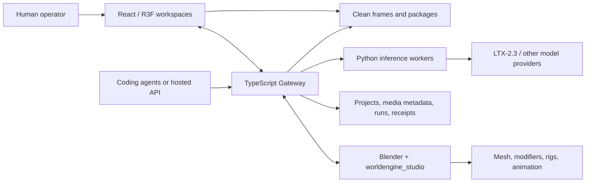

<div align="center">


# WorldEngine · Director

**Agent-native 3D staging, cinematography, animation, editorial, and verified AI-video handoff.**

[](https://github.com/OpenEnvision/WorldEngine/actions/workflows/ci.yml)
[](docs/site/public/engineering/COMPREHENSIVE_DIRECTOR_LICENSE)
[](#start-here)
[](frontend/director/)
[](.mcp.json)
[](docs/site/)

[Quick start](#start-here) · [Highlights](#highlights) · [Architecture](#architecture) · [Agent workflow](#agent-native-workflow) · [Feature status](docs/site/src/content/docs/reference/feature-status.md) · [Docs](#documentation-map)

</div>

> Languages: **English** · [中文](README.zh-CN.md)

WorldEngine is the repository-root production platform. Director is its browser-based production
desk in `frontend/director/`. A human can block a scene visually; an Agent can inspect and change
the same project through typed MCP, HTTP, CLI, or browser contracts.

One production system, four views — 3D Stage, Canvas production DAG, Video editorial, and Gallery
review — operated by humans and Agents through the same guarded contracts.

Every serious workflow ends with revision-bound audits and clean visual evidence, not an
unverified “command succeeded” message.

## Start here

Requirements: **Node.js 22**, **npm 10+**, and a WebGL 2 browser.

```bash
npm ci
npm run dev
```

For the integrated native modeling product, launch Blender from this WorldEngine root. It starts
the same Director frontend and Gateway, plus a local Blender 4.2+ process running
`worldengine_studio`. Blender remains the authoritative modeling scene. Install Blender or set
`BLENDER_BIN`:

```bash
npm run blender
```

| Surface  | Address                        | Purpose                                              |
| -------- | ------------------------------ | ---------------------------------------------------- |
| Director | <http://127.0.0.1:5175>        | Complete UI: standalone or integrated with Blender   |
| Gateway  | <http://127.0.0.1:8787/health> | Agent, production, DCC, and generation control plane |
| Docs     | <http://127.0.0.1:4321>        | Run separately with `npm run docs:dev`               |

Open `/?workspace=stage`, `/?workspace=canvas`, `/?workspace=video`, or `/?workspace=gallery`
to select a workspace.

## Highlights

| Domain                    | What you get                                                                                                                                                                                                 |
| ------------------------- | ------------------------------------------------------------------------------------------------------------------------------------------------------------------------------------------------------------ |
| **3D Stage**              | Catalog meshes, Blender-authored geometry, or promoted generated-3D assets; Mixamo characters; pose/IK; physical cameras; animation tracks; storyboard coverage; clean capture and diagnostic render passes |
| **Canvas & Video Editor** | Graph authoring and a durable multimodal production DAG, picture/audio/caption tracks, rational frame rates, SMPTE timecode, waveform display, proxy selection, and offline relink                           |
| **Agent control plane**   | Exact target tokens, revision/fingerprint guards, idempotency keys, audit/correct/deliver loops, persistent sessions, and role-to-model Profile routing                                                      |
| **Production automation** | A durable serial multi-Agent graph from planning through visual critique, repair, generation, and editorial reporting                                                                                        |
| **Interchange**           | Tested Director subsets for Fountain, OTIO/OTIOZ, glTF/GLB, USDA/USDZ, plus reviewable `.blend` import and a revision-guarded Blender round trip                                                             |
| **Generative production** | Durable ComfyUI image/video/audio jobs, Meshy/Tripo 3D jobs, transcription/captions, Shot IR and verified Shot Packages, plus an optional LTX-2.3 Python worker                                              |
| **Collaboration**         | Yjs synchronization, presence, anchored review comments, named versions, comparison, and restore for one Director gateway deployment                                                                         |

The [feature status matrix](./docs/site/src/content/docs/reference/feature-status.md) separates
stable, experimental, limited, and planned behavior. “Supported interchange” does not mean
lossless support for every feature of an external format.

## Architecture



Browser Stage and Blender are two views of one production system: native geometry is
authoritative in the bound Blender scene, while Director keeps the canonical production and
character semantics. Compatible character Action/Pose state is mapped onto the bound native
armature. See [the backend layout](./backend/README.md) and
[Control plane and Python workers](./docs/site/src/content/docs/architecture/control-plane.md).

### Repository layout

| Path                             | Responsibility                                                                                                                |
| -------------------------------- | ----------------------------------------------------------------------------------------------------------------------------- |
| `frontend/director/`             | React Director product and browser workspaces                                                                                 |
| `backend/gateway/`               | TypeScript Gateway, jobs, media, collaboration, and tool HTTP for DSH / MCP                                                   |
| `packages/`                      | Shared npm workspaces: protocol, agent-engine, dsh-plugin-workbench, project-schema, stage-protocol, dcc-*, model-provider, di, scene-pipeline |
| `packages/dsh-plugin-workbench/` | Director Stage / Canvas / Video / Blender tools as a DeepSeek Harness plugin                                                  |
| `vendor/`                        | Official third-party Git submodules: DeepSeek Harness, LTX-2, Hunyuan3D-2, TRELLIS, ARDY. Do not fork them in-tree            |
| `integrations/blender/live/`     | Blender live modeling kernel (`worldengine_studio`)                                                                           |
| `integrations/blender/interchange/` | Trusted `.blend` import and Director scene round-trip                                                                      |
| `integrations/plugins/`          | Portable Agent/MCP plugin built from the same workbench contracts                                                             |
| `assets/`                        | Asset catalogs, manifests, provenance, and license metadata                                                                   |
| `data/`                          | Mutable runtime state; only JSON Schemas and the README stay in Git                                                           |
| `docs/site/`                     | Product and engineering documentation site                                                                                    |
| `docs/research/`                 | Paper drafts, literature review, and research notes                                                                           |
| `tools/`                         | Vite, Vitest, ESLint, TypeScript, PostCSS/Tailwind configs; scripts, Playwright, evals                                        |

Generated scenes, build trees, and local checkpoints live under the ignored `.runtime/` directory.

## Per-directory READMEs

| README | Purpose |
| --- | --- |
| [`frontend/director/`](./frontend/director/README.md) | React + R3F browser product with Stage/Canvas/Video/Gallery workspaces |
| [`backend/`](./backend/README.md) | Backend layer overview (gateway; official model sources live in `vendor/`) |
| [`backend/gateway/`](./backend/gateway/README.md) | TypeScript gateway: jobs, media, collaboration, HTTP/MCP |
| [`vendor/`](./vendor/README.md) | Official third-party Git submodules and lock files |
| [`packages/`](./packages/README.md) | Shared transport contracts and runtime packages |
| [`integrations/`](./integrations/README.md) | Blender live kernel, interchange, and portable Agent plugin |
| [`assets/`](./assets/README.md) | Asset catalogs, manifests, and license metadata |
| [`tools/`](./tools/README.md) | Vite, Vitest, ESLint, TypeScript, and PostCSS/Tailwind configs |
| [`tools/scripts/`](./tools/scripts/README.md) | Repository automation, local launchers, and checks |
| [`tools/evals/`](./tools/evals/README.md) | Agent golden-task evals |
| [`tools/e2e/`](./tools/e2e/README.md) | Playwright end-to-end tests |
| [`docs/site/`](./docs/site/README.md) | Astro/Starlight bilingual documentation site |
| [`data/`](./data/README.md) | Mutable runtime state (only schema and README in Git) |

## Agent-native workflow

[`AGENTS.md`](./AGENTS.md) is the canonical instruction entry point for coding agents.
Project-level MCP configuration ships for Claude Code, Codex, and Cursor; `npm run repo:check`
verifies they all launch the same server. Any other MCP client can copy [`.mcp.json`](./.mcp.json).

```text
capabilities/catalog
  → observe exact target and guard
  → execute one atomic intent
  → observe/diff
  → audit
  → preview or deliver
  → inspect pixels and receipts
```

Quick gateway smoke test:

```bash
npm run --silent stage -- --help
npm run --silent stage -- director_workbench '{"op":"observe"}'
npm run --silent stage -- director_workbench '{"op":"capabilities"}'
```

`npm run stage --` prints an npm banner that is not valid JSON. Use `--silent` or
`node tools/scripts/stage-cli.mjs` when parsing stdout.

Use `director_workbench` for Stage plus generation, transcription, and generated-3D jobs;
`director_creative` for Canvas DAG, Video, interchange, and collaboration; and
`director_dcc` for DCC handoff. Do not automate the UI by screen coordinates when a semantic
operation exists.

`npm run dsh` prepares the Director workbench overlay and launches the pinned DeepSeek Harness
Web profile on `:3080`.

## Source and assets are separate

The GitHub repository contains source code, schemas, catalogs, and license metadata — not
runtime models, thumbnails, model weights, generated media, or mutable production data. Cleared
redistributable assets belong in a version-pinned Hugging Face dataset and are restored with the
asset manifest under `assets/library/`:

```bash
npm run assets:status
npm run assets:install
npm run assets:verify
```

`assets/manifest.lock.json` must name the real Hugging Face repository and an immutable dataset
revision. Mixamo exports are user-provided and must not be published as a shared Hugging Face
bundle. See
[Open-source Assets & Hugging Face](./docs/site/src/content/docs/development/open-source-assets.md).

## Optional LTX-2.3

Director vendors a pinned official LTX-2 checkout under `vendor/ltx-2`. The Gateway spawns
`tools/scripts/ltx23-generate.py` for one DistilledPipeline job at a time — same pattern as ARDY.
Accept the upstream license before cloning:

```bash
export DIRECTOR_ACCEPT_LTX2_LICENSE=1
npm run setup:ltx2
```

Point the Gateway at local weights with `LTX23_DISTILLED_CHECKPOINT_PATH`,
`LTX23_SPATIAL_UPSAMPLER_PATH`, and `LTX23_GEMMA_ROOT`. This integration is experimental until a
real checkpoint/GPU smoke test produces a stored receipt. Read
[White-box to Video](./docs/site/src/content/docs/pipelines/video-generation.md) before enabling it.

## Optional Hunyuan3D, TRELLIS, and ARDY sources

These are official Git submodules, cloned on demand. Director does not copy or fork them:

```bash
export DIRECTOR_ACCEPT_HUNYUAN3D_LICENSE=1
npm run setup:hunyuan3d
npm run setup:trellis
npm run setup:ardy
```

Hunyuan3D-2 uses a community license with territory and MAU limits. TRELLIS is MIT for the
pinned source (some mesh/render pip dependencies have separate terms). ARDY is Apache-2.0;
after `setup:ardy` the Gateway uses that checkout unless `DIRECTOR_ARDY_REPO` is set.
See `vendor/` (`ltx-2`, `hunyuan3d`, `trellis`, `ardy`, and their `*.lock.json` pins).

## Documentation map

```bash
npm --prefix docs/site install
npm run docs:dev
```

| Goal                              | Guide                                                                                                  |
| --------------------------------- | ------------------------------------------------------------------------------------------------------ |
| Install and verify                | [Install & Run](./docs/site/src/content/docs/getting-started/install.md)                               |
| Produce a first accepted shot     | [End-to-end verified shot](./docs/site/src/content/docs/tutorials/verified-shot.md)                    |
| Operate the 3D Stage              | [3D Editor](./docs/site/src/content/docs/editor/index.md)                                              |
| Pose, IK, and animate characters  | [Characters](./docs/site/src/content/docs/editor/characters.md)                                        |
| Connect an Agent                  | [Agent Control](./docs/site/src/content/docs/agents/index.md)                                          |
| Route roles to different models   | [Multi-Agent production](./docs/site/src/content/docs/agents/multi-agent.md)                           |
| Let Agents select real assets     | [Asset discovery](./docs/site/src/content/docs/agents/assets.md)                                       |
| Restore external runtime assets   | [Open-source assets](./docs/site/src/content/docs/development/open-source-assets.md)                   |
| Integrate HTTP                    | [Gateway HTTP API](./docs/site/src/content/docs/reference/http-api.md)                                 |
| Exchange with DCC/editorial tools | [Interchange](./docs/site/src/content/docs/pipelines/interchange.md)                                   |
| Understand maturity and limits    | [Feature status](./docs/site/src/content/docs/reference/feature-status.md)                             |
| Contribute safely                 | [Development guide](./docs/site/src/content/docs/development/index.md)                                 |

Deep schemas and engineering notes remain under
[`docs/site/src/content/docs/engineering/`](./docs/site/src/content/docs/engineering/).

## Verify a change

```bash
npm run lint
npm run format:check
npm run repo:check
npm run build
npm run test:core
npm run docs:build
```

CI runs the same checks on Node 22. The application build enforces an 800 KiB maximum application
chunk and rebuilds the portable MCP plugin.

Binary asset acceptance tests are gated behind `DIRECTOR_LOCAL_ASSET_TESTS=1`. Use
`npm run test:assets` on a workstation that already has the required local assets.

## Data and security defaults

- The gateway binds only to loopback and rejects a non-loopback host.
- Raw HTTP clients bootstrap a local browser token; workspace mutations also require exact target
  and revision/fingerprint guards.
- Anonymous (no-Origin) bootstrap is disabled by default. Same-process native clients inherit the
  shared `DIRECTOR_GATEWAY_TOKEN`.
- Hosted model credentials remain server-side and are omitted from discovery responses and
  durable session data.
- Project documents store stable IDs and metadata; large media bytes belong in browser media or
  artifact storage, not scene JSON.

## License

[MIT](docs/site/public/engineering/COMPREHENSIVE_DIRECTOR_LICENSE). Before redistribution, review
the licenses of the root project and every bundled or upstream asset or model. Third-party records
live in
[`engineering/THIRD_PARTY_NOTICES.md`](./docs/site/src/content/docs/engineering/THIRD_PARTY_NOTICES.md).
