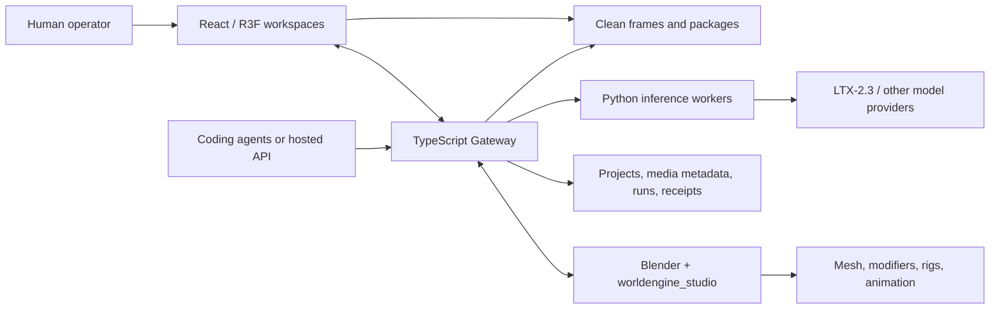

<div align="center">


# WorldEngine · Director

**Agent 原生的 3D 场景调度、摄影、动画、剪辑与经过验证的 AI 视频交付。**

_从意图到已交付镜头只有一条生产线——每一步都有类型、绑定 revision、可验证。_

[](https://github.com/OpenEnvision/WorldEngine/actions/workflows/ci.yml)
[](docs/site/public/engineering/COMPREHENSIVE_DIRECTOR_LICENSE)
[](#从这里开始)
[](frontend/director/)
[](.mcp.json)
[](docs/site/)

[快速开始](#从这里开始) · [亮点](#亮点) · [架构](#架构) · [Agent 工作流](#agent-原生工作流) · [功能状态](docs/site/src/content/docs/reference/feature-status.md) · [文档](#文档地图)

</div>

> 语言：**中文** · [English](README.md)

WorldEngine 是仓库根目录的制作平台。Director 是基于浏览器的制作台，实现在 `frontend/director/`。
人类可以在界面里调度场景；Agent 可以通过带类型的 MCP、HTTP、CLI 或浏览器契约检查并修改同一个项目。

一套制作系统，四种视图——3D Stage、Canvas 制作 DAG、Video 剪辑与 Gallery 审阅——由人类与 Agent
通过相同的受保护契约操作。

每一个严肃的工作流都以基于 revision 的审计和干净的视觉证据收尾，而不是一条未经验证的「命令成功」消息。

## 从这里开始

要求：**Node.js 22**、**npm 10+**，以及支持 WebGL 2 的浏览器。

```bash
npm ci
npm run dev
```

如需集成的原生建模产品，从这个 WorldEngine 根目录启动 Blender。它会启动同样的 Director 前端与网关，
外加一个运行 `worldengine_studio` 的本地 Blender 4.2+ 进程。Blender 仍是权威建模场景。安装 Blender
或设置 `BLENDER_BIN`：

```bash
npm run blender
```

| 界面     | 地址                           | 用途                               |
| -------- | ------------------------------ | ---------------------------------- |
| Director | <http://127.0.0.1:5175>        | 完整 UI：独立运行或与 Blender 集成 |
| Gateway  | <http://127.0.0.1:8787/health> | Agent、制作、DCC 与生成的控制平面  |
| Docs     | <http://127.0.0.1:4321>        | 使用 `npm run docs:dev` 单独运行   |

打开 `/?workspace=stage`、`/?workspace=canvas`、`/?workspace=video` 或 `/?workspace=gallery`
来选择工作区。

## 亮点

| 领域                       | 内容                                                                                                                                   |
| -------------------------- | -------------------------------------------------------------------------------------------------------------------------------------- |
| **3D Stage**               | 目录网格、Blender 原生几何或已提升的生成式 3D；Mixamo 角色；pose/IK；物理摄像机；动画轨道；故事板覆盖；干净捕获与诊断渲染通道          |
| **Canvas 与 Video 编辑器** | 图形创作与持久的多模态制作 DAG、画面/音频/字幕轨道、有理帧率、SMPTE 时间码、波形显示、代理选择与离线重链                               |
| **Agent 控制平面**         | 精确目标令牌、revision/fingerprint 守卫、幂等键、audit/correct/deliver 循环、持久会话与 role-to-model Profile 路由                     |
| **制作自动化**             | 一条从规划到视觉评审、修复、生成与剪辑报告的持久串行多 Agent 图                                                                        |
| **交换**                   | 经过测试的 Director 子集：Fountain、OTIO/OTIOZ、glTF/GLB、USDA/USDZ，以及可审阅的 `.blend` 导入和受 revision 守卫的 Blender 往返       |
| **生成式制作**             | 持久的 ComfyUI 图像/视频/音频任务、Meshy/Tripo 3D 任务、转录/字幕、Shot IR 与经过验证的 Shot Package，以及可选的 LTX-2.3 Python worker |
| **协作**                   | Yjs 同步、presence、锚定审阅评论、命名版本、对比与恢复                                                                                 |

[功能状态矩阵](./docs/site/src/content/docs/reference/feature-status.md)区分 stable、experimental、limited
与 planned。「支持的交换」并不意味着对外部格式的每一个特性都无损。

## 架构



浏览器 Stage 与 Blender 是同一套制作系统的两个视图：原生几何以绑定的 Blender 场景为准，
Director 保留规范的制作与角色语义。兼容的角色 Action/Pose 状态会映射到绑定的原生 armature。
参见 [后端布局](./backend/README.md) 与
[控制平面与 Python worker](./docs/site/src/content/docs/architecture/control-plane.md)。

### 仓库布局

| 路径                                | 职责                                                                                               |
| ----------------------------------- | -------------------------------------------------------------------------------------------------- |
| `frontend/director/`                | React Director 产品与浏览器工作区                                                                  |
| `backend/gateway/`                  | TypeScript 网关、任务、媒体、协作，以及 DSH / MCP 的工具 HTTP                                      |
| `packages/`                         | 共享 npm workspaces：protocol、agent-engine、dsh-plugin-workbench、project-schema 等               |
| `packages/dsh-plugin-workbench/`    | Director Stage / Canvas / Video / Blender 工具，作为 DeepSeek Harness 插件                         |
| `vendor/`                           | 官方第三方 Git 子模块：DeepSeek Harness、LTX-2、Hunyuan3D-2、TRELLIS、ARDY。不要在仓库内再分叉一份 |
| `integrations/blender/live/`        | Blender 实时建模内核（`worldengine_studio`）                                                       |
| `integrations/blender/interchange/` | 受信任的 `.blend` 导入与 Director 场景往返                                                         |
| `integrations/plugins/`             | 基于同一套 workbench 契约构建的可移植 Agent/MCP 插件                                               |
| `assets/`                           | 资产目录、清单、provenance 与许可元数据                                                            |
| `data/`                             | 可变运行时状态；仅 JSON Schema 与 README 留在 Git                                                  |
| `docs/site/`                        | 产品与工程文档站                                                                                   |
| `docs/research/`                    | 论文草稿、文献综述与研究笔记                                                                       |
| `tools/`                            | Vite、Vitest、ESLint、TypeScript、PostCSS/Tailwind 配置；脚本、Playwright、评测                    |

生成的场景、构建树与本地检查点放在被忽略的 `.runtime/` 目录下。

## 各部分 README 索引

| README                                                | 作用                                                       |
| ----------------------------------------------------- | ---------------------------------------------------------- |
| [`frontend/director/`](./frontend/director/README.md) | React + R3F 浏览器产品与 Stage/Canvas/Video/Gallery 工作区 |
| [`backend/`](./backend/README.md)                     | 后端分层总览（gateway；官方模型源码在 `vendor/`）          |
| [`backend/gateway/`](./backend/gateway/README.md)     | TypeScript 网关：任务、媒体、协作、HTTP/MCP                |
| [`vendor/`](./vendor/README.md)                       | 官方第三方 Git 子模块与 lock 文件                          |
| [`packages/`](./packages/README.md)                   | 共享传输契约与运行时包                                     |
| [`integrations/`](./integrations/README.md)           | Blender 实时内核、交换与可移植 Agent 插件                  |
| [`assets/`](./assets/README.md)                       | 资产目录、清单与许可元数据                                 |
| [`tools/`](./tools/README.md)                         | Vite、Vitest、ESLint、TypeScript 与 PostCSS/Tailwind 配置  |
| [`tools/scripts/`](./tools/scripts/README.md)         | 仓库自动化、本地启动器与检查                               |
| [`tools/evals/`](./tools/evals/README.md)             | Agent 黄金任务评测                                         |
| [`tools/e2e/`](./tools/e2e/README.md)                 | Playwright 端到端测试                                      |
| [`docs/site/`](./docs/site/README.md)                 | Astro/Starlight 双语文档站                                 |
| [`data/`](./data/README.md)                           | 可变运行时状态（仅 schema 与 README 进 Git）               |

## Agent 原生工作流

[`AGENTS.md`](./AGENTS.md) 是编码 Agent 的规范指令入口。项目级 MCP 配置随 Claude Code、Codex
和 Cursor 一起发布；`npm run repo:check` 验证它们全部启动同一台服务器。其他 MCP 客户端可以复制
[`.mcp.json`](./.mcp.json)。

```text
capabilities/catalog
  → observe exact target and guard
  → execute one atomic intent
  → observe/diff
  → audit
  → preview or deliver
  → inspect pixels and receipts
```

快速网关冒烟测试：

```bash
npm run --silent stage -- --help
npm run --silent stage -- director_workbench '{"op":"observe"}'
npm run --silent stage -- director_workbench '{"op":"capabilities"}'
```

`npm run stage --` 会在 stdout 写入 npm banner，破坏 `JSON.parse`。解析时请用 `--silent`，
或直接运行 `node tools/scripts/stage-cli.mjs`。

对 Stage 以及生成、转录与生成式 3D 任务使用 `director_workbench`；对 Canvas DAG、Video、交换与协作
使用 `director_creative`；对 DCC 交接使用 `director_dcc`。实验性的 `director_game` 工具在 live Stage
player 上规划并试玩一个类型化 game slice，导出走 `director_dcc` —— 它不会生成引擎原生游戏工程。
存在语义操作时，不要按屏幕坐标自动化 UI。

`npm run dsh` 会准备 Director workbench overlay，并在 `:3080` 启动锁定的 DeepSeek Harness Web 配置。

## 源码与资产分离

GitHub 仓库包含源码、schema、目录与许可元数据，不含运行时模型、缩略图、模型权重、生成媒体或可变
制作数据。已清理的可再分发资产属于版本锁定的 Hugging Face 数据集，并通过资产清单还原到
`assets/library/`：

```bash
npm run assets:status
npm run assets:install
npm run assets:verify
```

`assets/manifest.lock.json` 必须指明真实的 Hugging Face 仓库与不可变数据集 revision。Mixamo 导出
由用户提供，不得作为共享 Hugging Face bundle 发布。参见
[开源资产与 Hugging Face](./docs/site/src/content/docs/development/open-source-assets.md)。

## 可选的 LTX-2.3

Director 把锁定的官方 LTX-2 checkout 放在 `vendor/ltx-2`。网关按作业 spawn
`tools/scripts/ltx23-generate.py` 跑一次 DistilledPipeline，和 ARDY 同一套路。克隆前请接受上游许可：

```bash
export DIRECTOR_ACCEPT_LTX2_LICENSE=1
npm run setup:ltx2
```

用 `LTX23_DISTILLED_CHECKPOINT_PATH`、`LTX23_SPATIAL_UPSAMPLER_PATH` 和 `LTX23_GEMMA_ROOT`
指向本地权重。在一次真实的 checkpoint/GPU 冒烟测试产出已存储的 receipt 之前，此集成为实验性质。启用前请阅读
[White-box to Video](./docs/site/src/content/docs/pipelines/video-generation.md)。

## 可选的 Hunyuan3D、TRELLIS 与 ARDY 源码

这些是按需克隆的官方 Git 子模块。Director 不拷贝、不分叉：

```bash
export DIRECTOR_ACCEPT_HUNYUAN3D_LICENSE=1
npm run setup:hunyuan3d
npm run setup:trellis
npm run setup:ardy
```

Hunyuan3D-2 使用带地域与 MAU 限制的社区许可。TRELLIS 锁定源码为 MIT（部分网格/渲染 pip
依赖另有条款）。ARDY 为 Apache-2.0；`setup:ardy` 之后网关默认使用该检出，除非设置
`DIRECTOR_ARDY_REPO`。详见 `vendor/`（`ltx-2`、`hunyuan3d`、`trellis`、`ardy` 及其 `*.lock.json`）。

## 文档地图

```bash
npm --prefix docs/site install
npm run docs:dev
```

| 目标                     | 指南                                                                       |
| ------------------------ | -------------------------------------------------------------------------- |
| 安装与验证               | [安装与运行](./docs/site/src/content/docs/getting-started/install.md)      |
| 制作首个被接受的镜头     | [端到端验证镜头](./docs/site/src/content/docs/tutorials/verified-shot.md)  |
| 操作 3D Stage            | [3D 编辑器](./docs/site/src/content/docs/editor/index.md)                  |
| 为角色摆 pose、IK 与动画 | [角色](./docs/site/src/content/docs/editor/characters.md)                  |
| 连接 Agent               | [Agent 控制](./docs/site/src/content/docs/agents/index.md)                 |
| 将角色路由到不同模型     | [多 Agent 制作](./docs/site/src/content/docs/agents/multi-agent.md)        |
| 让 Agent 选择真实资产    | [资产发现](./docs/site/src/content/docs/agents/assets.md)                  |
| 还原外部运行时资产       | [开源资产](./docs/site/src/content/docs/development/open-source-assets.md) |
| 集成 HTTP                | [网关 HTTP API](./docs/site/src/content/docs/reference/http-api.md)        |
| 与 DCC/剪辑工具交换      | [交换](./docs/site/src/content/docs/pipelines/interchange.md)              |
| 理解成熟度与限制         | [功能状态](./docs/site/src/content/docs/reference/feature-status.md)       |
| 安全贡献                 | [开发指南](./docs/site/src/content/docs/development/index.md)              |

深度 schema 与工程笔记保留在
[`docs/site/src/content/docs/engineering/`](./docs/site/src/content/docs/engineering/)。

## 验证一次改动

```bash
npm run lint
npm run format:check
npm run repo:check
npm run build
npm run test:core
npm run docs:build
```

CI 在 Node 22 上运行同样的检查。应用构建强制 800 KiB 的最大应用 chunk，并重建可移植 MCP 插件。

二进制资产验收测试受 `DIRECTOR_LOCAL_ASSET_TESTS=1` 门控。在已还原所需本地资产的工作站上运行
`npm run test:assets`。

## 数据与安全默认

- 网关只绑定 loopback，并拒绝非 loopback 主机。
- 原始 HTTP 客户端引导一个本地浏览器令牌；工作区变更还要求精确目标与 revision/fingerprint 守卫。
- 匿名（无 Origin）引导默认关闭。同进程的原生客户端继承共享的 `DIRECTOR_GATEWAY_TOKEN`。
- 托管模型凭证保留在服务端，并从发现响应与持久会话数据中省略。
- 项目文档存储稳定的 ID 与元数据；大型媒体字节属于浏览器媒体或产物存储，而非场景 JSON。

## 许可

[MIT](docs/site/public/engineering/COMPREHENSIVE_DIRECTOR_LICENSE)。再分发前，请审阅根项目以及
每一个 bundled/upstream 资产或模型的许可。第三方记录见
[`engineering/THIRD_PARTY_NOTICES.md`](./docs/site/src/content/docs/engineering/THIRD_PARTY_NOTICES.md)。
