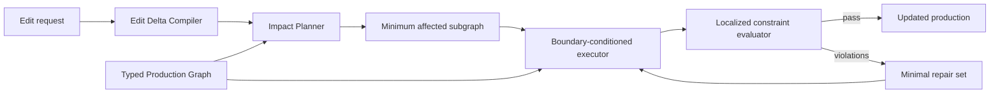

# CineDelta：面向多镜头生成式制作回溯修订的反事实影响定位

**English title:** _CineDelta: Counterfactual Impact Localization for Provenance-Aware Revision of Multi-Shot Generative Productions_  
**Document:** Research Proposal Draft  
**Version:** 0.3 — Literature-Grounded Draft  
**Target venue:** CVPR / ICCV；若最终贡献更偏三维制作与交互系统，则转向 SIGGRAPH / SIGGRAPH Asia  
**Date:** 2026-08-08

---

## 1. Executive summary

当前 Agentic Video Generation 系统主要研究一次性长视频生成、生成过程中的失败重试，或在 accepted history 上向前追加和编辑当前镜头。FilmAgent / MovieAgent、CoAgent 和 ContextMaster 分别代表这三条路线。然而，真实电影制作还包含对已完成作品的回溯修订：导演会改变早期角色服装、道具状态、人物走位、动作或摄影机，同时要求已经通过的其他镜头保持不变。

现有系统通常采用两个极端策略：只重生成用户点名的镜头，导致上下游状态或边界不连续；或者重新生成整场乃至整片，造成无关内容漂移和高昂成本。

本 proposal 提出 **CineDelta**，并将核心任务定义为 **Production Revision Impact Localization (PRIL)**：给定一个已经完成并接受的多镜头作品、完整生产 provenance 和一条可作用于任意历史节点的创作修改，系统将修改编译为结构化状态差分，在连接叙事、三维世界、镜头、生成任务、媒体产物和时间线的类型化生产图上，预测满足新约束所需的最小充分重执行计划；随后利用三维状态和相邻镜头边界进行局部重规划、局部重生成与局部修复，同时锁定未受影响内容。

核心研究问题是：

> **能否在不降低编辑成功率和跨镜头连续性的前提下，显著减少不必要的重生成与未修改内容漂移？**

我们还将构建 **CineDelta-Eval**。与一次性生成 benchmark 不同，每个样本是一段“基础作品 + 修改指令 + 预期状态变化 + 必要/可选/禁止修改节点 + 执行成本”的编辑 episode。

---

## 2. Abstract

### 2.1 中文摘要

现有长视频研究已经覆盖一次性叙事生成、失败镜头重试、交互式下一镜生成和多镜头视频编辑，但尚未把已完成制作上的回溯修订定义为显式影响定位问题。真实电影制作中，创作者会改变早期角色服装、道具状态、人物调度、动作或摄影机，并要求无关镜头和已经通过的内容保持不变。只修改被点名镜头可能破坏下游状态和镜头边界；大范围重生成则造成额外成本及未修改内容的身份、构图和风格漂移。

我们提出 **CineDelta**，一种面向已完成多镜头生成式制作的 provenance-aware revision 方法，并将任务定义为 Production Revision Impact Localization。CineDelta 使用统一的类型化生产图连接叙事事件、持久世界状态、三维空间关系、摄影机、镜头、生成任务、媒体产物和剪辑时间线。给定作用于任意历史节点的自然语言或直接操作修改，Edit Delta Compiler 首先生成结构化状态差分；Hybrid Impact Planner 随后结合显式依赖、学习式语义影响和成本感知选择，求解满足新约束所需的最小充分重执行计划。Boundary-Conditioned Executor 使用三维渲染条件、角色与道具状态、相邻镜头锚点和未修改产物锁定来执行局部重规划与重生成。最后，Localized Constraint Evaluator 将几何、时序和视觉语义错误定位到具体节点和关系，并触发最小范围修复。

我们进一步提出 **CineDelta-Eval**，将一次编辑过程而不是最终视频定义为评测样本。每个 episode 包含基础制作、编辑请求、状态变化、必要/可选/保护节点、连续性约束和执行成本。该 benchmark 联合评估受影响集合预测、编辑忠实度、未修改内容保持、重生成边界连续性和生产成本。我们的核心假设是：显式生产状态和约束感知影响分析能够在不降低编辑成功率的前提下，显著减少不必要的重生成与附带视觉漂移。

### 2.2 English abstract

Recent long-form video systems support one-pass narrative generation, verifier-driven retries, interactive next-shot generation, and multi-shot editing, but do not formulate retroactive revision of a completed production as explicit impact localization. In real film production, creators revise early character appearance, prop state, blocking, action, or cinematography after downstream shots have already been accepted, while expecting approved and unrelated content to remain unchanged. Editing only the named shot can leave downstream state and boundaries stale, whereas broad regeneration incurs unnecessary cost and collateral drift in identity, composition, and style.

We propose **CineDelta** for provenance-aware revision of completed multi-shot generative productions, and formulate the task as Production Revision Impact Localization. CineDelta represents narrative events, persistent world state, 3D spatial relations, cameras, shots, generation jobs, media artifacts, and editorial timing in a unified typed production graph. Given a natural-language or direct-manipulation edit targeting any historical production state, an Edit Delta Compiler first produces a structured state change. A Hybrid Impact Planner then combines explicit dependencies, learned semantic impact, and cost-aware selection to identify a minimally sufficient re-execution plan. A Boundary-Conditioned Executor performs local replanning and regeneration using 3D render conditions, character and prop states, neighboring-shot anchors, and locks on unaffected artifacts. Finally, a Localized Constraint Evaluator maps geometric, temporal, and visual-semantic failures back to specific nodes and relations, enabling localized repair instead of global retries.

We further introduce **CineDelta-Eval**, which treats an edit process rather than a final video as the unit of evaluation. Each episode contains a base production, an edit request, expected state changes, required/optional/protected nodes, continuity constraints, and execution costs. The benchmark jointly measures affected-set prediction, edit fidelity, preservation of unaffected content, boundary continuity, and production cost. We hypothesize that explicit production state and constraint-aware impact analysis can substantially reduce unnecessary regeneration and collateral visual drift without sacrificing edit success.

---

## 3. Research gap

完整调研、纳入标准和逐篇证据见 [CineDelta 文献调研与新颖性审计](./CINEDELTA_LITERATURE_REVIEW.md)。本节只保留会直接改变论文定义的结论。

### 3.1 What existing work already solves

相关领域已经分别解决了大量组成问题：

- [FilmAgent](https://arxiv.org/abs/2501.12909)、[MovieAgent](https://arxiv.org/abs/2503.07314) 和 [Hollywood Town](https://arxiv.org/abs/2510.22431) 已经覆盖分层叙事、多 Agent 电影角色、生产图和带反馈的长视频工作流；
- [CoAgent](https://arxiv.org/abs/2512.22536) 已使用 verifier 对不一致镜头触发 selective regeneration，因此“选择性重生成”不能作为新颖性 claim；
- [StoryBlender](https://arxiv.org/abs/2604.03315) 已研究具有 continuity memory graph、引擎验证和显式编辑能力的 3D storyboard；
- [Edit-As-Act](https://arxiv.org/abs/2603.17583) 已将 3D 场景编辑定义为实现目标世界状态的最小动作序列，并要求保持其余内容；
- [PermaVid](https://arxiv.org/abs/2606.16449) 已研究外观或几何编辑后的 RGB/depth memory 更新；
- [ContextMaster](https://arxiv.org/abs/2608.04956) 已把生成、参考和多镜头视频编辑组合为共享 accepted history 上的交互式操作；
- [Crayotter](https://arxiv.org/abs/2606.07636) 已把分析、蓝图、工具调用、中间渲染和输出作为 first-class artifacts；[VideoAgent](https://arxiv.org/abs/2606.23327) 已使用图优化组合大量编辑工具；
- 增量视图维护、self-adjusting computation 和 [Riker](https://www.usenix.org/conference/atc22/presentation/curtsinger) 已说明依赖跟踪与最小重计算在 systems 中不是新概念。

因此，CineDelta 不把多 Agent、生产 DAG、3D 可编辑、共享记忆、单镜头重试、中间产物追踪或一般依赖传播作为独立贡献。

### 3.2 Closest-work comparison

| Work                   | Trigger and task                         | Revision scope                          | Explicit output                                | Missing relative to CineDelta                               |
| ---------------------- | ---------------------------------------- | --------------------------------------- | ---------------------------------------------- | ----------------------------------------------------------- |
| Hollywood Town         | 从脚本一次性生成长视频                   | 叙事与视觉状态依赖                      | 完整视频与质检结果                             | 不研究已完成作品上的 retroactive edit 和影响集标签          |
| CoAgent                | 当前生成镜头未通过 verifier              | 当前镜头重试，必要时调整 prompt/mode    | 通过质检的镜头                                 | 不预测用户修改导致的跨镜头、跨产物失效集合                  |
| StoryBlender           | 用户编辑 3D storyboard                   | 3D 资产、布局和相机                     | 可编辑的一致 3D storyboard                     | 不评价下游视频作业、媒体版本、timeline 替换与真实成本       |
| Edit-As-Act            | 用户给出目标 3D 世界状态                 | 单个静态室内场景                        | 最小 EditLang 动作序列                         | 不处理多镜头时间状态、随机生成后端和媒体边界                |
| PermaVid               | 场景外观/几何发生编辑                    | 长视频上下文 memory                     | 编辑感知的 memory 与后续生成                   | 不输出 production impact plan 和 protected artifacts        |
| ContextMaster          | 当前轮次生成或编辑 source video          | 当前 target；接受后追加历史             | 新的生成/编辑镜头                              | 不定义任意历史节点修改后哪些已接受下游产物需修复            |
| Crayotter / VideoAgent | 长视频编辑目标与工具执行                 | artifact workflow / editing pipeline    | 可追踪产物或工具图                             | 不把 required/optional/protected 影响集作为预测和 benchmark |
| **CineDelta**          | 已完成制作上的 retroactive creative edit | 叙事、世界、镜头、作业、媒体和 timeline | Edit Delta、影响分数、重执行计划、冲突和 trace | Proposed research target                                    |

### 3.3 Precise research gap

本 proposal 不再声称“首次最小编辑”或“首次选择性重生成”。它研究以下联合问题：

1. **Retroactive revision**：修改作用于已完成作品中任意历史状态，而不是只生成或编辑当前下一镜；
2. **Counterfactual impact localization**：预测哪些状态、镜头、作业和媒体产物如果保持不变，就无法满足新约束；
3. **Minimal sufficient re-execution**：输出可执行且经过验证的重计算计划，不把节点数量最少误当成编辑充分；
4. **Preservation-aware repair**：显式锁定无关产物，并在新旧产物边界恢复状态、身份、动作、空间和摄影机连续性；
5. **Process-level evaluation**：联合评估影响集合充分性、编辑忠实度、无关漂移、边界质量和实测成本。

这个任务定义为 **Production Revision Impact Localization (PRIL)**。其科学难点不是普通 DAG invalidation，而是随机生成执行下不完全可观测、语义化和感知化依赖的发现与验证。

### 3.4 Novelty guardrails

投稿版本不得使用以下表述：first selective regeneration、first minimal edit、first editable 3D storyboard、first interactive multi-shot editor、first production DAG。可检验的贡献限定为：

- 一个以 completed production + retroactive edit + provenance 为输入的 PRIL task；
- required / optional / protected production artifacts 和 Pareto-valid plans 的 set-valued benchmark；
- 一个结合显式依赖、学习式语义影响、成本选择和执行后验证的 planner；
- edit fidelity、impact sufficiency、collateral preservation、boundary continuity 与 measured cost 的联合协议。

---

## 4. Scope

第一篇论文只研究 Production Revision Impact Localization，并限定为四类具有明确状态与跨镜头传播关系的 retroactive 修改：

1. **Identity and appearance**：角色身份、服装、颜色和持续外观；
2. **Prop state**：持有、放下、移动、打开、损坏和角色—道具关系；
3. **Blocking and action**：人物位置、朝向、轨迹、动作和动作结果；
4. **Camera and framing**：机位、焦段、景别、运动和镜头覆盖。

主要实验采用 2–5 个场景、8–20 个镜头的短片。灯光、剪辑和多轮修改作为扩展实验。完整对白、嘴型、声音生成、多人协作和无限时长视频不进入第一篇论文的主要范围。

### 4.1 Task assumptions

- 输入项目拥有稳定的角色、道具、摄影机、镜头和媒体标识符；
- 至少一个可执行的三维或结构化场景作为世界状态来源；
- 每个已生成镜头能够追溯到镜头条件、模型配置、随机种子和输入参考；
- 修改作用于当前已接受版本，而不是无版本的可变工作区；
- 基础作品必须在修改前完成、冻结并记录 accepted artifact versions；
- 生成后端可以是局部视频编辑、image-to-video 或整镜头生成，不要求统一模型架构；
- 系统允许返回“该保护要求与编辑目标冲突”，而不是静默修改受保护内容。

### 4.2 Explicitly out of scope

- 从零训练新的大规模视频基础模型；
- 只向前追加下一镜的在线 storytelling 或只编辑当前 target video；
- 将 Agent 数量或角色数量作为创新；
- 保证任意自然语言编辑都可执行；
- 对任意商业电影进行无损局部修改；
- 用单个 VLM 总分代替可解释的状态和连续性检查；
- 在第一篇论文中同时解决视频、对白、配音、嘴型、音乐和音效的全部联动修改。

---

## 5. Problem formulation

### 5.1 Production state

将已有制作表示为类型化生产图：

\[
\mathcal{G}=(\mathcal{V},\mathcal{E},\mathcal{X},\mathcal{C},\mathcal{A})
\]

- \(\mathcal{V}\)：叙事事件、场景、角色、道具、摄影机、镜头、任务、媒体和时间线节点；
- \(\mathcal{E}\)：包含、出现、观察、使用、状态转移、派生、渲染和装配关系；
- \(\mathcal{X}\)：节点当前状态，例如角色服装、道具归属、对象变换和摄影机参数；
- \(\mathcal{C}\)：创作与连续性约束；
- \(\mathcal{A}\)：已经生成或通过审核的图像、视频、三维场景和剪辑产物。

### 5.2 Edit delta

一次修改被编译为：

\[
\Delta=(T,O,X',C^+,C^-,P,\tau)
\]

- \(T\)：目标节点；
- \(O\)：有限编辑原语；
- \(X'\)：目标状态；
- \(C^+,C^-\)：新增和解除的约束；
- \(P\)：明确要求保护的节点或产物；
- \(\tau\)：修改生效的时间范围。

### 5.3 Constraint model

每个约束表示为：

\[
c=(id,type,S,R,\tau,y,w,h)
\]

- \(type\)：身份、外观、持有、空间、可见性、动作状态、摄影机、时序、产物保持或边界连续性；
- \(S\)：约束作用的主体节点；
- \(R\)：相关节点；
- \(\tau\)：生效帧或镜头范围；
- \(y\)：预期状态或关系；
- \(w\)：软约束权重；
- \(h\in\{0,1\}\)：是否为不可违反的硬约束。

约束分为三类：

1. **State constraints**：例如角色在 shot 5 进入时已经持有雨伞；
2. **Boundary constraints**：例如 shot 5 的退出姿态必须与 shot 6 的进入姿态一致；
3. **Preservation constraints**：例如第一场的镜头、剪辑节奏和已批准产物不得改变。

### 5.4 Optimization objective

系统输出可执行计划 \(\pi\)，其中包含选择节点、拓扑顺序、每个节点的执行动作、输入版本和边界条件。首先要求计划属于可行集合：

\[
\Pi_{valid}=\{\pi\mid H(\pi)=0,\;L_{edit}(\pi)\leq\epsilon_e,\;V_{boundary}(\pi)\leq\epsilon_b\}
\]

其中 \(H\) 表示硬约束和保护锁冲突，\(L_{edit}\) 表示编辑目标残差，\(V_{boundary}\) 表示边界连续性违反。随后在有效计划中优化：

\[
\pi^*\in\arg\min_{\pi\in\Pi_{valid}}
C_{exec}(\pi)
+\lambda D_{collateral}(\mathcal{A}'_{\neg\pi},\mathcal{A}_{\neg\pi})
+\mu N_{replace}(\pi)
\]

其中三项分别表示实测重执行成本、未受影响内容漂移和被替换产物数量。核心不是单纯选择节点最少或动作最短，而是在编辑成功与边界约束满足后，寻找成本和附带漂移上的 Pareto 非支配计划。

#### Counterfactual node status

影响集不假设存在唯一 gold set。对候选节点 \(v\)：

- 若所有 \(\pi\in\Pi_{valid}\) 都包含 \(v\)，则 \(v\) 为 **Required**；
- 若存在包含和不包含 \(v\) 的有效非支配计划，则 \(v\) 为 **Optional**；
- 若所有有效非支配计划都不包含 \(v\)，且修改它只增加漂移或成本，则 \(v\) 为 **Protected**；
- 若有限生成预算无法稳定判断，则保留 uncertainty，而不是强制二值标签。

在 controlled tier 中通过锁定节点并执行其余计划进行 counterfactual necessity test；在 open tier 中使用双人标注、第三人裁决和多 seed 执行证据近似 \(\Pi_{valid}\)。

### 5.5 Running example

考虑一个包含 8 个镜头的咖啡馆场景：

- shot 1–2：角色 Alice 空手进入咖啡馆；
- shot 3：Alice 从桌上拿起红色雨伞；
- shot 4–6：Alice 持伞与 Bob 交谈，包含主镜头和两个反打；
- shot 7–8：Alice 放下雨伞并离开。

用户提出：

> “从 shot 4 开始把雨伞改成蓝色，但不要改变 shot 1–3 的剪辑和 Bob 的镜头构图。”

Edit Delta 包含：

- 目标：`object:umbrella`；
- 操作：`set_entity_appearance`；
- 状态变化：`color: red -> blue`；
- 生效范围：shot 4–8；
- 保护集合：shot 1–3 的产物与 Bob-only coverage 的摄影机参数；
- 新增约束：雨伞在所有可见镜头中保持蓝色；
- 保留约束：shot 3 的退出位置与 shot 4 的进入位置一致。

候选传播应识别 shot 4、主角反打、雨伞特写、相应生成任务和时间线片段，但不应重做 Alice 不可见或雨伞不可见的 Bob 特写。若 shot 3 仍展示红色雨伞，而 shot 4 直接展示蓝色雨伞，则系统需要根据修改语义判断颜色变化是在镜头间发生，还是必须把 shot 3 的退出帧作为边界锚点重新编辑。这个例子同时测试时间范围、可见性、状态传播、保护约束和边界连续性。

---

## 6. Proposed method



### 6.1 Edit Delta Compiler

把自然语言、属性面板和时间线操作统一转换为有限原语：

- `set_entity_appearance`
- `move_entity`
- `bind_prop`
- `set_action_state`
- `replace_camera`
- `change_framing`

LLM 只负责语义解析，实际目标解析、时间范围和状态校验由 Director 的项目状态完成。输出必须是可执行结构，而不是自由文本计划。

编译过程分为四步：

1. **Entity resolution**：把“主角”“第三个镜头”“蓝色雨伞”等语言引用解析为项目内稳定 ID；
2. **Temporal grounding**：把“从她拿起雨伞之后”“只改第二场”等描述解析为镜头或帧范围；
3. **State differencing**：显式记录 before/after，而不是只保存目标提示词；
4. **Constraint synthesis**：从修改中产生新增、移除和保持约束。

编译器输出需通过以下验证：目标存在、patch 路径合法、时间范围非空、目标不同时属于保护集合、硬约束之间不存在直接矛盾。无法唯一解析的指令进入人工确认集，并在 benchmark 中单独统计解析失败，不与影响规划失败混合。

### 6.2 Unified Typed Production Graph

在现有 ProductionGraph 上增加对论文关键的关系：

- `appears_in(entity, shot)`
- `observes(camera_or_shot, entity)`
- `state_transition(entity, shot_i, shot_j)`
- `constrains(constraint, node)`
- `derived_from(artifact, state_or_shot)`
- `boundary(shot_i, shot_j)`

每个相关镜头保存进入状态、退出状态、可见对象、摄影机条件和产物 lineage，使错误可以定位回具体节点和关系。

#### Node layers

| Layer     | Node examples                              | Required attributes                                        |
| --------- | ------------------------------------------ | ---------------------------------------------------------- |
| Narrative | event, beat, scene                         | causal parents, involved entities, time order              |
| World     | character, prop, environment, action state | identity, transform, appearance, ownership, pre/post state |
| Shot      | camera, shot, take, coverage               | frame range, visible entities, pose, lens, composition     |
| Artifact  | keyframe, video, depth, mask, edit clip    | immutable ID, source nodes, hash, model receipt            |
| Execution | planning, render, generation, assembly job | inputs, outputs, cost, status, implementation version      |

#### Edge semantics

每种边必须定义传播方向、是否为硬依赖、适用编辑类型、有效时间范围和边界权重。例如：

| Edge               | Propagation                  | Default necessity | Example                          |
| ------------------ | ---------------------------- | ----------------- | -------------------------------- |
| `appears_in`       | entity → shot                | hard when visible | 服装变化传播到角色可见镜头       |
| `observes`         | entity → camera/shot         | candidate or hard | 道具位置变化传播到能观察它的镜头 |
| `state_transition` | shot/state → next shot/state | hard              | 持有状态跨镜头传播               |
| `uses`             | dependency → dependent       | hard              | 摄影机变化传播到使用它的镜头     |
| `renders`          | job → artifact               | hard              | 任务失效使产物失效               |
| `boundary`         | shot ↔ adjacent shot         | candidate         | 局部重生成产生新旧边界风险       |
| `protects`         | edit → node                  | hard exclusion    | 已批准产物不可重做               |

依赖按证据来源分为四类：

1. **Deterministic**：由 schema、引用和执行输入直接给出，例如 job 使用哪个 camera、artifact 由哪个 job 产生；
2. **Observed**：由 execution trace、可见性、接触、相机观察或 memory retrieval 实际记录得到；
3. **Semantic**：叙事因果、身份、动作结果、电影语言和感知连续性等无法由文件引用完全决定的关系；
4. **Latent**：只有局部执行失败后才暴露的遗漏关系，由 evaluator 定位并作为 episode-local evidence 回写。

实验分别报告四类边上的 impact recall，证明方法收益来自不确定语义依赖，而不是复制确定性 provenance。

### 6.3 Hybrid Impact Planner

第一步使用类型化规则产生保守候选集。例如，角色服装修改传播到生效时间之后所有可见该角色的镜头；摄影机修改只传播到使用该摄影机的镜头和直接边界；道具状态修改传播到观察该道具或依赖其状态的镜头。

第二步使用轻量相关性模型预测候选节点必须重执行的概率 \(q_v\)。输入包括编辑类型、边类型、时间距离、可见性、状态差异和节点执行成本。

第三步求解成本感知选择：

\[
\min_z \sum_v c_vz_v
+\alpha\sum_vq_v(1-z_v)
+\beta\sum_{(u,v)\in E_b}b_{uv}|z_u-z_v|
\]

硬依赖和保护节点作为硬约束。该二元能量可转换为 s-t min-cut 精确求解。学习模型只预测语义相关性，不负责绕过结构化硬约束。

第四步将选择集合编译为可执行计划：按 artifact version 和拓扑顺序绑定输入，生成 boundary packet、缓存复用决策和最大修复预算。执行后 evaluator 若发现未满足约束，则定位最可能遗漏的 dependency path 并扩大计划；该反馈必须记入 trace，不能在测试集上永久更新模型参数。

#### 6.3.1 Typed candidate propagation

候选传播保留每个节点的 provenance：起始目标、经过的关系、最短深度、时间过滤结果和成为 hard/candidate 的原因。一个节点可以由多条路径到达，hard 路径优先于 candidate 路径，相关性取多路径聚合值。

```text
Input: production graph G, edit delta Δ
Q ← all target nodes in Δ
required[target] ← true

while Q is not empty:
    u ← pop(Q)
    for each typed propagation edge e=(u,v):
        if e does not apply to Δ.operation: continue
        if e.active_range does not overlap Δ.time_range: continue
        required[v] ← required[v] OR (required[u] AND e is hard)
        relevance[v] ← aggregate(relevance[v], relevance[u] × e.weight)
        record provenance(u, e, v)
        enqueue v if its state changed

return conservative candidates, hard-required nodes, provenance
```

#### 6.3.2 Learned relevance prediction

相关性模型只处理候选节点。每个候选的特征包括：

- Edit Delta 文本与结构化 operation embedding；
- 目标节点、候选节点和关系类型 embedding；
- 图距离、镜头距离与时间重叠比例；
- 主体是否可见、可见面积和遮挡率；
- before/after 状态差异；
- 节点是否位于新旧产物边界；
- 生成后端支持的最小编辑粒度；
- 估计执行成本和历史失败率。

候选模型从可解释的 logistic regression、gradient-boosted trees 和 3–6 层带边类型的 message-passing network 逐级比较。只有当图模型在按项目隔离的 validation split 上稳定优于简单模型时，才进入完整方法。图模型中的节点文本由冻结文本编码器产生，结构化特征通过 MLP 投影。输出 \(q_v\in[0,1]\) 表示候选节点属于必要或合理重执行集合的概率。

训练标签采用三档监督：Required 为正样本，Protected 为负样本，Optional 使用软标签或 pairwise ranking。基础损失为：

\[
\mathcal{L}_{rel}=\mathcal{L}_{BCE}(R,P)
+\gamma\mathcal{L}_{rank}(R,O,P)
+\eta\mathcal{L}_{calibration}
\]

其中 \(R,O,P\) 分别表示 Required、Optional 和 Protected。训练/测试按基础项目划分，禁止同一项目的不同编辑进入不同 split，避免场景结构泄漏。

#### 6.3.3 Cost-aware constrained selection

对所有候选节点构建 s-t flow network：

- 不选择节点的 unary cost 为 \(\alpha q_v\)；
- 选择节点的 unary cost 为真实或估计执行成本 \(c_v\)；
- hard-required 节点的不选择 cost 设置为大于全部有限 cut 的容量；
- protected 节点的选择 cost 设置为同样的硬容量；
- 候选关系之间加入 \(\beta b_{uv}|z_u-z_v|\) 边界项。

若节点同时被硬依赖要求和保护，规划器必须返回 infeasible conflict，并指出冲突路径，不得通过调整权重静默违反任一硬条件。

s-t min-cut 是标准优化工具，不单独作为算法创新。研究贡献来自编辑任务定义、生产状态表示、相关性与边界风险的联合建模，以及该选择机制在真实生成与保持目标上的验证。

#### 6.3.4 Planner outputs

每次规划保存：候选集合、最终选择、拓扑执行动作、输入/输出 artifact versions、复用集合、保护集合、冲突集合、每个节点的相关性、成本、传播路径、boundary packet、min-cut 配置、图 fingerprint 和模型版本。该 trace 既用于用户解释，也用于论文错误分析。

### 6.4 Boundary-Conditioned Incremental Execution

执行阶段：

1. 锁定未受影响镜头、媒体和时间线区间；
2. 从修改后的三维状态重新渲染受影响镜头条件；
3. 提取重生成区域前后的边界锚点；
4. 仅重规划受影响的动作、摄影机和提示；
5. 根据后端能力选择局部编辑、整镜头重生成或关键帧到视频；
6. 将新产物装配回原时间线。

每个镜头生成一个 Conditioning Packet，包括 RGB 预演、深度、法线、实例分割、摄影机位姿、焦段、角色参考、骨骼姿态、道具状态、动作前后状态和相邻镜头锚点。

#### Conditioning Packet contract

| Field                             | Purpose                                 | Required for main experiment |
| --------------------------------- | --------------------------------------- | ---------------------------- |
| RGB proxy / keyframe              | composition and appearance anchor       | yes                          |
| Depth and camera matrix           | scene geometry and viewpoint            | yes                          |
| Instance/object ID mask           | local edit region and preservation mask | yes                          |
| Character identity reference      | face, body and wardrobe consistency     | yes for character edits      |
| Skeleton / pose                   | blocking and action state               | yes for motion edits         |
| Prop state and contact            | ownership and interaction consistency   | yes for prop edits           |
| Previous exit / next entry frame  | boundary continuity                     | yes                          |
| Prompt, negative prompt, duration | semantic and temporal control           | yes                          |
| Normals / optical flow            | optional geometric conditioning         | ablation dependent           |

后端能力通过 capability manifest 声明。若后端不支持深度或局部 mask，系统必须记录缺失条件，不能把后端能力差异混入 CineDelta 方法收益。

### 6.5 Localized Constraint Evaluator

评估器返回 `(node, relation, violated_constraint, evidence)`，而不是只有一个总分。

引擎可测约束包括：对象存在与可见性、相对位置、接触关系、摄影机构图、轴线、屏幕方向、动作和道具边界状态。

VLM 只处理难以从引擎直接测量的条件：角色身份、服装、动作语义、视觉风格和感知跳变。失败节点被映射为新的最小修复集合，而不是触发整场重试。

#### Evaluator hierarchy

1. **Deterministic checks**：schema、ID、时间范围、产物 hash、复用和任务状态；
2. **Engine checks**：对象位置、可见性、接触、视锥、轴线、屏幕方向和状态边界；
3. **Perceptual checks**：目标区域编辑成功和非目标区域保持；
4. **Semantic checks**：身份、动作语义、风格和叙事意图；
5. **Human adjudication**：仅用于冻结测试集和自动指标争议样本。

每个 violation 包含 constraint ID、节点、关系、帧范围、证据路径、置信度和建议修复粒度。修复 planner 只能在 violation 的因果祖先和边界邻居中扩展候选集合。

### 6.6 Incremental execution state machine

```text
compiled → planned → executing → evaluating → accepted
                         ↑             |
                         └── repair ───┘
```

每轮保存不可变产物和 revision-bound receipt。达到最大修复轮数仍失败时，系统返回失败位置和最后一个有效版本，而不是把失败输出覆盖为成功状态。主要实验固定最多两轮自动修复，额外轮数只作为敏感性分析。

---

## 7. Research questions and hypotheses

### RQ1 — Impact localization

类型化状态差分和学习式语义影响能否比 target-only、固定时间窗、typed closure、LLM 自由判断和 Edit-As-Act-style goal regression 更准确地预测必要重执行计划？

**H1：** CineDelta 在 required-node F1 和 cost-weighted overreach 上优于上述基线。

### RQ2 — Preservation versus edit success

增量重执行能否达到与全量重生成相当的编辑成功率，同时更好地保持未修改内容？

**H2：** 在预注册 non-inferiority margin 内，CineDelta 的编辑成功率不低于 full regeneration，但未修改内容漂移和实测成本显著更低。

### RQ3 — Boundary continuity

三维状态和相邻镜头边界条件能否减少局部修改后的角色、道具、动作、空间和摄影机跳变？

**H3：** CineDelta 的边界连续性优于 target-only regeneration，且修复范围小于整镜头或整场重试。

### RQ4 — Generalization

收益能否跨修改类型、项目长度和生成后端保持？

**H4：** 在至少两个结构不同且可复现的开放后端上，CineDelta 的相对收益方向一致；商业后端仅作为补充结果。

### RQ5 — Uncertainty and abstention

planner 的节点级置信度能否预测 under-repair 风险，并通过保守扩张或拒绝执行降低遗漏 Required 节点的概率？

**H5：** 经 calibration 后，CineDelta 在相同 coverage 下的 constraint failure rate 低于未校准 hard selection。

---

## 8. CineDelta-Eval

### 8.1 Evaluation unit

每个 episode 包含：

- 基础 Director 项目与冻结的 ProductionGraph fingerprint；
- 基础多镜头输出和 accepted artifact versions；
- 模型、参数、seed、reference、输入 hash、耗时与费用组成的 execution provenance；
- 自然语言和结构化 Edit Delta；
- 修改前后目标状态；
- 必要、可选和禁止修改的节点集合；
- 新增、保留和解除的约束；
- 各节点真实执行时间、GPU 时间或 API 成本；
- controlled episode 的 Pareto-valid plans 或 open episode 的可行计划证据；
- 修改后的输出、执行 trace 和失败定位。

### 8.2 Planned scale

benchmark 分为两层。**Controlled tier** 使用可执行 3D/规则世界获得准确状态和干预式影响标签；**Open tier** 使用生成式多镜头短片检验真实视觉和感知有效性。

先进行一个低成本 pilot：

- 10 个 controlled 基础项目，每个 6 个编辑 episode；
- 共 60 个图级和三维预演 episode；
- 从中冻结 20 个具有不同传播范围的 episode，完成最终视频重生成；
- 每个 controlled episode 至少执行 target-only、full、typed closure、goal regression 和 oracle 候选。

完整 benchmark 目标：

- Controlled tier：40 个基础项目、320 个 edit episodes；
- Open tier：20 个基础项目、160 个 edit episodes；
- 所有 480 个 episode 完成图级影响分析；
- controlled tier 全部完成确定性或低成本三维执行；
- 至少 120 个 episode 完成主要最终视频实验，其中 open tier 不少于 80 个；
- 40 个 episode 用于连续三轮修改与累计漂移测试。

### 8.3 Episode taxonomy and balancing

完整数据集按以下维度分层：

| Dimension          | Values                                            |
| ------------------ | ------------------------------------------------- |
| Edit type          | appearance, prop, blocking/action, camera/framing |
| Propagation scope  | local, scene, global                              |
| Project length     | 8–10, 11–15, 16–20 shots                          |
| Boundary count     | 0, 1, 2+ regenerated/unmodified boundaries        |
| Occlusion          | visible, partially occluded, temporarily absent   |
| Dependency depth   | 1-hop, 2–3-hop, 4+ hops                           |
| Edit round         | first, second, third                              |
| Backend capability | local edit, image-to-video, shot regeneration     |

四类主要编辑在测试集中的数量应基本均衡。至少 30% 的 episode 必须包含看似相关但实际不应重做的 hard negatives，例如角色在镜头文本中被提到但不在画面中出现，防止模型仅依赖文本共现。

### 8.4 Ground truth

参考受影响集合采用集合值标注：

- **Required**：不修改就无法完成意图或维持硬连续性；
- **Optional**：合理工作流可能修改，但不是唯一必要路径；
- **Protected**：不应被修改。

此外记录 \(\Pi^*\)：在可控图上通过枚举、约束求解和实际执行得到的 Pareto-valid plans。初始候选由可执行依赖产生，但不能把 downstream closure 直接当作 ground truth。

#### Controlled-tier intervention protocol

1. 从显式依赖和语义候选生成可能受影响节点；
2. 对候选节点 \(v\) 加保护锁，运行其余可行计划；
3. 在相同预算和 seed pool 下检查目标、硬连续性和保护约束；
4. 若所有排除 \(v\) 的计划均失败，则将其标为 Required；
5. 若包含或排除 \(v\) 都存在有效非支配计划，则标为 Optional；
6. 记录失败原因、最短依赖路径、实际执行成本和不确定性；
7. 对小图保留全部非支配计划，而不是只保留一个人工最小集合。

#### Annotation protocol

1. 标注者查看修改前项目、镜头列表、world state、artifact lineage、基础视频和候选 counterfactual；
2. 独立标注修改后必须变化的状态和必须保持的状态；
3. 对每个候选节点选择 Required、Optional、Protected 或 Irrelevant；
4. 为 Required 节点记录理由和最短依赖路径；
5. 对镜头边界标注需保持的进入/退出状态；
6. 两名标注者分歧由第三名高级标注者裁决；
7. 在数据冻结前重新播放至少一个不包含 Protected 节点的有效执行结果；
8. 保存分歧和 uncertainty，不把主观多解强制压成唯一 gold set。

报告 Cohen's kappa 或 Krippendorff's alpha，并分别计算节点标签和约束标签一致性。若某类编辑的 Required/Optional 分歧持续过高，则应重新定义任务或移出主测试集。

### 8.5 Dataset generation

数据来源包括人工搭建的 Director 项目、许可明确的三维资产、程序化环境，以及公共领域故事改写的短脚本。每个基础项目先冻结一个可执行版本，再通过模板和人工设计产生修改候选。自动合成只负责扩大覆盖，不直接进入测试集；所有测试 episode 需人工审核。

为了训练相关性模型，可从结构化世界状态自动生成额外图级编辑：随机改变对象属性、角色—道具关系、动作状态和摄影机参数，并由可执行图产生初始受影响集合。目标规模为 100–300 个程序化基础项目、10,000–50,000 个结构化 edit deltas；具体规模由学习曲线决定，而不是预先假设越大越好。这部分训练数据与人工测试集在基础场景、资产组合和脚本上完全隔离。

### 8.6 Data split and leakage control

- 按基础项目而不是 episode 随机划分；
- 相同场景布局的程序化变体放在同一 split；
- 相同角色和道具组合不跨 train/test 复用；
- test split 的修改模板、脚本和人工理由不提供给相关性模型；
- 发布不可变 manifest、项目 fingerprint、资产 hash 和 split seed；
- 商业后端结果只作为额外泛化子集，不进入模型训练。

---

## 9. Evaluation

### 9.1 Impact-set metrics

- Required-node Precision / Recall / F1；
- Required-edge/path Recall；
- Protected-node Violation Rate；
- Optional-node Selection Rate；
- Cost-weighted Overreach；
- 产物直接复用率；
- Valid-plan rate 与 Pareto domination gap。

设参考 Required 集合为 \(R\)，系统选择集合为 \(S\)，Protected 集合为 \(P\)：

\[
Precision_R=\frac{|S\cap R|}{|S\cap R|+|S\cap P|+|S\cap U|}
\]

\[
Recall_R=\frac{|S\cap R|}{|R|},\quad
F1_R=\frac{2Precision_RRecall_R}{Precision_R+Recall_R}
\]

其中 \(U\) 是未标为 Required 或 Optional 的选择。Optional 不作为普通 false positive，但计入成本超额：

\[
Overreach_c=\frac{\sum_{v\in S\setminus R}c_v}{\sum_{v\in S}c_v}
\]

保护违反率为 \(|S\cap P|/|P|\)。由于标注是集合值，exact-set match 只在存在唯一 oracle 的 controlled 子集报告；主要结果使用 valid-plan rate、Required recall 和相对 \(\Pi^*\) 的成本/漂移 domination gap。按编辑类型分层报告 macro-F1，避免长项目支配总指标。

### 9.2 Edit fidelity

编辑忠实度采用类型特定指标：

| Edit type       | Objective signal               | Semantic/human signal        |
| --------------- | ------------------------------ | ---------------------------- |
| Appearance      | 目标 mask 内颜色/纹理/身份变化 | 是否符合目标服装与身份描述   |
| Prop state      | 对象存在、位置、持有和接触     | 动作和交互是否自然           |
| Blocking/action | 轨迹、姿态、动作前后状态       | 动作语义是否完成             |
| Camera/framing  | 位姿、焦段、目标屏占比、视线   | 景别、构图和摄影意图是否完成 |

自动指标输出每项约束的 pass/fail 和置信度，主结果使用所有硬编辑约束通过的 episode success rate。VLM 结果需要与人工判断在冻结验证集上校准。

### 9.3 Unaffected-content preservation

- 编辑类型对应的任务成功率；
- 未修改镜头的直接哈希复用率；
- 受影响镜头非目标区域的 DINO/LPIPS 或光流对齐保持；
- 角色、背景、构图和时间节奏的无关漂移；
- 人工成对比较中的编辑完成偏好。

对于完全未重执行的镜头，直接复用率由 artifact ID 和 hash 验证。对于必须重生成但只修改局部区域的镜头，使用对象 mask 将图像分为目标区 \(M\) 和非目标区 \(\bar M\)：

\[
Drift_{unaff}=\frac{1}{T}\sum_t d\big(f(I_t\odot\bar M_t),f(I'_t\odot\bar M_t)\big)
\]

其中 \(f\) 为 DINO 或视频特征，\(d\) 为归一化距离。对摄影机修改不能直接比较像素时，使用对象身份、场景元素和几何关系的保持指标，不使用误导性的逐像素差异。

### 9.4 Continuity metrics

- 角色身份和服装连续性；
- 道具归属与动作状态连续性；
- 空间关系、轴线和屏幕方向；
- 重生成边界视觉跳变；
- 引擎约束违反次数与 VLM/人工连续性判断。

对每个新旧产物边界 \(b=(i,j)\) 计算：

- `StateMatch`：角色、道具和动作离散状态是否一致；
- `PoseGap`：对应骨骼关节或对象变换的归一化差异；
- `ScreenDirection`：角色运动和视线方向是否违反预期；
- `IdentityGap`：边界两侧角色/道具特征距离；
- `PerceptualCut`：排除有意 hard cut 后的感知突变；
- `HumanBoundaryPreference`：人工对局部剪辑自然度的成对判断。

报告所有边界平均值、每个 episode 最差边界和 boundary failure rate。最差边界对创作体验通常比平均值更敏感，因此作为主要诊断指标保留。

### 9.5 Efficiency metrics

- 重规划、重渲染和重生成节点数；
- 视频模型调用次数；
- GPU 时间、API 成本和端到端延迟；
- 达到通过结果所需的修复轮数。

统一成本定义为：

\[
Cost=\rho_1N_{LLM}+\rho_2N_{VLM}+\rho_3T_{GPU}+\rho_4C_{API}+\rho_5T_{human}
\]

主表分别报告原始单位，不只报告加权总分。加权成本仅用于 Pareto 分析，权重和敏感性区间必须公开。

### 9.6 Human evaluation protocol

- 使用 within-subject paired comparison；
- 每个参与者只比较同一基础项目和同一编辑指令下的结果；
- 隐藏方法名称并随机左右顺序；
- 分别询问编辑完成、未修改内容保持和边界自然度，不使用含混的“总体质量”作为唯一问题；
- 普通参与者不少于 30 人，另设 6–10 名影视/动画/三维专业子组；
- 每个 pair 至少获得 5 个普通判断和 2 个专业判断；
- 设置 attention checks 和重复 pair 估计评测者一致性。

### 9.7 Statistical analysis

主要结果应报告均值、中位数、95% bootstrap confidence interval 和效应量。主观比较采用配对检验或混合效应模型，并进行多重比较校正。

更具体地：

- 节点集合指标对 episode bootstrap；
- 编辑成功率使用 mixed-effects logistic regression，方法为固定效应、项目和编辑类型为随机效应；
- 连续指标先检查分布，必要时使用配对 Wilcoxon test；
- 多方法比较使用 Holm–Bonferroni 校正；
- 人工偏好使用 Bradley–Terry 或 mixed-effects logistic model；
- 预注册四个主要终点：Edit Success、Required F1、Unaffected Drift、Regeneration Cost；
- 其余指标作为诊断，不通过挑选单个有利指标改变主要结论。

### 9.8 Impact confidence and abstention

学习式 planner 必须输出节点级 impact probability，而不是只有硬集合。报告 Brier score、ECE、risk–coverage curve 和 selective abstention：当置信度不足时，系统可以保守扩大重执行范围或返回保护冲突，但不能静默遗漏 Required 节点。该分析用于区分“准确的局部化”与“偶然碰对一个集合”。

---

## 10. Baselines

1. **Full regeneration**：修改后重新生成全部镜头；
2. **Target-only regeneration**：只重做用户直接点名的镜头；
3. **Fixed temporal window**：重做目标前后固定 \(k\) 个镜头；
4. **Naive downstream closure**：沿全部下游关系无差别传播；
5. **Typed rule closure**：根据 edit type 使用手工规则传播；
6. **LLM-only planner**：让 LLM 根据 serialized production graph 直接输出受影响节点；
7. **Shot/camera dependency**：使用镜头/摄影机依赖、视觉状态和转场锚点，但没有 set-valued impact objective；
8. **CoAgent-style verifier repair**：只重试当前输出中 verifier 判定不一致的镜头；
9. **Edit-As-Act-style goal regression**：把 production edits 映射为带前提/效果的动作并进行 source-aware goal regression；
10. **ContextMaster-style broad V2MV edit**：将目标所在的整段 multi-shot source 统一编辑；
11. **Learned graph predictor only**：使用与 CineDelta 相同的 impact model，但不进行 cost-aware plan selection；
12. **Oracle / Pareto lower bound**：controlled tier 使用 \(\Pi^*\)，open tier 使用人工验证计划；
13. **CineDelta**：完整方法。

所有可控比较使用相同基础项目、生成后端、随机采样预算和候选数量。

### 10.1 Baseline implementation rules

- Full regeneration 从修改后的权威项目状态开始，不能故意使用更差提示；
- Target-only 允许使用与 CineDelta 相同的单镜头 conditioning，但不得传播到相邻节点；
- Fixed temporal window 在 validation split 选择 \(k\)，不能在 test 上调参；
- Typed closure 使用冻结规则表，并公开每种 edge/edit type 的传播条件；
- LLM-only 得到相同的项目摘要和 token budget，输出镜头 ID，不访问参考标注；
- Shot/camera-dependency baseline 使用镜头/摄影机依赖、参考帧与转场锚点，但不访问 Required/Optional/Protected 标注；
- CoAgent-style baseline 使用相同 verifier、阈值和最大重试轮数，只允许 failure-driven shot repair；
- Edit-As-Act-style baseline 获得相同显式 state/action schema，动作长度和真实执行成本分别报告；
- ContextMaster-style baseline 使用相同多镜头编辑后端；若官方模型不可复现，则实现任务等价的 broad-edit protocol 并明确标记；
- Oracle 只替换影响计划，后续执行器与 CineDelta 相同，用于分离 planner 与 generator 上界；
- 所有方法共享生成候选数量和最大修复轮数；若某方法超出预算，记为 failure 而不是追加隐藏预算。

### 10.2 Randomness and generation budget

- Planner 模型至少使用 5 个训练随机种子，报告均值与跨 seed 方差；
- 图级规则 baseline 为确定性运行；
- 最终视频主实验的 40-episode 核心子集使用 3 个生成种子；
- 其余最终视频 episode 使用 1 个冻结种子，并在补充材料报告预算限制；
- 所有方法在同一 episode 上使用相同 seed 列表、候选数量、分辨率和最大时长；
- 主表同时给出 matched-cost 与 matched-quality 两种协议；
- 模型加载、缓存 miss、失败重试和人工介入时间均进入 execution trace；
- VLM judge 的 temperature 固定为 0，若后端仍非确定则缓存原始响应并报告重复一致性。

---

## 11. Ablations

1. 去掉类型化连续性关系，只保留一般 DAG；
2. 去掉学习相关性，使用保守传播；
3. 去掉 min-cut 成本优化，选择全部候选节点；
4. 去掉三维 conditioning，只使用文本和参考图；
5. 去掉相邻镜头边界锚点；
6. 不锁定未受影响产物；
7. 仅使用 VLM，不使用引擎约束；
8. 仅使用引擎约束，不使用 VLM；
9. 局部约束修复与整镜头/整场重试比较；
10. 单次修改与连续三次修改比较。

### 11.1 Experiment matrix

| Experiment                   |                 Episodes | Compared methods                                              | Main outputs                           |
| ---------------------------- | -----------------------: | ------------------------------------------------------------- | -------------------------------------- |
| E1 Impact localization pilot |                       60 | target, window, naive, typed, LLM, goal-regression, CineDelta | F1, overreach, valid plan, conflict    |
| E2 Full graph benchmark      |                      480 | all planning baselines and Pareto oracle                      | stratified RQ1/RQ5 results             |
| E3 3D preview execution      |                      320 | target, full, typed, goal-regression, CineDelta, oracle       | edit pass, reuse, boundary state       |
| E4 Final-video main study    |                      120 | target, full, CoAgent-style, broad V2MV, CineDelta, oracle    | edit, preservation, continuity, cost   |
| E5 Backend transfer          |       40 common episodes | two open backends; commercial backend optional                | relative gains and capability analysis |
| E6 Multi-turn edits          |            40 × 3 rounds | full, target, typed, broad V2MV, CineDelta                    | cumulative drift and cost              |
| E7 Planner ablation          |                      480 | no typed edges, no learned score, no cut                      | RQ1 component gains                    |
| E8 Execution ablation        |             60–80 videos | no 3D, no boundary anchors, no locks                          | RQ2/RQ3 components                     |
| E9 Evaluator/repair ablation |             60–80 videos | engine-only, VLM-only, full evaluator                         | failures and repair cost               |
| E10 Creator study            | power-analysis dependent | manual, full, CineDelta                                       | time, retries, preference              |

### 11.2 RQ-to-evidence mapping

| Research question       | Primary experiment | Supporting experiment               | Required evidence                             |
| ----------------------- | ------------------ | ----------------------------------- | --------------------------------------------- |
| RQ1 impact localization | E2                 | E1, E7                              | F1/overreach gains with confidence intervals  |
| RQ2 preservation        | E4                 | E6, E8                              | same edit success, lower drift and cost       |
| RQ3 boundary continuity | E4                 | E8, E9                              | fewer state and perceptual boundary failures  |
| RQ4 generalization      | E5                 | edit-type and length stratification | consistent relative direction across backends |
| RQ5 uncertainty         | E2, E7             | calibration and abstention curves   | lower failure at matched coverage             |

### 11.3 Sensitivity studies

- 相关性权重 \(\alpha\) 与边界权重 \(\beta\)；
- 每节点执行成本估计误差；
- 相关性模型校准误差；
- hard/candidate 边分类错误；
- 最大修复轮数 0/1/2/3；
- 镜头数、候选子图大小和图深度；
- 不同 VLM judge 与提示模板；
- 单候选生成与 best-of-k 预算。

---

## 12. Decision gates

### Gate A — Graph-level research signal

在 60 个 pilot episode 上：

- Required recall 相对保守传播满足暂定 2 个百分点的 non-inferiority margin；
- Cost-weighted overreach 至少降低 25%；
- Required F1 明确优于 LLM-only、naive closure 和 Edit-As-Act-style goal regression；
- 相同 Required recall 下的实测计划成本低于 typed closure；
- held-out edit type 上仍有正向收益；
- 结果在不同编辑类型上方向一致。

若系统只能节省成本，却持续漏掉必要依赖，应停止扩展 UI 和视频后端，重新设计状态关系与任务定义。

### Gate B — Visual research signal

在至少 40 个最终视频编辑上：

- 编辑成功率相对 full regeneration 满足暂定 5 个百分点的 non-inferiority margin；
- 重生成成本目标降低 30% 以上；
- 未修改内容漂移目标相对 full regeneration 降低 20% 以上；
- 边界失败率目标相对 target-only regeneration 降低 20% 以上。

这些阈值是 pilot 前的工程 gate，不是预设论文结论。正式 non-inferiority margin、样本量和主要统计检验将在 pilot 方差估计后冻结，并以置信区间和效应量报告。

### Gate C — Submission readiness

投稿前必须具备：冻结的 controlled/open 测试集、至少八个可运行基线、CoAgent/ContextMaster/Edit-As-Act 对照、主要消融、两个开放后端复现、多轮编辑、人工评测、成本分析、失败分类、同期工作刷新和匿名代码包。

---

## 13. Work plan

### Weeks 1–3: task freeze and pilot

- 冻结 Edit Delta、Constraint 和 episode schema；
- 完成 3 个示范场景和 20 个 episode；
- 实现 target-only、full regeneration、naive closure 与 typed propagation；
- 验证修改、保护和产物 lineage 可以完整记录。

### Weeks 4–7: benchmark and impact planner

- 扩展到 10 个项目、60 个 episode；
- 完成类型化传播、相关性特征和 min-cut 选择；
- 完成 RQ1 主要表格与错误分析；
- 通过或否决 Gate A。

### Weeks 8–12: incremental execution

- 实现 Conditioning Packet；
- 接入一个开放视频后端；
- 实现边界锚点、产物锁定和局部装配；
- 完成至少 40 个最终视频修改和 Gate B。

### Weeks 13–16: full experiments

- 扩充 benchmark；
- 加入商业后端共同子集；
- 完成消融、多轮编辑、成本与失败分析；
- 冻结实验配置和测试集。

### Weeks 17–20: paper and release

- 完成人工评测；
- 生成主结果表、Pareto 图和案例图；
- 完成论文、匿名代码、数据卡和复现说明；
- 根据最终贡献选择 CVPR/ICCV 或 SIGGRAPH 路线。

---

## 14. Implementation plan in Director

### 14.1 Existing assets

| Existing Director capability                       | Research use                             | Missing work                                   |
| -------------------------------------------------- | ---------------------------------------- | ---------------------------------------------- |
| DirectorProject scene/object/camera/timeline state | world and shot layers                    | semantic pre/post state and edit deltas        |
| ProductionGraph and immutable lineage              | graph backbone                           | continuity edges and cross-workspace authority |
| 3D Stage and privileged render passes              | conditioning and objective evaluation    | batch headless capture and packet export       |
| Storyboard, takes and coverage                     | shot planning and temporal scope         | explicit entry/exit state and visibility       |
| Canvas production DAG                              | incremental execution                    | invalidation and protected-node scheduling     |
| Generation jobs and receipts                       | real cost and lineage                    | edit-aware reuse and rerun policies            |
| Gallery and Video Editor                           | artifact preservation and assembly       | versioned boundary replacement                 |
| Blender/DCC bridge                                 | offline rendering and benchmark creation | deterministic batch runner                     |
| Multi-agent orchestrator                           | compiler, planning and repair roles      | research-specific protocols and trace export   |

### 14.2 Research module boundaries

```text
frontend/director/src/research/cinedelta/
  schema/          Edit Delta, constraints, episode and trace contracts
  graph/           typed state and dependency projection
  impact/          propagation, relevance model interface and min-cut
  conditioning/    shot packet generation and backend capabilities
  execution/       invalidation, locking, rerun and assembly plans
  evaluation/      edit, preservation, continuity and cost metrics
  dataset/         episode generation, split and manifest logic

backend/gateway/research/cinedelta/
  runner/          headless experiment execution
  jobs/            recoverable batch scheduling
  reports/         result aggregation and table export

backend/inference/cinedelta/
  relevance/       model training and inference
  video/           open-backend adapters
  evaluators/      VLM and perceptual metric workers
```

产品 UI 与研究 runner 保持分离。所有主要实验必须能从冻结 manifest 在 headless 环境复现，工作台只负责示范和人工检查。

### 14.3 Versioning and traceability

每个结果绑定：代码 commit、项目 revision、ProductionGraph fingerprint、Edit Delta hash、资产 hash、生成后端版本、模型 checkpoint、提示模板、随机种子、执行计划、产物 hash 和评价器版本。任何一个字段变化都会产生新的 run ID，禁止覆盖旧结果。

---

## 15. Resource and cost plan

### 15.1 Compute stages

| Stage               | Workload                               | Expected hardware                   |
| ------------------- | -------------------------------------- | ----------------------------------- |
| Graph/3D pilot      | 60–480 episodes                        | CPU + one local GPU for rendering   |
| Relevance model     | synthetic plus annotated graphs        | one 24–48 GB GPU                    |
| Open video backend  | 120 main episodes × methods/candidates | multi-GPU or rented high-memory GPU |
| VLM evaluation      | changed shots and boundaries           | API or local VLM batch worker       |
| Commercial transfer | 40 common episodes                     | capped API budget                   |

正式预算只能在 20-episode pilot 测得单镜头生成时间和失败率后冻结。若每个 episode 包含平均 4 个候选方法、3 个受影响镜头和 2 个候选采样，120 个最终视频 episode 约产生 2,880 次镜头级生成调用，尚未计算修复轮次。因此必须先用图级和三维预演筛掉无区分度样本。

### 15.2 Minimum team

- 1 人负责生产图、planner、runner 和系统；
- 1 人负责视频生成、conditioning 与 perceptual evaluation；
- 1 人负责场景、数据、标注和实验；
- 至少 1 名影视/动画顾问参与 edit taxonomy、边界规则和专业评测。

如果只有 1–2 人，应把完整视频主实验缩小到 60–80 个高信息 episode，但不得削减图级测试集、核心 baseline、主要消融和失败分析。

---

## 16. Reproducibility and release plan

- 发布 Edit Delta、constraint、episode、trace 和 metric schemas；
- 发布冻结的图级 benchmark 与不受资产许可限制的三维 pilot；
- 提供一键运行的 target-only、full、naive、typed 和 CineDelta planner；
- 发布开放后端配置、conditioning capability manifest 和随机种子；
- 对无法公开的商业结果发布输入 hash、参数、成本和评测 trace；
- 结果表由 runner 直接导出，避免人工复制；
- 提供 data card、model card、annotation guide 和 failure taxonomy；
- 匿名投稿版本移除作者、内部服务和不可公开资产信息。

---

## 17. Expected contributions

如果实验支持假设，论文将主张四项贡献：

1. **PRIL task formulation**：将已完成多镜头生成式制作上的 retroactive revision 定义为 counterfactual impact localization 和 executable re-planning；
2. **CineDelta-Eval**：提供 controlled/open 两层 edit episodes、production provenance、Required/Optional/Protected 节点和 Pareto-valid plan 证据；
3. **CineDelta method**：统一状态差分、显式与学习式影响传播、成本感知计划选择、边界条件局部执行与约束定位式修复；
4. **Empirical findings**：系统分析不同 edit type、依赖深度和后端下，局部修订在编辑成功、保持、连续性与成本之间的边界。

不把“首次”写入当前版本。相关措辞只有在投稿前完成系统性检索并获得实验支持后才保留。

---

## 18. Main risks

- **Novelty overlap**：CoAgent 已覆盖选择性重生成，Edit-As-Act 已覆盖最小动作编辑，ContextMaster 已覆盖交互式多镜头编辑，Crayotter/VideoAgent 已覆盖 artifact workflow。主任务必须严格限定为 completed production 上的 retroactive、cross-artifact、set-valued impact planning。
- **Looks like engineering**：必须提供明确优化目标、可比较算法、冻结 benchmark、消融和统计结果，UI 只作为 demo。
- **Generator dominates results**：同一后端内比较不同重生成策略，并用 Oracle impact set 分离规划误差和生成误差。
- **Evaluation ambiguity**：使用 required/optional/protected 三档标注，不假设创作任务只有唯一正确路径。
- **Experiment cost**：全部 episode 做图级与三维实验，最终视频只在有区分度的冻结子集上生成。

### 18.1 Additional validity threats

- **Planner labels depend on one workflow**：使用 Required/Optional/Protected 三档标签，并保留 Oracle 执行验证；
- **3D state is too clean**：加入遮挡、缺失属性和不完整可见性估计，测试对状态噪声的鲁棒性；
- **Preservation metric rewards copying**：必须同时满足编辑成功，不能单独优化低漂移；
- **Cost model is arbitrary**：原始 GPU 时间、调用数和费用始终单独报告；
- **VLM judge contamination**：固定提示、盲测方法名、在人工子集校准，并进行 judge 替换敏感性实验；
- **Benchmark overfits Director**：公开通用图级 schema，并至少在一个外部或简化生产格式上验证 planner 输入转换。

---

## 19. Ethics and broader impact

CineDelta 降低视频修改和重生成成本，可能提高影视预演、教育内容、独立创作和可访问性制作效率，也可能降低合成媒体篡改成本。公开版本应保存生成和修改 provenance，支持内容凭证或水印接口，并在数据卡中说明角色肖像、版权、资产许可和商业后端条款。

benchmark 不使用未经授权的电影片段、私人肖像或不明版权资产。人工参与者需获得知情同意，研究只保存完成任务所需的匿名评价数据。论文应明确系统不能保证生成内容的事实真实性，也不应用于冒充真实人物。

---

## 20. Expected paper figures and tables

### Figures

1. **Teaser**：同一服装/道具修改下，full regeneration、target-only 和 CineDelta 的传播与结果对比；
2. **Method overview**：Edit Delta、生产图、impact planner、局部执行和 repair loop；
3. **Typed graph example**：running example 的世界、镜头、任务、产物和边界关系；
4. **CineDelta-Eval**：四类编辑、三种传播范围和三档节点标签；
5. **Pareto frontier**：编辑成功率、未修改漂移与重生成成本；
6. **Scaling plot**：镜头数增加时不同方法的重执行比例；
7. **Multi-turn drift**：三轮编辑后的累计漂移和成本；
8. **Success/failure cases**：规划错误、生成错误和 evaluator 错误分离。

### Tables

1. Closest-work task comparison；
2. Impact localization main results；
3. Final-video edit/preservation/continuity results；
4. Cost and latency comparison；
5. Planner ablations；
6. Execution/evaluator ablations；
7. Backend and project-length generalization；
8. Human preference and creator study；
9. Failure taxonomy and frequency。

---

## 21. Paper outline

1. **Introduction**：真实制作包含已接受产物上的 retroactive revision，当前生成/编辑系统缺少影响定位；
2. **Related Work**：重点正面对照 CoAgent、ContextMaster、Edit-As-Act、StoryBlender、PermaVid、Crayotter/VideoAgent 和增量计算；
3. **Task Definition**：PRIL、生产 graph/provenance、Edit Delta、set-valued impact labels 与 Pareto-valid plans；
4. **CineDelta Method**：编译、传播、相关性、graph cut、局部执行和修复；
5. **CineDelta-Eval**：数据构建、标注、split、指标和协议；
6. **Experiments**：RQ1–RQ5、强 baseline、matched-cost/matched-quality、消融和统计结果；
7. **Analysis**：多轮编辑、后端迁移、成本、规模和失败模式；
8. **Limitations and Broader Impact**；
9. **Conclusion**。

---

## 22. Immediate pilot specification

### Pilot scene A — Prop-state propagation

- 6–8 shots；
- 角色拿起、携带和放下同一道具；
- 修改道具颜色、拿起时刻和持有角色；
- 验证 `appears_in`、`state_transition` 和 contact constraint。

### Pilot scene B — Appearance with temporary absence

- 主角在中间镜头离开画面后重新出现；
- 修改后半段服装但保护前半段；
- 验证可见性、时间范围和 persistent identity。

### Pilot scene C — Local camera edit

- 同一表演包含 master、over-shoulder 和 close-up coverage；
- 只修改一个 close-up 的焦段与构图；
- 验证相机依赖不会错误传播到共享表演的所有镜头。

每个场景先手工制作 6–8 个 edits，总计至少 20 个。第一周结束时必须能导出 Edit Delta、候选集合、选择集合、保护集合、成本和 trace；第三周结束时必须完成 target-only、full、fixed-window、naive、typed、CoAgent-style 和 Edit-As-Act-style baseline 表格。

---

## 23. One-sentence paper claim

> **CineDelta localizes the counterfactual production impact of retroactive creative edits and executes a minimally sufficient, provenance-aware repair plan, reducing regeneration and collateral drift while preserving edit fidelity and cross-boundary continuity.**

---

## 24. Preliminary references

### Agentic production and workflow

1. [Hollywood Town](https://arxiv.org/abs/2510.22431). arXiv, 2025.
2. Zeng et al. [CoAgent: Collaborative Planning and Consistency Agent for Coherent Video Generation](https://arxiv.org/abs/2512.22536). arXiv, 2025.
3. Xu et al. [FilmAgent: A Multi-Agent Framework for End-to-End Film Automation in Virtual 3D Spaces](https://arxiv.org/abs/2501.12909). arXiv, 2025.
4. Wu et al. [Automated Movie Generation via Multi-Agent CoT Planning](https://arxiv.org/abs/2503.07314). arXiv, 2025.
5. Yan et al. [Crayotter: Traceable Multi-Agent Workflows for Long-Form Video Editing](https://arxiv.org/abs/2606.07636). arXiv, 2026.
6. Zhou et al. [VideoAgent: All-in-One Framework for Video Understanding and Editing](https://arxiv.org/abs/2606.23327). arXiv, 2026.

### Multi-shot generation, memory and interaction

7. Guo et al. [ContextMaster: Interactive Multi-Shot Video Creation via Fixed-Budget Sparse Context Routing](https://arxiv.org/abs/2608.04956). arXiv, 2026.
8. Meng et al. [CausalCine: Real-Time Autoregressive Generation for Multi-Shot Video Narratives](https://arxiv.org/abs/2605.12496). arXiv, 2026.
9. Luo et al. [ShotStream: Streaming Multi-Shot Video Generation for Interactive Storytelling](https://arxiv.org/abs/2603.25746). arXiv, 2026.
10. Wang et al. [MultiShotMaster: A Controllable Multi-Shot Video Generation Framework](https://arxiv.org/abs/2512.03041). CVPR, 2026.
11. Meng et al. [HoloCine: Holistic Generation of Cinematic Multi-Shot Long Video Narratives](https://openaccess.thecvf.com/content/CVPR2026/html/Meng_HoloCine_Holistic_Generation_of_Cinematic_Multi-Shot_Long_Video_Narratives_CVPR_2026_paper.html). CVPR, 2026.
12. An et al. [OneStory: Coherent Multi-Shot Video Generation with Adaptive Memory](https://openaccess.thecvf.com/content/CVPR2026/html/An_OneStory_Coherent_Multi-Shot_Video_Generation_with_Adaptive_Memory_CVPR_2026_paper.html). CVPR, 2026.
13. Yang et al. [PermaVid: Consistent Video Generation Across Edits via Disentangled Context Memory](https://arxiv.org/abs/2606.16449). arXiv, 2026.
14. He et al. [EntityBench: Towards Entity-Consistent Long-Range Multi-Shot Video Generation](https://arxiv.org/abs/2605.15199). arXiv, 2026.

### Editing and 3D/4D grounding

15. Noh et al. [Edit-As-Act: Goal-Regressive Planning for Open-Vocabulary 3D Indoor Scene Editing](https://arxiv.org/abs/2603.17583). CVPR, 2026.
16. Li et al. [StoryBlender: Inter-Shot Consistent and Editable 3D Storyboard with Spatial-temporal Dynamics](https://arxiv.org/abs/2604.03315). arXiv, 2026.
17. Yu et al. [Aurora: Unified Video Editing with a Tool-Using Agent](https://arxiv.org/abs/2605.18748). arXiv, 2026.
18. Fang et al. [V-RGBX: Video Editing with Accurate Controls over Intrinsic Properties](https://openaccess.thecvf.com/content/CVPR2026/html/Fang_V-RGBX_Video_Editing_with_Accurate_Controls_over_Intrinsic_Properties_CVPR_2026_paper.html). CVPR, 2026.
19. Ren et al. [GEN3C: 3D-Informed World-Consistent Video Generation with Precise Camera Control](https://arxiv.org/abs/2503.03751). CVPR, 2025.
20. Fang et al. [WorldReel: 4D Video Generation with Consistent Geometry and Motion Modeling](https://openaccess.thecvf.com/content/CVPR2026/html/Fang_WorldReel_4D_Video_Generation_with_Consistent_Geometry_and_Motion_Modeling_CVPR_2026_paper.html). CVPR, 2026.
21. Wang et al. [WorldDirector: Building Controllable World Simulators with Persistent Dynamic Memory](https://arxiv.org/abs/2607.02517). arXiv, 2026.

### Evaluation

22. Li et al. [FiVE-Bench: A Fine-grained Video Editing Benchmark](https://openaccess.thecvf.com/content/ICCV2025/html/Li_FiVE-Bench_A_Fine-grained_Video_Editing_Benchmark_for_Evaluating_Emerging_Diffusion_ICCV_2025_paper.html). ICCV, 2025.
23. Wei et al. [UniVBench: Towards Unified Evaluation for Video Foundation Models](https://openaccess.thecvf.com/content/CVPR2026/html/Wei_UniVBench_Towards_Unified_Evaluation_for_Video_Foundation_Models_CVPR_2026_paper.html). CVPR, 2026.
24. Jiang et al. [UniEditBench: A Unified and Cost-Effective Benchmark for Image and Video Editing](https://arxiv.org/abs/2604.15871). arXiv, 2026.
25. Chen et al. [DirectorBench: Diagnosing Long-Form Video Generation with Personalized Multi-Agent Evaluation](https://arxiv.org/abs/2605.30090). arXiv, 2026.

### Incremental computation and provenance

26. Gupta et al. [Maintaining Views Incrementally](https://sigmodrecord.org/1993/06/03/maintaining-views-incrementally/). SIGMOD, 1993.
27. Acar et al. [A Consistent Semantics of Self-Adjusting Computation](https://arxiv.org/abs/1106.0478). JFP, 2011.
28. Curtsinger and Barowy. [Riker: Always-Correct and Fast Incremental Builds from Simple Specifications](https://www.usenix.org/conference/atc22/presentation/curtsinger). USENIX ATC, 2022.
29. Missier et al. [Provenance and Data Differencing for Workflow Reproducibility Analysis](https://arxiv.org/abs/1406.0905). 2014.

更完整的分类、差异矩阵、reviewer attack 和同期工作监控清单见 [CineDelta 文献调研与新颖性审计](./CINEDELTA_LITERATURE_REVIEW.md)。
