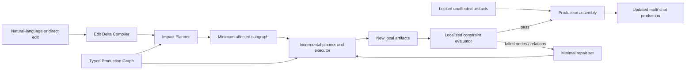

# CineDelta：面向可编辑长视频生成的约束感知增量式电影制作

**English title:** _CineDelta: Constraint-Aware Incremental Film Production for Editable Long-Form Video Generation_

**文档类型：** Research Proposal  
**版本：** 1.0  
**日期：** 2026-08-08  
**目标方向：** CVPR / ICCV 风格的方法与基准论文；若研究重心进一步偏向交互式三维制作，可转向 SIGGRAPH / SIGGRAPH Asia / ACM TOG  
**工作名称说明：** “CineDelta” 是暂定名称，正式投稿前仍需完成论文标题、项目名和域名的系统检索。

---

## 0. Proposal decision

### 0.1 One-sentence thesis

> **CineDelta 研究的不是“如何再生成一段视频”，而是：一次创作修改发生后，如何在叙事、三维世界、镜头和生成产物之间识别最小必要重执行范围，在完成修改并恢复连续性的同时，最大限度保留已经通过的内容。**

这是一个可以被直接证伪的主张。若 CineDelta 不能同时做到更高的必要依赖覆盖、更少的无关重生成，以及不低于全量重生成的编辑成功率，那么核心假设不成立。

### 0.2 Primary paper scope

第一篇论文只研究四类具有明确状态和跨镜头传播关系的修改：

1. 人物身份与外观；
2. 道具状态与人物—道具关系；
3. 人物调度、动作和空间关系；
4. 摄影机、构图和镜头覆盖。

灯光和剪辑变化作为扩展实验。对白、嘴型、完整声音生成、多人协作和任意时长影片不进入第一篇论文的主要实验，以避免系统范围掩盖核心科学问题。

### 0.3 Novelty boundary

本 proposal 不把以下能力作为创新：多 Agent 分工、文本到分镜、拥有生产 DAG、使用三维条件、支持视频编辑、保存视觉历史或提供一站式创作界面。相关工作已经分别覆盖这些方向。

拟验证的创新交集是：

1. 把创作修改表示为跨叙事、世界状态、镜头和产物的结构化状态差分；
2. 预测并优化满足新约束所需的最小生产子图；
3. 在受影响子图边界使用旧产物和三维状态执行局部重生成；
4. 联合评价编辑忠实度、边界连续性、无关内容保持和真实重执行成本。

本项目不把“多 Agent”“从文本到视频的一站式界面”或“拥有一张生产 DAG”作为主要创新。这些能力已经广泛出现在 MovieAgent、FilmAgent、Hollywood Town 等系统中，Director 本身也已具备相当多的工程基础。

本 proposal 聚焦一个更接近真实电影制作、同时尚未被现有工作完整解决的问题：

> 当创作者修改人物、道具、调度、动作或摄影机时，系统能否理解这一修改会影响哪些镜头和下游产物，只重规划、重渲染和重生成必要部分，并让未受影响的内容保持不变？

我们将这一问题定义为 **Constraint-Aware Incremental Film Production（约束感知的增量式电影制作）**。

核心技术路线是：以一张连接叙事、三维世界、镜头、生成素材和时间线的类型化生产图为中间表示；将用户修改编译为结构化增量；预测最小受影响子图；在子图边界上使用旧产物和三维状态作为锚点进行局部重生成；最后把检测到的连续性问题定位回具体节点和关系，而不是整段返工。

这一路线利用 Director 已经拥有的 3D Stage、Storyboard、Canvas DAG、Video Editor、生成任务、空间几何和 Agent 工具，但把它们组织成一个可验证的研究方法，而不只是继续扩展产品功能。

---

## 1. 中文摘要

当前长视频生成研究主要关注一次性生成时的叙事规划、角色一致性、跨镜头视觉连续性和生成质量。然而，真实电影制作不是一次性过程，而是持续修改的过程。创作者可能要求更换角色服装、移动道具、改变人物走位、调整摄影机或修改某个动作。现有系统通常采用两种极端策略：只修改用户指出的镜头，因而破坏上下游连续性；或重新生成大范围内容，导致未修改部分发生身份、构图和风格漂移，并产生高昂的时间与推理成本。

我们提出 CineDelta，一种面向可编辑长视频生成的约束感知增量式电影制作框架。CineDelta 使用统一的类型化生产图表示叙事事件、场景、角色与道具状态、三维空间关系、摄影机、镜头、生成条件、媒体产物和剪辑时间线。给定自然语言或图形界面修改，系统首先将其转换为结构化 Edit Delta；随后通过类型化依赖传播和学习式相关性预测，推断满足新意图所需的最小受影响子图；再利用三维场景渲染、前后镜头边界、角色与场景参考以及未修改产物锁定，执行局部重规划和局部重生成。一个结合引擎可测约束与视觉语言模型语义判断的局部评估器，将错误映射回具体节点或约束边，并触发最小范围修复。

我们同时计划构建 CineDelta-Eval，专门评估多镜头作品在连续修改过程中的编辑忠实度、未修改内容保持、跨镜头连续性、影响范围预测和重生成成本。与一次性视频质量基准不同，该基准将一个样本定义为“基础作品 + 修改指令 + 预期约束变化 + 参考受影响范围”，并覆盖局部、场景级与全局修改。我们的核心假设是：显式生产状态和约束感知的影响分析，能够在不降低编辑成功率的前提下，显著减少重生成范围和未修改内容漂移。该研究将把 Agentic Video Generation 从“一次性自动生成”推进到“可持续修改、可局部修复的生成式电影制作”。

---

## 2. English abstract

Long-form video generation research has primarily studied one-pass creation: narrative planning, character consistency, cross-shot coherence, and final visual quality. Real film production, however, is inherently iterative. A creator may change a character’s wardrobe, move a prop, revise blocking, adjust a camera, or alter an action after several shots have already been produced. Existing systems commonly either regenerate only the explicitly selected shot, breaking downstream continuity, or regenerate a broad portion of the production, causing unnecessary cost and visual drift in content that should remain unchanged.

We propose **CineDelta**, a constraint-aware incremental film production framework for editable long-form video generation. CineDelta represents narrative events, persistent world state, 3D spatial relations, cameras, shots, generation conditions, media artifacts, and editorial timing in a unified typed production graph. Given a natural-language or direct-manipulation edit, an edit compiler first produces a structured delta. A hybrid impact planner then combines typed dependency propagation with learned relevance prediction to identify the minimum subgraph that must be replanned or regenerated. Boundary-conditioned execution preserves unaffected artifacts while using 3D render passes, neighboring-shot anchors, identity references, and temporal constraints to regenerate only the affected region. Finally, a localized evaluator combines measurable engine constraints with semantic visual-language judgments, maps failures back to graph nodes and relations, and requests minimal repairs rather than global retries.

We further propose **CineDelta-Eval**, an edit-centric benchmark in which each episode consists of a base multi-shot production, an edit request, expected constraint changes, and a reference affected set. The benchmark measures edit fidelity, preservation of unaffected content, continuity across regenerated boundaries, impact localization, and production cost. We hypothesize that explicit production state and constraint-aware impact planning can substantially reduce regeneration and collateral visual drift without sacrificing edit success. CineDelta reframes agentic video creation from one-pass automation into an incrementally editable and repairable production process.

---

## 3. Motivation

### 3.1 The missing production loop

现有长视频生成论文通常采用如下流程：

1. 输入故事、脚本或创意；
2. 生成场景与镜头规划；
3. 为每个镜头生成关键帧或视频；
4. 选择或评估结果；
5. 合成为最终影片。

这个流程把最终影片当作终点，但专业创作恰恰从第一版成片之后才进入高频迭代。导演可能提出“第二场里角色已经拿到了钥匙，因此第三场不应再次从桌上拿钥匙”；摄影指导可能要求“保持轴线不变，但把反打改成更近的焦段”；客户可能要求“只把主角外套改成红色，其他人物、镜头和剪辑节奏都不变”。

这些修改不是孤立的像素编辑，而是对生产状态和跨镜头约束的修改。它们可能只影响一个镜头，也可能沿着角色状态、道具状态、动作因果、摄影机覆盖或剪辑关系向后传播。

### 3.2 Why naive regeneration is insufficient

只重生成目标镜头会产生边界不连续：角色的位置、朝向、手中道具、动作阶段或环境光可能无法与相邻镜头衔接。全量重生成则会破坏已经通过的内容，并把生成模型的随机性扩散到整个作品。

因此，问题不是简单地“能否编辑视频”，而是：

> 如何在满足新创作意图和全部必要连续性约束的同时，使重新执行的生产范围与未修改内容的变化最小？

这一问题同时具有视觉生成、三维推理、图规划、Agent 执行和人机协同价值，也与 Director 的已有系统结构高度匹配。

---

## 4. Related work and research gap

截至 2026-08-08，相关研究已经迅速覆盖了长视频生成、三维一致性、可控摄影机、多 Agent 制作和三维 Storyboard 编辑。因此，本研究必须主动避开已经被充分占据的表述。

### 4.1 Agentic long-form video generation

- **Hollywood Town** [1] 使用图/超图、有限循环和反思，组织跨模态多 Agent 长视频协作。
- **CoAgent** [2] 将规划、合成与验证闭环，并对未通过质检的镜头做选择性重生成。
- **MovieAgent** [4] 和 **FilmAgent** [3] 已经证明多 Agent 可以承担导演、编剧、摄影和场景规划等角色。
- 这些系统把“从脚本到成片”作为主要链路，但没有把一次修改后的最小生产重执行集合定义为独立任务和优化目标。

结论：**多 Agent 角色分工、分层脚本和一次性生产管线不能再作为主要创新。**

### 4.2 Multi-shot, camera control and persistent world memory

- **ShotAdapter、MultiShotMaster 和 ShotDirector** [8–10] 已经从扩散模型、注意力、摄影参数和转场模式层面研究多镜头生成与控制。
- **GEN3C、WorldStereo、CineScene 和 WorldReel** [7,11–13] 使用显式或隐式三维表示改善摄影机控制、场景一致性和长时几何记忆。
- **WorldDirector** [6] 已明确研究通过三维轨迹、位置条件和外观条件实现动态对象记忆与 object permanence。
- **PermaVid** [18] 进一步把编辑后的 RGB 外观记忆与深度几何记忆分离，并根据全局或局部编辑选择性失效和检索历史上下文。

结论：**“三维条件改善视频一致性”“持久对象记忆”或“编辑后更新视觉记忆”本身已经不足以构成独立贡献，且本项目不能使用 WorldDirector 作为名称。** CineDelta 必须研究生产依赖、受影响集合和跨产物重执行，而不是重新包装模型级视觉记忆。

### 4.3 Editable 3D storytelling and video editing

- **StoryBlender** 已提出可编辑、跨镜头一致的三维 Storyboard，使用 continuity memory graph、统一三维资产和引擎反馈进行空间修正，并支持相机、灯光、布局和资产的非破坏编辑。
- **V-RGBX** [14] 等方法研究单段视频或四维场景中的局部属性编辑和时空传播。
- **ContextMaster** [19] 已将生成、参考条件和视频编辑组合为有持续历史的交互式多镜头创作，并通过固定预算上下文路由保持多轮效率。

结论：**“可编辑三维 Storyboard”和“交互式多镜头视频编辑”都不是空白。** 仍需回答的是：一次修改如何跨越 Storyboard、三维世界、镜头条件、生成任务、媒体产物和时间线传播；如何预测最小受影响集合；如何避免重做无关内容；以及如何联合量化传播准确性、边界连续性和生产成本。

### 4.4 Evaluation

- 现有长视频一致性基准主要评估一次性生成的跨场景、场景内和全局视觉一致性。
- 2026 年的 **DirectorBench** 已使用多 Agent 对长视频的脚本、视觉、音频、跨模态和稳定性进行诊断，因此本项目也不能再使用 DirectorBench 作为基准名称。

现有基准大多把一个完整生成结果作为样本。CineDelta-Eval 则把一次**修改过程**作为样本，评价修改是否实现、是否错误波及无关内容、是否破坏边界连续性，以及为了完成修改重新执行了多少工作。

### 4.5 Closest-work comparison

| Work | Primary state | Edit unit | What it optimizes | Missing relative to CineDelta |
| --- | --- | --- | --- | --- |
| Hollywood Town [1] | 叙事上下文与视觉锚点 | 初始长视频生产 | 一次性叙事与视觉一致性 | 不研究修改后的最小重执行 |
| StoryBlender [5] | 统一三维 Storyboard | 相机、布局、资产 | 可编辑且跨镜头一致的三维分镜 | 不追踪最终生成产物和重生成成本 |
| PermaVid [18] | RGB/深度上下文记忆 | 全局或空间局部编辑 | 编辑后的长时视觉记忆 | 不预测镜头、任务和时间线的受影响集合 |
| ContextMaster [19] | 模型内部共享视觉历史 | 生成、参考、视频编辑操作 | 固定预算的交互式多镜头生成 | 不显式优化生产图重执行与无关产物保持 |
| **CineDelta** | 类型化生产状态与已生成产物 | 结构化创作状态差分 | 编辑成功、连续性、保持与成本的联合最优化 | 本 proposal 拟验证的研究对象 |

### 4.6 Precise gap statement

截至 2026-08-08，根据目前检索到的公开工作，我们尚未发现一个方法同时完成以下四项任务：

1. 用统一表示连接叙事状态、三维世界、镜头、生成任务、媒体产物和剪辑；
2. 将高层创作修改转换为明确的状态增量和连续性约束变化；
3. 推断并执行最小受影响生产子图，而不是固定地重做单镜头或整场；
4. 以编辑忠实度、边界连续性、无关内容保持和重生成成本联合评价多镜头修改。

这四项能力的交集是 CineDelta 的研究空间。

---

## 5. Research objective and scope

### 5.1 Primary objective

设计并验证一种约束感知的增量式电影制作方法，使 Agent 能够在已有多镜头作品上执行创作修改，并自动确定最小必要重执行范围。

### 5.2 Intended task boundary

本研究处理：

- 2–5 个场景、8–20 个镜头的叙事短片或预演作品；
- 人物外观、道具状态、空间调度、动作和摄影机级修改；
- 由三维片场提供可执行世界状态，同时允许最终镜头由图像/视频生成模型渲染；
- 多轮修改，而不是只有初始生成与一次修正；
- 可替换的生成后端。

本阶段不把以下内容作为目标：

- 从零训练新的超大规模视频基础模型；
- 证明多 Agent 数量越多越好；
- 用大量泛化审查步骤代替具体的几何、语义和连续性验证；
- 追求无限时长或任意复杂度故事；
- 在第一篇论文中解决完整对白、嘴型和声音生成；
- 把 UI 设计本身作为论文贡献；
- 用一个庞大且主观的总分 rubric 掩盖具体失败。

---

## 6. Problem formulation

### 6.1 Production state

将一个电影制作项目表示为类型化生产图：

\[
\mathcal{G}=(\mathcal{V},\mathcal{E},\mathcal{X},\mathcal{C},\mathcal{A})
\]

其中：

- \(\mathcal{V}\) 是叙事、场景、对象、摄影机、镜头、媒体和时间线节点；
- \(\mathcal{E}\) 是包含、使用、出现、状态转移、观察、派生和装配等类型化关系；
- \(\mathcal{X}\) 是节点的当前状态，例如角色服装、对象变换、摄影机参数和镜头时间范围；
- \(\mathcal{C}\) 是必须或应当满足的连续性与创作约束；
- \(\mathcal{A}\) 是已经产生的图像、视频、三维场景和剪辑产物。

### 6.2 Edit delta

一次用户修改被编译为：

\[
\Delta=(T, O, X', C^{+}, C^{-}, P)
\]

其中 \(T\) 是目标节点，\(O\) 是操作类型，\(X'\) 是目标状态，\(C^{+}\) 和 \(C^{-}\) 分别是新增和解除的约束，\(P\) 是用户明确要求保持不变的内容。

例如，“从第三个镜头起让主角一直拿着红色雨伞，但不要改变第一场的剪辑节奏”会产生：

- 主角和雨伞的绑定关系；
- 从指定动作时刻开始的持有状态；
- 后续可见镜头中的一致性约束；
- 第一场时间线与已通过镜头的保护范围。

### 6.3 Optimization objective

系统需要选择重新执行节点集合 \(R\)，使编辑意图和连续性约束得到满足，同时最小化生产成本和无关变化：

\[
R^*=\arg\min_R
\underbrace{\sum_{v\in R}c(v)}_{\text{重新执行成本}}
+\lambda\underbrace{D(\mathcal{A}'_{\bar R},\mathcal{A}_{\bar R})}_{\text{未受影响内容变化}}
+\mu\underbrace{V(\mathcal{C}',\mathcal{X}',\mathcal{A}')}_{\text{连续性约束违反}}
+\nu\underbrace{L_{edit}(\Delta,\mathcal{X}',\mathcal{A}')}_{\text{修改意图未完成}}
\]

这里的关键不是仅追求最小节点数，而是在编辑成功、边界连续性和保持原结果之间取得可解释的折中。

---

## 7. Research questions and hypotheses

### RQ1: Impact localization

类型化生产图能否比“只改目标镜头”、简单向后传播和 LLM 自由判断更准确地预测真实受影响范围？

**H1：** 结合类型化依赖和状态差分的影响规划器，将在受影响节点集合的 precision、recall 与 F1 上优于上述基线。

### RQ2: Preservation versus edit success

增量重执行能否在不降低编辑成功率的情况下，显著减少未修改内容的视觉漂移？

**H2：** CineDelta 将达到与全量重生成相当或更高的编辑忠实度，同时在无关镜头保持和产物复用率上明显更好。

### RQ3: Boundary continuity and repair efficiency

三维世界状态、边界条件和约束定位式修复能否减少局部重生成区域与既有镜头之间的不连续，同时避免扩大重试范围？

**H3：** 使用三维状态、相邻镜头锚点和动作前后状态，将降低角色、道具、空间、摄影机和动作连续性错误；将失败映射回具体节点与关系，会比整镜头或整场重试减少重复生成。

### RQ4: Generalization and scaling

方法收益是否能跨生成后端、修改类型和不同项目长度保持？

**H4：** 在至少一个开放模型和一个商业生成后端上，CineDelta 的影响定位、无关保持和成本收益方向一致，并且不会随镜头数量增加而退化为接近全量重生成。

### Secondary question: Creator experience

创作者是否能更准确地预判系统将修改哪些内容，并以更少返工完成指定修改？该问题作为支持性用户研究，不承担主要方法结论。

**H5：** 与全量重生成和手工逐镜头修复相比，CineDelta 将降低完成时间和返工次数，并获得更高的成对偏好。

---

## 8. Proposed method

### 8.1 Unified Typed Production Graph

生产图分为五个相互连接的层级：

1. **Narrative layer**：故事事件、场景、因果事实和角色目标；
2. **World layer**：角色、道具、环境、空间关系、动作状态和三维轨迹；
3. **Shot layer**：摄影机、构图、镜头覆盖、时间范围和动作阶段；
4. **Artifact layer**：关键帧、视频、三维场景和编辑片段；
5. **Execution layer**：生成、渲染、转码、装配和修复任务。

现有 Director ProductionGraph 已覆盖 production、scene、asset、object、camera、shot、take、coverage、artifact 和 job 等节点，并拥有 contains、uses、derived_from、renders 与 references 等一般关系。研究实现将重点增加：

- `appears_in`：角色或道具在哪些镜头可见；
- `state_transition`：动作或对象状态如何跨镜头变化；
- `observes`：摄影机如何观察世界对象；
- `constrains`：一个创作或连续性要求作用于哪些节点；
- 节点的 pre-state、post-state 与可见性范围；
- 从世界状态到生成条件和最终产物的可追踪映射。

生产图不是为了展示在 UI 里，而是影响分析和增量执行的内部表示。普通创作者只需要看到“将修改 3 个镜头，保留另外 9 个镜头”这样的结果摘要。

### 8.2 Edit Delta Compiler

Edit Delta Compiler 将自然语言、属性面板操作或时间线操作统一转为有限、明确的编辑原语，例如：

- `set_entity_appearance`
- `move_entity`
- `bind_prop`
- `set_action_state`
- `replace_camera`
- `change_framing`
- `change_lighting`（扩展实验）
- `retime_event`（扩展实验）

LLM 负责从自然语言识别目标、时间范围与创作意图；Director 的项目状态负责解析实际对象、镜头和时间位置。编译结果必须可直接执行，不以长篇自然语言计划作为最终控制接口。

编译器还区分三类范围：

- **Local edit**：预计只影响一个镜头或一个镜头内部区域；
- **Scene edit**：影响同一场景中的多镜头；
- **Global edit**：改变角色设定、整体风格或贯穿全片的事实。

范围不是由用户手工选择，而是影响规划器的输出；用户可以覆盖系统判断。

### 8.3 Hybrid Impact Planner

影响规划分为两步。

#### Step A: typed candidate propagation

从 Edit Delta 的目标节点出发，根据关系类型执行不同传播规则：

- 修改角色外观，传播到修改生效时间之后所有可见该角色的镜头及其生成产物；
- 修改摄影机，只传播到使用该摄影机的镜头及直接相邻的转场约束；
- 修改一个道具的位置，只传播到能观察该道具或依赖其动作状态的镜头；
- 修改人物动作或调度，传播到共享该表演状态的覆盖镜头，以及依赖其前后状态的相邻镜头；
- 修改贯穿场景的人物外观，传播到所有可见该人物的镜头，但不重做无关叙事规划。

该步骤生成保守候选集合，确保重要依赖不会被遗漏。

#### Step B: learned relevance pruning

一个轻量级相关性模型读取 Edit Delta、候选节点状态、边类型、时间距离和可见性，预测每个候选节点是否确实需要重执行。训练监督来自 CineDelta-Eval 中的参考受影响集合，以及通过 Director 可执行状态自动合成的编辑轨迹。

最终选择同时考虑：

- 约束覆盖；
- 节点重执行成本；
- 与受保护内容的边界；
- 传播置信度；
- 生成后端是否支持局部编辑。

这个混合方案比纯规则更能处理语义依赖，也比完全交给 LLM 更可控、更容易复现实验。

#### Step C: cost-aware constrained selection

对每个候选节点定义二元变量 \(z_v\)，表示是否重执行。规划器在目标节点必须更新、硬依赖必须满足的条件下，联合最小化节点执行成本、漏掉高相关节点的风险以及新旧子图边界的不连续风险：

\[
\min_{z}\sum_v c_v z_v
+\alpha\sum_v q_v(1-z_v)
+\beta\sum_{(u,v)\in E_b}b_{uv}|z_u-z_v|
\]

其中 \(q_v\) 是相关性预测，\(E_b\) 是可能形成新旧产物边界的关系。结构化硬依赖由图规则保证，学习模型只处理语义上不确定的候选项。该设计使“少做工作”与“不能漏掉必要连续性依赖”成为同一个可比较的优化问题。

### 8.4 Boundary-Conditioned Incremental Execution

确定受影响子图后，执行器采用以下策略：

1. 锁定未受影响的镜头、媒体和时间线区间；
2. 从最新世界状态重新渲染受影响镜头的控制信息；
3. 为重生成区间提取前后边界锚点；
4. 只重新规划受影响的动作、摄影机或生成提示；
5. 根据后端能力选择局部视频编辑、镜头重生成或关键帧到视频；
6. 将新产物重新装配到原时间线；
7. 只检查发生变化的节点及其边界关系。

每个镜头可生成一个 **Cinematic Conditioning Packet**：

- RGB 预演画面；
- 深度、法线与实例分割；
- 摄影机位姿、焦段和画幅；
- 角色身份参考与骨骼姿态；
- 道具状态和可见性；
- 动作前状态与后状态；
- 相邻镜头的结束/开始锚点；
- 镜头文本与时长约束。

不同生成后端不必使用全部条件。论文需要报告各后端实际使用了哪些控制信息，避免把后端本身的能力误归因于 CineDelta。

### 8.5 Localized Constraint Evaluator

评估器只处理与创作结果直接相关的检查，不引入泛化的形式审查流程。

**引擎可测约束：**

- 对象是否存在、可见和位于正确相对位置；
- 角色/道具数量；
- 摄影机是否对准目标并达到要求景别；
- 轴线、视线和屏幕方向；
- 角色碰撞、穿模与接触关系；
- 动作和对象状态在镜头边界是否匹配。

**视觉语义约束：**

- 角色身份、服装和风格是否符合修改；
- 动作语义是否实现；
- 场景氛围、光照和叙事意图是否满足；
- 新旧镜头在视觉上是否存在明显跳变。

评估器输出的不是泛化总分，而是 `(node, relation, violated_constraint, evidence)`。修复规划器据此选择新的最小修复集合。

### 8.6 Multi-turn state

真实使用中修改会连续发生，因此系统保存的是增量生产状态，而不是每次回到原始脚本重新推导。多轮实验至少覆盖：

- 局部修改之后再进行场景级修改；
- 后一次修改撤销或覆盖前一次修改；
- 两次修改作用于不同分支；
- 全局修改之后进行局部精调。

多轮性能将揭示错误是否随修改次数积累，这是一次性生成评测无法观察的性质。

---

## 9. Expected scientific contributions

如果实验支持假设，论文计划主张以下贡献：

1. **New task formulation.** 系统化定义约束感知的增量式电影制作任务，把长视频研究从一次性生成扩展到多轮修改与最小重执行。
2. **CineDelta method.** 提出统一生产图、Edit Delta 编译、混合影响规划、边界条件局部重生成和约束定位式修复方法。
3. **CineDelta-Eval.** 提出以编辑 episode 为单位的多镜头评测集和协议，联合衡量编辑忠实度、无关保持、连续性、影响定位与成本。

支持性产出包括：分析显式生产状态和最小重执行在不同修改类型与生成后端上的收益边界，并发布可运行的研究实现、任务定义、编辑轨迹、评测代码和代表性结果。

“首次”措辞只在最终 related-work 检索和实验完成后保留；proposal 阶段将其视为待验证主张。

---

## 10. CineDelta-Eval benchmark

### 10.1 Unit of evaluation

一个 benchmark episode 包含：

- 基础生产项目；
- 基础多镜头输出；
- 一条自然语言或结构化修改指令；
- 修改前后的目标状态与约束差异；
- 参考受影响节点集合；
- 明确要求保持不变的内容；
- 修改后的系统输出和执行记录。

由于创作任务通常不存在唯一正确像素结果，benchmark 不要求输出匹配一段固定视频，而是检查新约束是否满足、旧约束是否保留，以及系统是否进行了不必要的修改。

### 10.2 Planned scale

首个公开版本计划包含：

- 60 个基础制作项目；
- 每个项目 2–4 个场景、8–16 个镜头；
- 每个项目 8 个修改 episode，共 480 个 episode；
- 其中至少 240 个 episode 完成最终生成视频，其余用于图规划、三维预演与影响定位评测；
- 另设 20 个更长项目作为多轮与规模压力测试，不参与影响模型训练。

该规模先通过 10 个项目、60 个 episode 的 pilot 验证可行性，再决定是否扩大。

### 10.3 Edit taxonomy

1. **Identity and appearance**：服装、颜色、角色资产或持续性外观；
2. **Prop state**：持有、放下、打开、损坏、消失和位置变化；
3. **Blocking and motion**：人物走位、朝向、轨迹和接触动作；
4. **Camera and framing**：机位、焦段、景别、运动和轴线；
5. **Lighting and environment**：时间、天气、主光方向和场景属性；
6. **Action causality**：动作顺序、前置条件和结果状态；
7. **Dialogue and synchronization**：对白文本、时长、动作/嘴型与字幕同步；
8. **Editorial and global style**：镜头时长、剪辑节奏、场景重排与贯穿风格。

每类同时包含 local、scene 和 global 三种传播范围，避免 benchmark 只测试容易的单镜头替换。

### 10.4 Data sources

- Director 中人工搭建的可执行三维场景；
- BlenderProc、Infinigen 或自建程序化场景生成器产生的空间变化；
- 许可清晰或公共领域的三维人物、道具和环境资产；
- 人工编写或基于公共领域故事改写的短脚本；
- 自动生成的 edit 候选，经人工筛选后进入正式测试集。

不以受版权限制的电影镜头作为公开 benchmark 的核心数据。

### 10.5 Ground-truth affected set

参考受影响集合由三部分产生：

1. 生产图中的确定性依赖给出初始集合；
2. 两名具备三维或影视制作经验的标注者独立判断实际需要修改的镜头与产物；
3. 分歧通过讨论解决，并保留“必要”“可选”“不应修改”三档标签。

这种标注比单一二值答案更符合创作任务，也允许评价系统是否采取了合理但不同的实现路径。

---

## 11. Evaluation metrics

### 11.1 Impact-set quality

- **Required-node precision / recall / F1**：是否找到所有必要节点，同时避免扩大修改范围；
- **Protected-node violation rate**：是否错误修改了明确保护的内容；
- **Cost-weighted overreach**：多做的工作按实际生成或渲染成本加权。

### 11.2 Edit fidelity

- 修改目标的任务特定成功率；
- 文本/视觉语义一致性；
- 人工成对比较中的修改完成偏好。

不同编辑类型采用对应指标，不把所有任务硬压成一个统一评分。

### 11.3 Unaffected-content preservation

- 未重执行镜头的直接复用率；
- 受影响镜头中非目标区域的视觉保持；
- 角色、背景、构图和节奏的无关变化；
- 多轮修改后的累计漂移。

### 11.4 Continuity

- 角色身份和服装连续性；
- 道具与动作状态连续性；
- 空间关系和摄影机方向连续性；
- 重生成边界的视觉跳变；
- 对白、动作、字幕和声音同步。

### 11.5 Efficiency

- 重规划节点数；
- 重渲染/重生成镜头数；
- 生成模型调用次数；
- GPU 时间或 API 成本；
- 从修改指令到可预览结果的端到端延迟；
- 为达到通过结果所需的修复轮数。

### 11.6 Human evaluation

主观评测采用简短成对选择，而不是要求参与者填写庞大 rubric：

- 哪个结果更准确完成修改？
- 哪个结果更好保持未要求修改的内容？
- 哪个结果在镜头边界上更自然？
- 作为创作者，你更愿意继续编辑哪个版本？

计划招募不少于 30 名普通参与者，并设置 6–10 名具备影视、动画或三维经验的专业子组。最终人数由 pilot 的效应量和功效分析确定。

---

## 12. Baselines

所有可控实验应尽量使用相同脚本、基础项目、生成后端和随机采样预算。

1. **Full regeneration**：从修改后的脚本或项目重新生成全部镜头；
2. **Target-only regeneration**：只重做用户直接指出的镜头，不传播依赖；
3. **Naive downstream closure**：沿所有下游关系无差别传播；
4. **LLM-only impact planner**：让 LLM 直接列出需要修改的镜头；
5. **Shot/camera dependency propagation**：使用镜头/摄影机依赖和视觉锚点，但不使用完整世界状态与成本优化；
6. **3D scene edit only**：修改三维 Storyboard，但不进行跨媒体影响分析；
7. **Oracle impact set**：使用人工参考受影响集合，作为局部执行上界；
8. **CineDelta**：完整方法。

StoryBlender、WorldDirector 等任务定义与本研究不完全一致，不应强行进行不公平的最终视频数值比较。对于无法直接运行的论文系统，应将其作为概念基线或在共同子任务上比较，并明确实现差异。

---

## 13. Ablation studies

至少进行以下消融：

1. 去掉类型化约束边，只保留一般依赖；
2. 去掉学习式相关性剪枝，使用保守传播；
3. 去掉引擎可测反馈，只使用 VLM；
4. 去掉 VLM 语义反馈，只使用几何与时间规则；
5. 去掉相邻镜头边界锚点；
6. 不锁定未受影响产物；
7. 去掉三维 conditioning，只用文本与参考图；
8. 单轮修复与约束定位式多轮修复对比；
9. 单次修改与连续三次修改对比。

关键消融应直接对应论文贡献，不为了增加表格数量而制造边缘组件。

---

## 14. Experimental protocol

### 14.1 RQ1: Impact prediction

- 在全部 480 个 episode 上比较影响集合；
- 报告不同编辑类型、传播范围和项目长度下的 precision、recall、F1 与成本加权 overreach；
- 单独分析漏掉必要节点和错误扩大范围两类失败。

### 14.2 RQ2–RQ4: Rendering and regeneration

- 在至少 240 个完整生成 episode 上运行主要方法；
- 固定基础生成模型与候选预算；
- 比较目标成功、保持、连续性、调用次数和端到端时间；
- 对失败 episode 记录首次失败位置和修复范围。

### 14.3 RQ5: Backend transfer

- 一个可公开复现的开放生成后端作为主实验；
- 一个商业高质量后端作为泛化实验；
- 在共同子集上复用相同生产图和修改任务；
- 分开报告后端绝对质量和 CineDelta 相对收益。

### 14.4 RQ6: Creator study

采用 within-subject 设计，让参与者使用两到三种工作流完成相同类型的修改任务。记录：

- 完成时间；
- 手工重试次数；
- 被误改内容数量；
- 最终成对偏好；
- 对“系统将修改什么”的预测是否与实际一致。

界面保持简洁，只展示修改摘要、受影响镜头和结果对比，不把内部节点目录暴露给普通参与者。

### 14.5 Statistics

- 主要指标报告均值、中位数和 95% bootstrap confidence interval；
- 成对偏好使用混合效应 logistic regression 或配对非参数检验；
- 多方法比较进行适当的多重比较校正；
- 同时报告效应量，不只报告显著性；
- 预先确定主要指标：Edit Fidelity、Unaffected Preservation、Continuity、Regeneration Cost；其余作为诊断指标。

---

## 15. Mapping to the current Director codebase

| Director 现有能力                              | 在研究中的用途             | 仍需新增的研究能力                                  |
| ---------------------------------------------- | -------------------------- | --------------------------------------------------- |
| `DirectorProject` 场景、对象、摄影机与动画状态 | World layer 的基础状态     | 跨场景 pre/post state、语义关系与修改增量           |
| `productionGraph` 节点和一般关系               | 统一生产图骨架             | 类型化连续性边、跨 workspace 权威状态与影响传播     |
| Storyboard 与 shot generation metadata         | Shot layer 与镜头生成入口  | 镜头前后状态、边界锚点和修改作用范围                |
| `directorSpatialGeometry`                      | 引擎可测空间约束           | 视锥、遮挡、屏幕方向、接触与动作连续性指标          |
| Canvas DAG 与 pipeline                         | 增量执行和分支并行基础     | 按 Edit Delta 失效、保护节点和最小子图重执行        |
| 多 Agent production orchestrator               | 编剧、摄影、生成和修复执行 | 专用 Edit Compiler、Impact Planner 和局部修复协议   |
| Gallery / persistent media / Video Editor      | 产物复用和最终装配         | 修改前后 lineage、边界替换和保持指标                |
| Blender / DCC bridge                           | 高质量离线渲染与数据构建   | 批量 conditioning pass 和 benchmark headless runner |

当前仓库已经出现 ProductionGraph 投影实现，但文档仍将“跨 Stage、Storyboard、Gallery、Canvas、Video、DCC 和 multi-Agent 的单一权威图”列为 planned。论文实现需要完成这一闭环，但应把它视为方法基础设施，而不是单独的论文贡献。

### 15.1 Proposed research modules

建议后续实现按研究边界拆分为：

- `research/cinedelta/schema`：Edit Delta、constraint 和 benchmark episode；
- `research/cinedelta/impact`：候选传播、相关性模型和最小子图选择；
- `research/cinedelta/conditioning`：三维控制信息生成；
- `research/cinedelta/execution`：增量任务规划和产物锁定；
- `research/cinedelta/evaluation`：任务指标、连续性指标和成本统计；
- `research/cinedelta/dataset`：场景、修改 episode 和数据导出；
- `backend/gateway/research`：批量实验、任务队列和结果汇总。

研究代码和产品 UI 应保持边界清晰：方法先由 headless runner 复现，再接入工作台展示。

---

## 16. Work plan and milestones

### Phase 0 — Task freeze and pilot design（第 1–2 周）

- 完成 related-work matrix；
- 固定任务定义、Edit Delta schema 和主要指标；
- 选择一个开放生成后端；
- 手工制作 3 个基础项目和 20 个修改 episode；
- 确认系统能够记录受影响范围、复用产物和成本。

**Exit criterion：** 至少展示一个跨三个镜头传播的道具或动作修改，以及一个只影响单镜头摄影机的修改。

### Phase 1 — Production graph and benchmark skeleton（第 3–5 周）

- 扩展统一生产图；
- 实现 Edit Delta 编译与 deterministic impact baseline；
- 实现 benchmark episode 格式；
- 建立 headless 三维场景与预演渲染管线；
- 完成 10 个项目、60 个 pilot episode。

**Deliverable：** CineDelta-Eval pilot 与影响集合基线表。

### Phase 2 — Hybrid impact planner（第 6–8 周）

- 生成图级修改训练数据；
- 实现相关性模型；
- 实现成本感知最小子图选择；
- 完成 RQ1 主实验和错误分析。

**Deliverable：** 影响定位主要结果、消融和可视化。

### Phase 3 — Incremental generation and local repair（第 9–12 周）

- 实现 conditioning packet；
- 接入开放生成模型；
- 实现未受影响产物锁定与边界锚点；
- 实现局部约束评估和最小修复循环；
- 完成 80–120 个完整视频 episode。

**Deliverable：** 第一版 end-to-end demo 与 RQ2–RQ4 pilot。

### Phase 4 — Full benchmark and generalization（第 13–16 周）

- 扩展到计划 benchmark 规模；
- 补充商业后端共同子集；
- 完成主要基线、消融和多轮修改实验；
- 冻结测试集和实验配置。

**Deliverable：** 完整结果表、失败分类和成本分析。

### Phase 5 — User study, paper and release（第 17–20 周）

- 完成 creator study；
- 绘制方法图、定量图和案例图；
- 完成论文初稿与内部 rebuttal 模拟；
- 整理 benchmark、代码、模型配置和复现实验；
- 根据贡献重心确定 CVPR/ICCV 或 SIGGRAPH 路线。

**Deliverable：** 投稿稿件、匿名代码包和项目页面素材。

---

## 17. Resource plan

### 17.1 Compute

本研究不依赖从零训练大型视频模型，主要计算来自：

- Blender 或 Director 的批量三维渲染；
- 轻量影响相关性模型训练；
- 开放视频模型的局部重生成；
- VLM 语义评价；
- 多基线、多随机种子的完整实验。

最低 pilot 可以使用一张 24–48 GB GPU 配合少量 API 调用。正式开放模型实验预计需要多张高显存 GPU 或稳定的云端推理资源。实验成本必须在 pilot 后根据每个 episode 的真实生成时间估算，再决定最终视频子集规模。

### 17.2 People

理想配置：

- 1 人负责生产图、Agent 与系统；
- 1 人负责视频生成、conditioning 和评价；
- 1 人负责数据、三维场景与实验；
- 1 名具有影视/动画经验的合作者参与任务设计与用户研究。

若以单人或两人推进，应优先保证方法、影响 benchmark 和 120–240 个完整视频 episode，不追求过大的产品功能面。

---

## 18. Risks and mitigation

### Risk 1: Novelty overlap

StoryBlender 已覆盖可编辑三维 Storyboard，WorldDirector 已覆盖动态对象记忆，FilmAgent / MovieAgent 已覆盖多 Agent 长视频生产。

**Mitigation：** 始终把主任务限定为跨生产产物的 Edit Delta、最小受影响集合和增量重生成，不把三维一致性或 Agent 分工单独包装成创新。

### Risk 2: The work looks like a software system rather than a method

**Mitigation：** 在论文中明确形式化优化目标；提供可比较的影响规划算法、基准、消融和统计结果；UI 只承担 demo，不进入主要贡献。

### Risk 3: Generator limitations dominate results

**Mitigation：** 使用同一生成后端比较不同重生成策略；将“是否选择正确范围”和“选中范围内生成质量”分别报告；引入 Oracle impact set 区分规划误差与生成误差。

### Risk 4: VLM evaluator is unstable

**Mitigation：** 可由三维状态、摄影机和时间线直接测量的条件不交给 VLM；VLM 只处理身份、动作语义、风格和感知跳变；最终主要结论由客观指标与人工成对实验共同支持。

### Risk 5: Benchmark annotation is ambiguous

**Mitigation：** 将节点标为“必要、可选、不应修改”，不强迫所有合理工作流共享唯一二值答案；公开修改理由和约束变化。

### Risk 6: Full video evaluation is too expensive

**Mitigation：** 分为图级全部 episode、三维预演全部 episode和最终视频子集；先用 pilot 测量效应和成本，再扩充最有区分度的任务。

### Risk 7: Scope explosion

**Mitigation：** 第一篇论文只支持八类明确编辑原语和有限多轮修改。协作、多用户、实时同步、完整声音生成和超长电影留给后续工作。

---

## 19. Success criteria and decision gates

### Gate A — Research signal

在 60 个 pilot episode 上，完整方法相对 target-only 与 naive closure 同时表现出：

- 更高的必要节点覆盖；
- 更少的无关节点重执行；
- 没有明显降低编辑成功率。

若只能节约成本却持续漏掉连续性依赖，应暂停模型扩展，重新设计图关系和任务定义。

### Gate B — Visual signal

在至少 40 个完整视频修改上，CineDelta 应同时优于 full regeneration 的无关保持，以及 target-only 的边界连续性。

若收益只存在于三维预演而不能转移到最终视频，需要把论文定位调整为三维预演/制作系统，而不是视频生成方法。

### Gate C — Submission readiness

投稿前必须具备：

- 一个清晰的新任务；
- 一个可以脱离 UI 运行的方法；
- 一个冻结的测试集；
- 至少四个有意义基线；
- 主要消融；
- 多后端或跨场景泛化证据；
- 人工评测；
- 成本和失败分析；
- 可匿名复现的代码与样例数据。

不提前承诺录用；以是否形成可被反驳、可被复现的科学结论作为完成标准。

---

## 20. Expected paper structure

1. **Introduction**：真实制作是迭代过程，一次性生成范式缺少最小修改能力；
2. **Related Work**：Agentic video、multi-shot generation、3D-grounded storytelling、video editing、evaluation；
3. **Task Definition**：生产图、Edit Delta、受影响集合和优化目标；
4. **CineDelta Method**：图表示、影响规划、局部执行和修复；
5. **CineDelta-Eval**：数据、编辑类型、参考集合和指标；
6. **Experiments**：影响定位、生成质量、保持、连续性、效率和用户研究；
7. **Analysis**：多轮编辑、不同后端、失败模式和规模边界；
8. **Limitations and Broader Impact**：生成后端依赖、数据范围、创作控制与可复现性；
9. **Conclusion**：从一次性自动生成走向可持续修改的生成式制作。

### Candidate paper figures

- Figure 1：一次服装/道具修改在 full regeneration、target-only 与 CineDelta 下的不同传播结果；
- Figure 2：统一生产图与 Edit Delta；
- Figure 3：影响规划和边界条件局部重生成方法；
- Figure 4：CineDelta-Eval 编辑类型与数据样例；
- Figure 5：编辑忠实度—保持—成本三者的 Pareto 图；
- Figure 6：多轮修改中的累计漂移曲线；
- Figure 7：成功案例和失败案例。

---

## 21. Immediate next actions

1. 冻结 `EditDelta v0` 和 `Constraint v0` 数据模型；
2. 选择三个可清楚展示传播差异的 pilot 场景：
   - 道具跨镜头状态变化；
   - 人物服装在后半段改变；
   - 单镜头摄影机修改且不影响其他镜头；
3. 为三个场景人工标注目标、必要、可选和保护节点；
4. 实现 target-only、full regeneration、naive closure 三个最小基线；
5. 用 Director 现有 ProductionGraph 构建第一个跨 Stage—Storyboard—Gallery—Video 的修改闭环；
6. 在接入昂贵视频生成前，先用三维预演验证影响集合和增量执行；
7. pilot 达到 Gate A 后再实现 learned relevance pruning 和最终视频实验。

---

## 22. References and primary sources

1. [Hollywood Town](https://arxiv.org/abs/2510.22431). arXiv, 2025.  
   https://arxiv.org/abs/2510.22431

2. Zeng et al. **CoAgent: Collaborative Planning and Consistency Agent for Coherent Video Generation.** arXiv, 2025.  
   https://arxiv.org/abs/2512.22536

3. Xu et al. **FilmAgent: A Multi-Agent Framework for End-to-End Film Automation in Virtual 3D Spaces.** arXiv, 2025.  
   https://arxiv.org/abs/2501.12909

4. Wu et al. **Automated Movie Generation via Multi-Agent CoT Planning.** arXiv, 2025.  
   https://arxiv.org/abs/2503.07314

5. Li et al. **StoryBlender: Inter-Shot Consistent and Editable 3D Storyboard with Spatial-temporal Dynamics.** arXiv, 2026.  
   https://arxiv.org/abs/2604.03315

6. Wang et al. **WorldDirector: Building Controllable World Simulators with Persistent Dynamic Memory.** arXiv, 2026.  
   https://arxiv.org/abs/2607.02517

7. Ren et al. **GEN3C: 3D-Informed World-Consistent Video Generation with Precise Camera Control.** CVPR, 2025.  
   https://openaccess.thecvf.com/content/CVPR2025/html/Ren_GEN3C_3D-Informed_World-Consistent_Video_Generation_with_Precise_Camera_Control_CVPR_2025_paper.html

8. Kara et al. **ShotAdapter: Text-to-Multi-Shot Video Generation with Diffusion Models.** CVPR, 2025.  
   https://openaccess.thecvf.com/content/CVPR2025/html/Kara_ShotAdapter_Text-to-Multi-Shot_Video_Generation_with_Diffusion_Models_CVPR_2025_paper.html

9. Wang et al. **MultiShotMaster: A Controllable Multi-Shot Video Generation Framework.** CVPR, 2026.  
   https://openaccess.thecvf.com/content/CVPR2026/papers/Wang_MultiShotMaster_A_Controllable_Multi-Shot_Video_Generation_Framework_CVPR_2026_paper.pdf

10. Wu et al. **ShotDirector: Directorially Controllable Multi-Shot Video Generation with Cinematographic Transitions.** CVPR, 2026.  
    https://openaccess.thecvf.com/content/CVPR2026/html/Wu_ShotDirector_Directorially_Controllable_Multi-Shot_Video_Generation_with_Cinematographic_Transitions_CVPR_2026_paper.html

11. Huang et al. **CineScene: Implicit 3D as Effective Scene Representation for Cinematic Video Generation.** CVPR, 2026.  
    https://openaccess.thecvf.com/content/CVPR2026/html/Huang_CineScene_Implicit_3D_as_Effective_Scene_Representation_for_Cinematic_Video_CVPR_2026_paper.html

12. Zhang et al. **WorldStereo: Bridging Camera-Guided Video Generation and Scene Reconstruction via 3D Geometric Memories.** CVPR, 2026.  
    https://openaccess.thecvf.com/content/CVPR2026/html/Zhang_WorldStereo_Bridging_Camera-Guided_Video_Generation_and_Scene_Reconstruction_via_3D_CVPR_2026_paper.html

13. Fang et al. **WorldReel: 4D Video Generation with Consistent Geometry and Motion Modeling.** CVPR, 2026.  
    https://openaccess.thecvf.com/content/CVPR2026/html/Fang_WorldReel_4D_Video_Generation_with_Consistent_Geometry_and_Motion_Modeling_CVPR_2026_paper.html

14. Fang et al. **V-RGBX: Video Editing with Accurate Controls over Intrinsic Properties.** CVPR, 2026.  
    https://openaccess.thecvf.com/content/CVPR2026/html/Fang_V-RGBX_Video_Editing_with_Accurate_Controls_over_Intrinsic_Properties_CVPR_2026_paper.html

15. Chen et al. **DirectorBench: Diagnosing Long-Form Video Generation with Personalized Multi-Agent Evaluation.** arXiv, 2026.  
    https://arxiv.org/abs/2605.30090

16. Meng et al. **CausalCine: Real-Time Autoregressive Generation for Multi-Shot Video Narratives.** arXiv, 2026.  
    https://arxiv.org/abs/2605.12496

17. Huang et al. **CineWeaver: Training-Free Reference-Controllable Multi-Shot Long Video Generation for Cinematic Storytelling.** arXiv, 2026.  
    https://arxiv.org/abs/2607.26529

---

## Final assessment

CineDelta 的价值不在于复现又一套一次性成片管线，而在于把 Director 独有的可执行三维状态、跨工作区制作能力和结构化 Agent 操作，转化为一个清晰的新研究问题：**生成式电影如何在多轮修改中做到改该改的、保留不该改的，并用最少返工恢复连续性。**

这个方向比“集成更多 Agent”和“生成更长视频”更有论文辨识度，也比单纯展示完整产品更容易形成严格实验。它仍然有较高工程和数据成本，但可以通过图级 pilot、三维预演和分阶段最终视频实验控制风险。下一步不应继续扩 UI，而应先完成 Edit Delta、约束图和 60 个 pilot episode，尽快验证核心假设是否成立。
