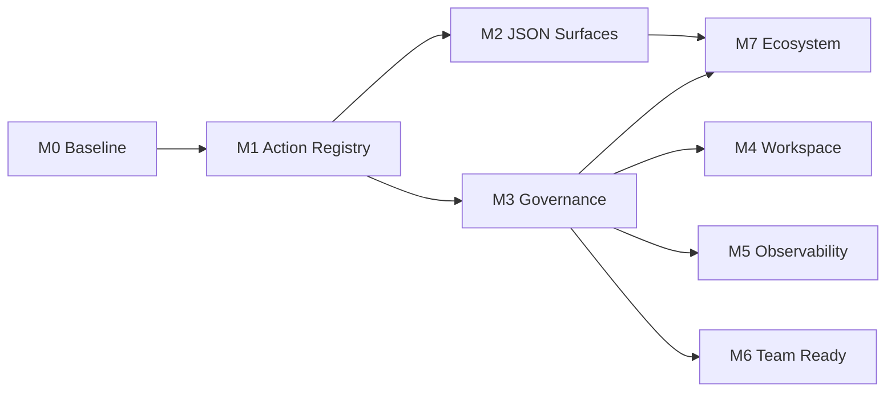

This roadmap turns gaps from the
[Agent-Native Architecture Assessment](/research/agent-native-architecture-assessment/)
into shippable milestones. The goal is to move Director from "agent-native on core paths" to
"full parity plus unified governance" without replacing Stage, Canvas, Video, or Agent stores in
one migration.

Drafted: **2026-08-02**. Last verified: **2026-08-25**.

## Completed foundation — naive caller boundary

The shared public boundary is implemented for the current mutation surfaces. A caller may submit
the semantic intent without first managing a browser lease, revision/fingerprint, or retry key.
Director discovers one exact target, performs the required read-only preflight, injects missing
guards/keys, and returns a structured `agent_boundary` receipt. Browser execution remains strict,
and exact retries are either replayed, rejected as changed-key reuse, or rejected as stale.

Covered surfaces: Workbench project mutations and evidence, Production CRUD, Creative edits,
Canvas pipeline start, collaboration comments, durable generation/transcription/3D submit and
retry, generated-3D promotion, Storyboard capture/export, and Blender native apply. This closes
the transport-safety foundation; the remaining milestones concern UI/action parity, governance,
collaboration breadth, and observability rather than naive-call correctness.

Blender `apply` snapshots and injects a missing native epoch, revision, and intent ID. If its
post-dispatch outcome is unknown, the Gateway returns the complete bound input as the exact retry ticket.

Related docs:

- [Agent-native Production](/concepts/agent-native-production/) — control loop and contracts
- [Feature Status](/reference/feature-status/) — current capability boundaries
- [Pipeline implementation roadmap](/engineering/pipeline_implementation_roadmap/) — data model and ProductionGraph evolution (runs in parallel; coordinate at M6)

---

## North star

By the end of **Milestone 4**, Director should:

1. Expose a **semantic action for every documented UI mutation**; agents and UI share one executor.
2. Automate **Interchange / Collaboration / Media** without human-only panels.
3. Apply the **same role and audit policy** across MCP, HTTP, CLI, and hosted API.
4. Keep Structured Agent control **Implemented** in Feature Status, with parity tests covering main workspaces.

Target: raise the self-assessment score from **4/5 → 4.5/5**.

---

## Delivery rules

1. **Contract before UI** — new actions land in Zod schemas and tests before React changes.
2. **Do not weaken revision guards** — after UI convergence, `expected_revision` / `snapshot_fingerprint` behavior must not regress.
3. **Every user-facing mutation needs an agent recovery test** — same rule as the [Pipeline roadmap](/engineering/pipeline_implementation_roadmap/).
4. **Human-only capabilities stay explicit** — update `capabilities`, Skills, and Feature Status until JSON surfaces ship.
5. **Milestones merge independently** — each milestone leaves the product releasable.
6. **`stage_*` only shrinks** — new automation uses `director_workbench` / `director_creative`; legacy `stage_*` is maintained, not extended.

---

## Phase overview

| Phase  | Theme                      | Status          | Main outputs                                                                                                 | Depends on              |
| ------ | -------------------------- | --------------- | ------------------------------------------------------------------------------------------------------------ | ----------------------- |
| **M0** | Baseline & metrics         | **Partial**     | Stage inventory + parity tests + Feature Status row shipped; generator and `stage_*` map open                  | —                       |
| **M1** | Shared action registry     | **Partial**     | Stage one-shot mutators share `applyDirectorAuthoringActions`; Canvas/Video (1e/1f) open                       | M0                      |
| **M2** | Remove human-only surfaces | **Implemented** | Interchange export + import (plan-import/import) and collaboration reads/writes (resolve, version create/restore, …) are JSON operations | M1 (partially parallel) |
| **M3** | Unified gateway governance | **Implemented** | Shared `filmRoleToolPolicy` on MCP / local / hosted / raw HTTP+CLI; source-tagged `/api/tools/*` audit trail | M1                      |
| **M4** | In-product workspace       | Planned         | SQL-backed instructions / skills / memory                                                                    | M3                      |
| **M5** | Observability              | Planned         | Traces, cost, long-running progress                                                                          | M3                      |
| **M6** | Team readiness             | Planned         | Collaboration auth, multi-agent enhancements                                                                 | M3, M5                  |
| **M7** | Ecosystem protocols        | **Implemented** | Tool manifest, A2A go/no-go concluded in ADR 0004 (runtime no-go; discovery-only card served), cross-app receipt recipe. A2A runtime not shipped | M2, M3                  |

---

## Milestone 0 — Baseline & metrics

**Status: Partial** (verified 2026-08-25).

**Goal:** make parity work measurable and regression-testable.

### Shipped

- [UI/Agent parity inventory](/engineering/ui-agent-parity-inventory/) covers every Stage
  `directorStore` mutation entry point with mutator, file, semantic action, and
  `shared` / `ui-only` / `human-only-interactive` status (35 / 87 project mutators shared, ~40%).
- Parity tests in `frontend/director/tests/agent/dispatchDirectorAuthoringActions.test.ts` assert
  that store mutators and direct `applyDirectorAuthoringActions` produce the same
  `getDirectorProjectRevision` for deletes, transforms, camera update/add/activate, character
  motion set/clear, and light add/update/delete.
- Feature Status carries an **Agent UI parity coverage** row linking the inventory.

### Remaining work

- Extend the inventory to the top Canvas/Video mutation paths (currently a documented
  out-of-scope note, not per-mutator rows).
- Parity harness failures should emit revision **diffs**, not only boolean assertions.
- Optional inventory generator (`tools/scripts/auditUiMutations.ts`) so the doc cannot drift.
- Document `stage_*` → `director_workbench` **migration map** (op mapping, deprecation timeline).

### Acceptance

- Inventory covers top 20 mutation paths across Stage, Canvas, and Video (Stage is exhaustive
  today; Canvas/Video rows are open).
- Parity harness passes for the current `directorAuthoring` action set.
- No runtime behavior changes.

---

## Milestone 1 — Shared action registry

**Status: Partial** (verified 2026-08-25). Stage one-shot project mutators for objects, cameras,
characters/motion/IK, lights, world, scene, storyboard, and entity animation now route through
`dispatchDirectorAuthoringActions` (batches 1a–1c plus lights/world; see the
[parity inventory](/engineering/ui-agent-parity-inventory/) for the exact per-mutator status and
legacy fallbacks). Timeline audio, annotations/measurements, layers, materials, asset flows, and
the whole of Canvas/Video (1e/1f) still patch state directly, so M1 is **not complete**.

**Goal:** UI and agents share one mutation path; eliminate dual writes.

### Work

#### 1.1 UI dispatch layer — shipped for Stage

- `dispatchDirectorAuthoringActions(actions, context)`
  (`frontend/director/src/agent/dispatchDirectorAuthoringActions.ts`) — thin UI wrapper that:
  - fills `expected_revision` / `idempotency_key`;
  - hooks unified error toasts and undo;
  - calls `applyDirectorAuthoringActions` internally.
- UI patch → action compilers live in
  `frontend/director/src/agent/compileDirectorUiAuthoringActions.ts`.
- Same pattern for Canvas/Video via `creativeWorkspaceAgentContract` — **open**.

#### 1.2 Migrate UI mutations in batches

| Batch  | Scope                   | Typical actions                                        | Status                                            |
| ------ | ----------------------- | ------------------------------------------------------ | ------------------------------------------------- |
| **1a** | Object CRUD, transforms | `add_object`, `update_object`, `delete_objects`        | Shared for delete/one-shot transform/toggle; add flows and multi-select batches open |
| **1b** | Cameras and shots       | `add_camera`, `update_camera`, `set_active_camera`     | Shared                                            |
| **1c** | Characters and motion   | `set_character_motion`, `set_character_pose_controls`, `set_character_ik` | Shared                          |
| **1d** | Timeline / coverage     | `add_coverage_shot`, `add_performance_take`, timeline audio | Storyboard + entity animation shared; timeline audio open |
| **1e** | Canvas nodes / edges    | creative `author` batches                              | Open                                              |
| **1f** | Video tracks / clips    | creative `author` batches                              | Open                                              |

#### 1.3 Semantic equivalents for interactive controls

- **Viewport drag** → debounced `update_object` author batches.
- **Camera pilot** → `update_camera` stream or new `pilot_camera` action (schema extension).
- Operations that cannot be semanticized stay human-only and appear in capabilities exclusions.

#### 1.4 Converge `stage_*`

- Mark `stage_*` as **legacy compact surface** in MCP, docs, and Skills.
- All new automation examples use `director_workbench`.
- Do not delete `stage_*`; freeze op expansion.

### Acceptance

- Parity harness covers batches **1a–1d** with matching revisions on UI and agent paths
  (1a–1c plus lights/world/storyboard covered today; timeline audio open).
- No new high-priority "UI-only, no agent twin" gaps.
- Existing MCP / HTTP / CLI integration tests pass.

### Risks

| Risk                            | Mitigation                                     |
| ------------------------------- | ---------------------------------------------- |
| UI perf regression per revision | Local batching; debounced author for drags     |
| Undo/redo vs author batches     | Wire existing undo in M1; unify receipts in M4 |

---

## Milestone 2 — Remove human-only surfaces

**Status: Implemented** (verified 2026-08-25).

**Goal:** Interchange, Collaboration, and Media are reachable through JSON operations with plan/receipt.

### Shipped

`director_creative` exposes the full JSON surface:

| Surface                        | Actions                                                                                                                                                             | Evidence                                                                                                                                                                                                                             |
| ------------------------------ | -------------------------------------------------------------------------------------------------------------------------------------------------------------------- | ------------------------------------------------------------------------------------------------------------------------------------------------------------------------------------------------------------------------------------ |
| Interchange export             | `capabilities`, `plan-export`, `export`                                                                                                                              | `packages/protocol/src/creativeWorkspaceProtocol.ts`, Creative Agent tests, [Interchange](/pipelines/interchange/)                                                                                                                   |
| Interchange import             | `plan-import` (source `inline`, Gallery `media_id`, or `workspace_path`), then `import` (`plan_id` + `expected_guard_fingerprint` + `confirm:true`)                  | same protocol, `frontend/director/src/agent/creativeWorkspaceSemanticOperations.ts`, `frontend/director/tests/agent/creativeWorkspaceAgentContract.test.ts`                                                                          |
| Collaboration comments         | `observe`, `list-comments`, `add-comment`, `resolve-comment`, `reopen-comment`, `update-comment`, `delete-comment` (fingerprint guard + idempotency; delete confirms) | same protocol, `frontend/director/tests/agent/creativeWorkspaceSemanticOperations.test.ts` (resolve-comment)                                                                                                                          |
| Collaboration versions         | `list-versions`, `compare`, `create-version`, `restore-version`, `delete-version` (restore/delete require `confirm:true`)                                            | same protocol + semantic-operation tests (create-version, restore-version)                                                                                                                                                           |
| Gallery / media mutations      | `gallery.media.*`, `media.proxy.attach`, and related execute ops                                                                                                     | Feature Status Gallery **Implemented**; persistent media **Limited**                                                                                                                                                                 |

The browser file picker remains available as an optional convenience for local files a human already
has open; it is no longer the only import path and no longer blocks agent automation. Format
boundaries are unchanged: Feature Status keeps Fountain / OTIO / glTF / USD **Limited** for the
documented subsets (FBX export and rich rig/animation round trip are still out of scope), and large
media bytes still never enter Yjs.

### Leftover (non-blocking)

- The verified-shot tutorial has not yet been re-recorded as an agent-only OTIO import + version
  snapshot walkthrough; the JSON operations it needs all exist.

---

## Milestone 3 — Unified gateway governance

**Status: Implemented** (verified 2026-08-25). Optional UI permission gating and confirmation boundaries continue as follow-ups.

**Goal:** every control surface obeys the same permission and audit policy.

### Shipped

Role policy lives in `backend/gateway/agents/filmRoleToolPolicy.ts` (not a separate `gatewayToolPolicy.ts`). MCP, the local Agent harness, the hosted API adapter, and the raw gateway HTTP tool boundary share it:

| Surface        | Binding                                                                                                                                                                                                                        |
| -------------- | ------------------------------------------------------------------------------------------------------------------------------------------------------------------------------------------------------------------------------ |
| MCP            | `DIRECTOR_FILM_ROLE` in `backend/gateway/mcp-server.ts`                                                                                                                                                                        |
| Local harness  | `agentAdapters.ts` prompt + `filmRoleToolPolicyRejection` before tool dispatch                                                                                                                                                 |
| Hosted adapter | `openAiCompatibleAdapter.ts` visibility + rejection                                                                                                                                                                            |
| Raw HTTP / CLI | `backend/gateway/agents/httpToolPolicy.ts` on every `/api/tools/*` route (`DIRECTOR_FILM_ROLE` + `DIRECTOR_PLAN_MODE`, same 403 rejection body as MCP; covers the Stage CLI and the DSH plugin, which POST to the same routes) |

#### 3.1 Raw HTTP and CLI permissions (shipped)

- `filmRoleToolPolicy` now gates raw `POST /api/tools/{tool-name}` (and therefore the CLI and DSH plugin) through the shared `httpToolPolicyRejection` helper, before any browser-target execution.
- An unknown `DIRECTOR_FILM_ROLE` fails closed with the same structured rejection.

#### 3.2 Unified audit trail (shipped)

- Every `/api/tools/*` invocation is appended to a gateway-local audit log (`backend/gateway/agents/toolInvocationAuditStore.ts`, JSONL under the control-plane data directory), tagged `source: ui | mcp | http | cli | dsh | unknown` derived from the payload `session_id` prefix.
- Structured fields: `tool`, `operation`, `revision_before`, `revision_after`, `idempotency_key`, `role`, `session_id`, `outcome`, `http_status`, redacted error code/message.
- `GET /api/agent/audit` (gateway-authorized) lists records with `session_id` / `source` / `tool` filters and an `after` cursor.

### Remaining

#### 3.1b Optional UI permission gating

- Optional: read-only mode and role-gated UI disable from the same policy source. UI-dispatched author actions are not yet written to the unified audit trail.

#### 3.3 Confirmation boundaries

- Define destructive/publish actions (`deliver`, `export`, `version_restore`, etc.).
- Agent path: harness approval or explicit `confirm_token`.
- UI path: existing modals; shared `confirm_token` generation.

### Acceptance

- Denied MCP ops are also denied on raw HTTP/CLI for the same role — done (`backend/gateway/tests/routes/httpToolPolicyRoutes.test.ts`).
- Audit log reconstructs a tool chain across HTTP/CLI/MCP/DSH entry points via `GET /api/agent/audit` — done (`backend/gateway/tests/routes/agentAuditRoutes.test.ts`). UI-dispatched author actions remain out of scope until UI gating lands.
- Governance tests cover HTTP bypass cases — done; UI bypass cases remain with 3.1b.

---

## Milestone 4 — In-product agent workspace

**Goal:** team instructions, skills, and memory live in SQLite and are editable in-app.

### Work

- Add `agent_workspace` tables (org / user scope):
  - `instructions` (AGENTS.md equivalent)
  - `learnings` (LEARNINGS.md equivalent)
  - `skill_refs`
  - `memory_entries` (structured KV with TTL)
- Workbench harness merges: repo Skills → DB workspace → session override.
- UI: **Settings → Agent Workspace** editor with version history.
- Migrate or merge with `DIRECTOR_AGENT_PROFILES_JSON`.

### Acceptance

- DB instruction edits appear in new sessions without repo changes.
- Export/import workspace bundle (JSON) for clone workflows.
- Redaction matches existing harness rules.

---

## Milestone 5 — Observability

**Goal:** supervise and measure long-running, multi-step agent work.

### Work

- **Trace view**: per-session tool chain, revision changes, capture thumbnails.
- **Cost / latency**: aggregate tokens, wall time, retries from provider adapters.
- **Progress API**: unified schema for video jobs, multi-agent runs, DCC exports.
- **Eval hooks**: optional rubric scores after deliver, stored as session artifacts.

### Acceptance

- Workbench UI or `/agent/traces` shows the latest production run.
- Feature Status Observability moves from Partial → Implemented.

---

## Milestone 6 — Team readiness

**Goal:** multi-user collaboration and multi-agent orchestration reach hosted trial quality.

### Work

- Collaboration: **room auth**, invite tokens, server snapshot policy.
- Multi-agent: configurable graph beyond fixed serial DAG; safe parallel critic + operator.
- Deployment: internet-facing hardening checklist (auth, rate limits, CORS, secret rotation).
- Lightweight org model: users, roles, shared workspace (SQLite-first).

### Acceptance

- Two humans plus an agent editing one scene produces predictable, auditable conflicts.
- Multi-agent runs resume from checkpoints (extend existing Experimental path).
- Deployment doc lists minimum production configuration.

### Coordination with Pipeline roadmap

- ProductionGraph v1 (Pipeline M1) supplies cross-workspace identity — multi-agent here should consume graph IDs, not ad hoc strings.

---

## Milestone 7 — Ecosystem protocols

**Status: Implemented** (verified 2026-08-25; the full A2A runtime is intentionally not shipped).

**Goal:** interoperate with other agent-native apps.

### Shipped

- **Tool manifest export**: `GET /api/control-plane/tool-manifest` returns the machine-readable
  `director-tool-manifest-v1` catalog derived from the same Zod schemas that validate execution —
  surfaces (`mcp` / `http` / `both`), wire `op` enums, HTTP bindings, and `legacy` flags on the
  HTTP-only `stage_*` compatibility tools. Evidence: `backend/gateway/controlPlane/toolManifest.ts`,
  `backend/gateway/routes/controlPlaneRoutes.ts`, and their tests.
- **A2A spike conclusion**: [ADR 0004](/engineering/adr/0004-a2a-gateway-spike/) records the
  written go/no-go — **no-go** for a live A2A JSON-RPC runtime (auth mismatch with the
  loopback-only, process-token gateway; it would be a second execution protocol; exact-target and
  revision guards have no native A2A slot), **go** for a discovery-only agent card.
  `GET /api/control-plane/a2a-agent-card` serves that card: `discovery_only: true`, a `null` A2A
  endpoint, loopback URLs only, and skills mirroring the live tool manifest. Full A2A stays
  deferred unless a partner product concretely requires it.
- **Cross-app recipe**: [Control surfaces — cross-app receipt handoff](/agents/control-surfaces/#cross-app-receipt-handoff)
  documents how an external app consumes `deliver` and interchange `export` receipts —
  `plan_id` / `receipt_id`, guard fingerprints, and per-file SHA-256 verification — per
  [ADR 0003](/engineering/adr/0003-import-export-receipts/).

---

## Suggested timeline (indicative)

At **~2 weeks per milestone** (adjust for capacity):

| Period      | Milestone                                |
| ----------- | ---------------------------------------- |
| Weeks 1–2   | M0 Baseline                              |
| Weeks 3–6   | M1 Shared actions (6 PR batches)         |
| Weeks 5–8   | M2 JSON surfaces (parallel with late M1) |
| Weeks 7–8   | M3 Governance                            |
| Weeks 9–10  | M4 Workspace                             |
| Weeks 11–12 | M5 Observability                         |
| Weeks 13–16 | M6 Team readiness                        |
| Weeks 17–18 | M7 Ecosystem                             |

**Critical path:** M0 → M1 → M3. M2 can parallel late M1; M4–M7 depend on M3.

---

## Out of scope

- Replacing Zustand with a remote CRDT primary store
- Full SaaS multi-tenant billing
- Complete A2A implementation (ADR 0004: runtime no-go; discovery-only card only, unless a partner requires more)
- Removing `stage_*` tools (freeze expansion only)
- Finishing LTX / UE pipelines (see [Pipeline roadmap](/engineering/pipeline_implementation_roadmap/))

---

## Success metrics

| Metric                          | Today (2026-08-25)                                          | After remaining M3         | After M4 |
| ------------------------------- | ----------------------------------------------------------- | -------------------------- | -------- |
| Parity coverage (top mutations) | ~40% of Stage project mutators (35/87)                      | ≥85%                       | ≥95%     |
| Documented human-only classes   | 0 (M2 shipped; retained boundaries in M2, OBJ/STL export-only) | 0                          | 0        |
| Consistent gateway policy       | Yes (MCP / local / hosted / raw HTTP+CLI; UI dispatch still ungated) | Yes, including optional UI gating | Yes      |
| In-product workspace            | No                                                          | No                         | Yes      |
| Agent-native self-score         | 4.1                                                         | 4.2                        | 4.5      |

---

## Immediate next steps

1. Remaining M1: Canvas/Video UI stores (1e/1f) and the leftover Stage ui-only writers in the [parity inventory](/engineering/ui-agent-parity-inventory/)
2. M3 follow-ups: optional role-gated UI disable (3.1b) and confirmation boundaries (3.3); the HTTP/CLI policy gate and unified audit trail shipped 2026-08-25
3. M7 leftovers landed: ADR 0004 concluded the A2A spike (runtime no-go; discovery-only card served) and the cross-app receipt recipe is documented in Control surfaces
