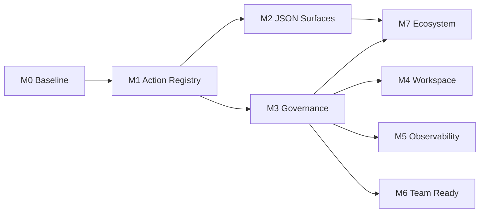

This roadmap turns gaps from the
[Agent-Native Architecture Assessment](/research/agent-native-architecture-assessment/)
into shippable milestones. The goal is to move Director from "agent-native on core paths" to
"full parity plus unified governance" without replacing Stage, Canvas, Video, or Agent stores in
one migration.

Drafted: **2026-08-02**. Last verified: **2026-08-13**.

## Completed foundation — naive caller boundary

The shared public boundary is implemented for the current mutation surfaces. A caller may submit
the semantic intent without first managing a browser lease, revision/fingerprint, or retry key.
Director discovers one exact target, performs the required read-only preflight, injects missing
guards/keys, and returns a structured `agent_boundary` receipt. Browser execution remains strict,
and exact retries are either replayed, rejected as changed-key reuse, or rejected as stale.

Covered surfaces: Workbench project mutations and evidence, Production CRUD, Creative edits,
Canvas pipeline start, collaboration comments, durable generation/transcription/3D submit and
retry, generated-3D promotion, Storyboard capture/export, and Blender native apply. This closes
the transport-safety foundation; the remaining milestones concern UI/action parity, governance,
collaboration breadth, and observability rather than naive-call correctness.

Blender `apply` snapshots and injects a missing native epoch, revision, and intent ID. If its
post-dispatch outcome is unknown, the Gateway returns the complete bound input as the exact retry ticket.

Related docs:

- [Agent-native Production](/concepts/agent-native-production/) — control loop and contracts
- [Feature Status](/reference/feature-status/) — current capability boundaries
- [Pipeline implementation roadmap](/engineering/pipeline_implementation_roadmap/) — data model and ProductionGraph evolution (runs in parallel; coordinate at M6)

---

## North star

By the end of **Milestone 4**, Director should:

1. Expose a **semantic action for every documented UI mutation**; agents and UI share one executor.
2. Automate **Interchange / Collaboration / Media** without human-only panels.
3. Apply the **same role and audit policy** across MCP, HTTP, CLI, and hosted API.
4. Keep Structured Agent control **Implemented** in Feature Status, with parity tests covering main workspaces.

Target: raise the self-assessment score from **4/5 → 4.5/5**.

---

## Delivery rules

1. **Contract before UI** — new actions land in Zod schemas and tests before React changes.
2. **Do not weaken revision guards** — after UI convergence, `expected_revision` / `snapshot_fingerprint` behavior must not regress.
3. **Every user-facing mutation needs an agent recovery test** — same rule as the [Pipeline roadmap](/engineering/pipeline_implementation_roadmap/).
4. **Human-only capabilities stay explicit** — update `capabilities`, Skills, and Feature Status until JSON surfaces ship.
5. **Milestones merge independently** — each milestone leaves the product releasable.
6. **`stage_*` only shrinks** — new automation uses `director_workbench` / `director_creative`; legacy `stage_*` is maintained, not extended.

---

## Phase overview

| Phase  | Theme                      | Status      | Main outputs                                                                                 | Depends on              |
| ------ | -------------------------- | ----------- | -------------------------------------------------------------------------------------------- | ----------------------- |
| **M0** | Baseline & metrics         | Planned     | UI/agent parity inventory, parity harness                                                    | —                       |
| **M1** | Shared action registry     | Planned     | High-traffic UI paths via `applyDirectorAuthoringActions`                                    | M0                      |
| **M2** | Remove human-only surfaces | **Partial** | Interchange export + collab observe/comment shipped; import and remaining collab writes open | M1 (partially parallel) |
| **M3** | Unified gateway governance | **Partial** | Shared `filmRoleToolPolicy` on MCP / local / hosted; raw HTTP/UI and unified audit open      | M1                      |
| **M4** | In-product workspace       | **Shipped** | SQL-backed instructions / skills / memory, Settings editor, bundle export/import             | M3                      |
| **M5** | Observability              | Planned     | Traces, cost, long-running progress                                                          | M3                      |
| **M6** | Team readiness             | Planned     | Collaboration auth, multi-agent enhancements                                                 | M3, M5                  |
| **M7** | Ecosystem protocols        | Planned     | OpenAPI manifest, A2A spike                                                                  | M2, M3                  |

---

## Milestone 0 — Baseline & metrics

**Goal:** make parity work measurable and regression-testable.

### Work

- Audit all `directorStore` mutation entry points; produce a **UI mutation inventory**.
- Map against `directorAuthoringActionSchema`; label **parity gaps** (high / medium / low).
- Add a **parity harness** test suite:
  - given authoring actions → UI executor and agent executor produce the same revision;
  - failures emit diffs, not only boolean assertions.
- Add **Agent UI parity coverage** to Feature Status (percentage + link to inventory).
- Document `stage_*` → `director_workbench` **migration map** (op mapping, deprecation timeline).

### Acceptance

- Inventory covers top 20 mutation paths across Stage, Canvas, and Video.
- Parity harness passes for the current `directorAuthoring` action set.
- No runtime behavior changes.

### Suggested PR order

1. Inventory doc + optional generator (`tools/scripts/auditUiMutations.ts`)
2. Parity harness framework + 5 seed cases
3. Feature Status and assessment cross-links

---

## Milestone 1 — Shared action registry

**Goal:** UI and agents share one mutation path; eliminate dual writes.

### Work

#### 1.1 UI dispatch layer

- Add `dispatchDirectorAuthoringActions(actions, context)` — thin UI wrapper that:
  - fills `expected_revision` / `idempotency_key`;
  - hooks unified error toasts and undo;
  - calls `applyDirectorAuthoringActions` internally.
- Same pattern for Canvas/Video via `creativeWorkspaceAgentContract`.

#### 1.2 Migrate UI mutations in batches

| Batch  | Scope                   | Typical actions                                   |
| ------ | ----------------------- | ------------------------------------------------- |
| **1a** | Object CRUD, transforms | `create_object`, `update_object`, `delete_object` |
| **1b** | Cameras and shots       | `create_camera`, `update_camera`, `frame_camera`  |
| **1c** | Characters and motion   | `assign_motion`, `update_character_pose`          |
| **1d** | Timeline / coverage     | `create_coverage`, `assign_take`                  |
| **1e** | Canvas nodes / edges    | creative `author` batches                         |
| **1f** | Video tracks / clips    | creative `author` batches                         |

#### 1.3 Semantic equivalents for interactive controls

- **Viewport drag** → debounced `update_object` author batches.
- **Camera pilot** → `update_camera` stream or new `pilot_camera` action (schema extension).
- Operations that cannot be semanticized stay human-only and appear in capabilities exclusions.

#### 1.4 Converge `stage_*`

- Mark `stage_*` as **legacy compact surface** in MCP, docs, and Skills.
- All new automation examples use `director_workbench`.
- Do not delete `stage_*`; freeze op expansion.

### Acceptance

- Parity harness covers batches **1a–1d** with matching revisions on UI and agent paths.
- No new high-priority "UI-only, no agent twin" gaps.
- Existing MCP / HTTP / CLI integration tests pass.

### Risks

| Risk                            | Mitigation                                     |
| ------------------------------- | ---------------------------------------------- |
| UI perf regression per revision | Local batching; debounced author for drags     |
| Undo/redo vs author batches     | Wire existing undo in M1; unify receipts in M4 |

---

## Milestone 2 — Remove human-only surfaces

**Status: Partial** (verified 2026-08-13).

**Goal:** Interchange, Collaboration, and Media are reachable through JSON operations with plan/receipt.

### Shipped

`director_creative` already exposes:

| Surface                          | Actions                                                               | Evidence                                                                                                           |
| -------------------------------- | --------------------------------------------------------------------- | ------------------------------------------------------------------------------------------------------------------ |
| Interchange export               | `capabilities`, `plan-export`, `export`                               | `packages/protocol/src/creativeWorkspaceProtocol.ts`, Creative Agent tests, [Interchange](/pipelines/interchange/) |
| Collaboration read + add comment | `observe`, `list-comments`, `add-comment`, `list-versions`, `compare` | same protocol + semantic-operation tests                                                                           |
| Gallery / media mutations        | `gallery.media.*`, `media.proxy.attach`, and related execute ops      | Feature Status Gallery **Implemented**; persistent media **Limited**                                               |

Import stays human-file-picker-only: an Agent does not fabricate a browser file handle.

### Remaining

#### 2.1 Interchange import

- `import_plan` / `import_apply` (or an equivalent host-adapter path) with `expected_revision` + idempotency
- Align with [ADR 0003 import/export receipts](/engineering/adr/0003-import-export-receipts/)
- Keep Feature Status **Limited** Fountain / OTIO / glTF / USD subset boundaries

#### 2.2 Remaining collaboration writes

| op                                   | Purpose                           |
| ------------------------------------ | --------------------------------- |
| comment resolve                      | Close or resolve a review comment |
| `version_create` / `version_restore` | Named versions                    |

Large media bytes still never enter Yjs.

### Acceptance (remaining)

- Each remaining op has a Zod schema, executor, MCP exposure, and at least one integration test.
- Skills and capabilities list JSON as the execution surface, with import still explicit as human-file-picker-only until it ships.
- Verified-shot tutorial can complete OTIO import + version snapshot **via agent only** (optional human review).

---

## Milestone 3 — Unified gateway governance

**Status: Partial** (verified 2026-08-13).

**Goal:** every control surface obeys the same permission and audit policy.

### Shipped

Role policy lives in `backend/gateway/agents/filmRoleToolPolicy.ts` (not a separate `gatewayToolPolicy.ts`). MCP, the local Agent harness, and the hosted API adapter share it:

| Surface        | Binding                                                                        |
| -------------- | ------------------------------------------------------------------------------ |
| MCP            | `DIRECTOR_FILM_ROLE` in `backend/gateway/mcp-server.ts`                        |
| Local harness  | `agentAdapters.ts` prompt + `filmRoleToolPolicyRejection` before tool dispatch |
| Hosted adapter | `openAiCompatibleAdapter.ts` visibility + rejection                            |

### Remaining

#### 3.1 Raw HTTP and UI permissions

- Apply `filmRoleToolPolicy` to raw `POST /api/tools/{tool-name}` (and therefore CLI).
- Optional: read-only mode and role-gated UI disable from the same policy source.

#### 3.2 Unified audit trail

- Log all tool invocations to `agentSessionStore` (including UI-dispatched author, tagged `source: ui | mcp | http | cli`).
- Structured fields: `tool`, `operation`, `revision_before`, `revision_after`, `idempotency_key`, `role`, `outcome`.

#### 3.3 Confirmation boundaries

- Define destructive/publish actions (`deliver`, `export`, `version_restore`, etc.).
- Agent path: harness approval or explicit `confirm_token`.
- UI path: existing modals; shared `confirm_token` generation.

### Acceptance (remaining)

- Denied MCP ops are also denied on raw HTTP/CLI for the same role.
- Audit log reconstructs a full author session tool chain across entry points.
- New governance integration test suite covers HTTP and UI bypass cases.

---

## Milestone 4 — In-product agent workspace

**Status: Shipped** (verified 2026-08-25).

**Goal:** team instructions, skills, and memory live in SQLite and are editable in-app.

### Shipped

- `agent_workspace_*` tables (org / user scope) in
  `backend/gateway/agents/agentWorkspaceStore.ts` on Node's built-in `node:sqlite`
  (`agent-workspace.sqlite` under the data directory, WAL):
  - `agent_workspace_documents` + `agent_workspace_document_versions` — `instructions`
    (AGENTS.md equivalent) and `learnings` (LEARNINGS.md equivalent) with bounded version history;
  - `agent_workspace_skill_refs` — references to bundled or custom skills (never executable content);
  - `agent_workspace_memory` — structured KV with TTL, purged on access.
- Harness merge, lowest precedence first: **repo skills → DB workspace (org → user) → session
  override**. The gateway composes the effective prompt at
  `GET /api/agent/workspace/prompt` (`agentWorkspacePrompt.ts`); the DSH plugin
  (`packages/dsh-plugin-workbench/src/workspacePrompt.ts`) registers it as the
  `director:workspace` system-prompt section and refreshes it, so DB edits reach new sessions
  without repo changes or a harness restart. `DIRECTOR_SESSION_INSTRUCTIONS` supplies the
  ephemeral session override.
- UI: **Settings → Agent Workspace** popover (`AgentWorkspaceSettings.tsx`) with document
  editing, version history restore, skill refs, memory entries, and JSON bundle export/import.
- `DIRECTOR_AGENT_PROFILES_JSON` merge strategy is documented in
  [Configuration](/reference/configuration/): model/provider profiles (and their credentials)
  stay on the profile axis (env JSON + `agent-api-providers.json`, env-first with user overlays
  and reserved ids env-owned); the workspace stores only instructions / learnings / skill refs /
  memory, and the bundle can never contain provider credentials.

### Acceptance (verified)

- DB instruction edits appear in new sessions without repo changes (store + prompt + plugin tests).
- Export/import workspace bundle (JSON) round-trips (`agentWorkspaceStore.test.ts`, route tests).
- Redaction matches existing harness rules: the shared `backend/gateway/redaction.ts` rule set is
  used by both planner diagnostics and workspace prompt composition.
- Red line: memory entries are user-controlled, labeled untrusted, and **never injected
  automatically** into any prompt; composition excludes them by construction and by test.

---

## Milestone 5 — Observability

**Goal:** supervise and measure long-running, multi-step agent work.

### Work

- **Trace view**: per-session tool chain, revision changes, capture thumbnails.
- **Cost / latency**: aggregate tokens, wall time, retries from provider adapters.
- **Progress API**: unified schema for video jobs, multi-agent runs, DCC exports.
- **Eval hooks**: optional rubric scores after deliver, stored as session artifacts.

### Acceptance

- Workbench UI or `/agent/traces` shows the latest production run.
- Feature Status Observability moves from Partial → Implemented.

---

## Milestone 6 — Team readiness

**Goal:** multi-user collaboration and multi-agent orchestration reach hosted trial quality.

### Work

- Collaboration: **room auth**, invite tokens, server snapshot policy.
- Multi-agent: configurable graph beyond fixed serial DAG; safe parallel critic + operator.
- Deployment: internet-facing hardening checklist (auth, rate limits, CORS, secret rotation).
- Lightweight org model: users, roles, shared workspace (SQLite-first).

### Acceptance

- Two humans plus an agent editing one scene produces predictable, auditable conflicts.
- Multi-agent runs resume from checkpoints (extend existing Experimental path).
- Deployment doc lists minimum production configuration.

### Coordination with Pipeline roadmap

- ProductionGraph v1 (Pipeline M1) supplies cross-workspace identity — multi-agent here should consume graph IDs, not ad hoc strings.

---

## Milestone 7 — Ecosystem protocols

**Goal:** interoperate with other agent-native apps.

### Work

- **OpenAPI / tool manifest export** from Zod schemas.
- **A2A spike**: evaluate wrapping the gateway as an A2A agent card; record go/no-go ADR.
- **Cross-app recipe**: document receipt handoff (e.g. Director deliver → external video post).

### Acceptance

- `GET /api/control-plane/tool-manifest` returns a machine-readable tool catalog.
- A2A spike produces a written conclusion; implementation is optional.

---

## Suggested timeline (indicative)

At **~2 weeks per milestone** (adjust for capacity):

| Period      | Milestone                                |
| ----------- | ---------------------------------------- |
| Weeks 1–2   | M0 Baseline                              |
| Weeks 3–6   | M1 Shared actions (6 PR batches)         |
| Weeks 5–8   | M2 JSON surfaces (parallel with late M1) |
| Weeks 7–8   | M3 Governance                            |
| Weeks 9–10  | M4 Workspace                             |
| Weeks 11–12 | M5 Observability                         |
| Weeks 13–16 | M6 Team readiness                        |
| Weeks 17–18 | M7 Ecosystem                             |

**Critical path:** M0 → M1 → M3. M2 can parallel late M1; M4–M7 depend on M3.

---

## Out of scope

- Replacing Zustand with a remote CRDT primary store
- Full SaaS multi-tenant billing
- Complete A2A implementation (spike only unless M7 go)
- Removing `stage_*` tools (freeze expansion only)
- Finishing LTX / UE pipelines (see [Pipeline roadmap](/engineering/pipeline_implementation_roadmap/))

---

## Success metrics

| Metric                          | Today (2026-08-13)               | After remaining M2/M3          | After M4                     |
| ------------------------------- | -------------------------------- | ------------------------------ | ---------------------------- |
| Parity coverage (top mutations) | ~60%                             | ≥85%                           | ≥95%                         |
| Documented human-only classes   | Import + remaining collab writes | Import explicit until it ships | 0                            |
| Consistent gateway policy       | Partial (MCP / local / hosted)   | Yes, including raw HTTP/UI     | Yes                          |
| In-product workspace            | No                               | No                             | **Yes (shipped 2026-08-25)** |
| Agent-native self-score         | 4.0                              | 4.2                            | 4.5                          |

---

## Immediate next steps

1. Finish remaining M2: interchange import JSON, then collaboration comment resolve and version create/restore
2. Finish remaining M3: apply `filmRoleToolPolicy` to raw HTTP/UI, then unify the audit trail
3. Keep [Feature Status](/reference/feature-status/) and the [architecture assessment](/research/agent-native-architecture-assessment/) in the same change when those land
