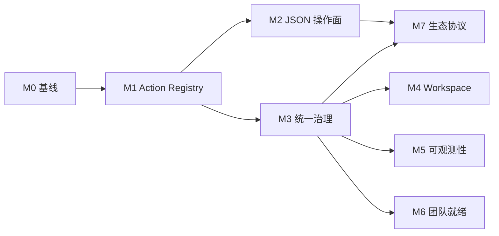

本路线图将 [Agent-Native 架构符合性评估](/zh/research/agent-native-architecture-assessment/) 中的差距，转化为可分批交付的里程碑。目标是在不推翻现有 Stage / Canvas / Video / Agent store 的前提下，把 Director 从「核心路径 agent-native」推进到「全面对等 + 统一治理」。

Drafted: **2026-08-02**。最近核验：**2026-08-25**。

## 已完成基础：naive caller boundary

当前 mutation surface 已统一经过公开 Agent 边界。调用方可以只提交语义意图，无需预先管理
浏览器 lease、revision/fingerprint 或 retry key。Director 会发现一个精确目标，执行必要的
只读 preflight，注入缺失的 guard/key，并返回结构化 `agent_boundary` 回执。浏览器执行边界
仍保持严格；精确重试会重放原结果，changed-key reuse 与 stale replay 都会被拒绝。

覆盖 Workbench 项目 mutation 与证据、Production CRUD、Creative 编辑、Canvas pipeline
start、协作评论、generation/transcription/3D durable submit/retry、Generated 3D 晋升、
Storyboard 捕获/导出以及 Blender native apply。后续里程碑处理的是 UI/action parity、
治理、协作广度和可观察性，不再是 naive-call 正确性基础。

Blender `apply` 会快照原生场景并注入缺失的 epoch、revision 和 intent ID。派发后的结果
若不确定，Gateway 会返回完整的已绑定输入，作为精确重试票据。

相关文档：

- [Agent-native Production](/zh/concepts/agent-native-production/) — 控制循环与契约
- [Feature Status](/zh/reference/feature-status/) — 当前能力边界
- [Pipeline implementation roadmap](/zh/engineering/pipeline_implementation_roadmap/) — 数据模型与 ProductionGraph 演进（与本路线图并行、需协调）

---

## 目标愿景

到 **Milestone 4** 结束时，Director 应满足：

1. **任意已文档化的 UI 变更** 都有对应的 semantic action，且 Agent 与 UI 走同一 executor。
2. **Interchange / Collaboration / Media** 不再依赖 human-only 面板完成自动化。
3. **MCP / HTTP / CLI / Hosted API** 共享同一套 role 与 audit 策略。
4. **Feature Status** 中 Structured Agent control 仍为 **Implemented**，且 parity 测试覆盖主要 workspace。

综合目标：评估文档中的 **4/5 → 4.5/5**。

---

## 交付规则

1. **契约先于 UI** — 新 action 先进入 Zod schema 与测试，再改 React 组件。
2. **不破坏 revision 守卫** — UI 收敛到 shared action 后，`expected_revision` / `snapshot_fingerprint` 行为不得退化。
3. **每个 user-facing mutation 必须有 Agent 恢复测试** — 与 [Pipeline roadmap](/zh/engineering/pipeline_implementation_roadmap/) 第 5 条一致。
4. **Human-only 能力必须显式标注** — 在 `capabilities`、Skill 与 Feature Status 中同步更新，直到 JSON 操作面落地。
5. **里程碑可独立合并** — 每个 milestone 完成后产品仍可发布；不要求一次大迁移。
6. _*stage_* 只减不增_* — 新 automation 一律走 `director_workbench` / `director_creative`；`stage_*` 仅维护兼容。

---

## 阶段总览

| 阶段   | 主题                   | 状态        | 主要产出                                                                         | 依赖             |
| ------ | ---------------------- | ----------- | -------------------------------------------------------------------------------- | ---------------- |
| **M0** | 基线与度量             | Planned     | UI/Agent parity 清单、parity harness                                             | 无               |
| **M1** | Shared action registry | Planned     | UI 高频路径经 `applyDirectorAuthoringActions`                                    | M0               |
| **M2** | Human-only 面消除      | **Implemented** | Interchange 导出 + 导入（plan-import/import）与 collaboration 读写（resolve、version create/restore 等）均为 JSON 操作 | M1（部分可并行） |
| **M3** | Gateway 统一治理       | **Partial** | MCP / 本地 / 托管已共享 `filmRoleToolPolicy`；原始 HTTP/UI 与统一审计未完成      | M1               |
| **M4** | 产品内 workspace       | Planned     | SQL-backed instructions / skills / memory                                        | M3               |
| **M5** | 可观测性               | Planned     | Trace、cost、长任务进度                                                          | M3               |
| **M6** | 团队就绪               | Planned     | Collaboration auth、multi-agent 增强                                             | M3、M5           |
| **M7** | 生态协议               | **Partial** | Tool manifest 已交付（`GET /api/control-plane/tool-manifest`）；A2A spike 结论为 no-go / 暂缓 | M2、M3           |

---

## Milestone 0 — 基线与度量

**目标：** 让后续 parity 工作可量化、可回归。

### 工作项

- 审计 `directorStore` 中所有 mutation 入口，产出 **UI mutation inventory**（文件、函数、是否已有 semantic twin）。
- 对照 `directorAuthoringActionSchema`，标记 **parity gap 列表**（高 / 中 / 低优先级）。
- 新增 **parity harness** 测试套件：
  - 给定一组 authoring actions → UI executor 与 agent executor 产出相同 revision；
  - 失败时输出 diff，而非仅断言 boolean。
- 在 Feature Status 增加一行 **Agent UI parity coverage**（百分比 + 链接到 inventory）。
- 文档化 `stage_*` → `director_workbench` **迁移对照表**（op 映射、废弃时间表）。

### 验收

- Inventory 覆盖 Stage / Canvas / Video 三大 workspace 的 top 20 变更路径。
- Parity harness 至少对现有 `directorAuthoring` 全集通过。
- 无运行时行为变更。

### 建议 PR 顺序

1. Inventory 文档 + 生成脚本（可选：`tools/scripts/auditUiMutations.ts`）
2. Parity harness 框架 + 5 个 seed cases
3. Feature Status 与 assessment 文档互链

---

## Milestone 1 — Shared Action Registry

**目标：** UI 与 Agent 共享同一 mutation 路径，消除「双轨写入」。

### 工作项

#### 1.1 引入 UI dispatch 层

- 新增 `dispatchDirectorAuthoringActions(actions, context)` — UI 专用薄封装：
  - 自动填充 `expected_revision` / `idempotency_key`；
  - 统一错误 toast / undo 挂钩；
  - 内部仍调用 `applyDirectorAuthoringActions`。
- Canvas / Video 同理：Creative workspace 经 `creativeWorkspaceAgentContract` 执行，UI 不再直接 patch snapshot。

#### 1.2 分批迁移 UI mutation（按 inventory 优先级）

| 批次   | 范围                 | 典型 action                                       |
| ------ | -------------------- | ------------------------------------------------- |
| **1a** | 对象 CRUD、transform | `create_object`, `update_object`, `delete_object` |
| **1b** | 相机与镜头           | `create_camera`, `update_camera`, `frame_camera`  |
| **1c** | 角色与 motion        | `assign_motion`, `update_character_pose`          |
| **1d** | Timeline / coverage  | `create_coverage`, `assign_take`                  |
| **1e** | Canvas nodes / edges | creative `author` batch                           |
| **1f** | Video tracks / clips | creative `author` batch                           |

#### 1.3 交互式操控的 semantic 等价物

- **Viewport 拖拽** → `update_object` with computed transform（debounce + revision batch）。
- **Camera pilot** → `update_camera` stream 或 `pilot_camera` 新 action（需 schema 扩展）。
- 无法 semantic 化的操作（如 raw pointer paint）保留 human-only 并写入 capabilities 排除列表。

#### 1.4 stage_* 收敛

- 在 MCP / docs / Skill 中标记 `stage_*` 为 **legacy compact surface**。
- 新增 automation 示例全部改用 `director_workbench`。
- 不删除 `stage_*`，但停止扩展 op 集。

### 验收

- Parity harness 覆盖 **1a–1d** 批次，UI 与 Agent 路径 revision 一致。
- 无新增「UI 直连 store、Agent 无等价」的高优先级 gap。
- 现有 MCP / HTTP / CLI 集成测试全部通过。

### 风险与缓解

| 风险                             | 缓解                                      |
| -------------------------------- | ----------------------------------------- |
| UI 性能退化（每操作算 revision） | 本地 batching；拖拽用 debounced author    |
| Undo/redo 与 author batch 冲突   | M1 先接现有 undo stack；M4 再统一 receipt |

---

## Milestone 2 — Human-only 面消除

**状态：Implemented**（核验于 2026-08-25）。

**目标：** Interchange、Collaboration、Media 可通过 JSON 操作完成，且带 plan/receipt。

### 已交付

`director_creative` 已暴露：

| 操作面                | Actions                                                                                                                                                          | 证据                                                                                                                                                                                 |
| --------------------- | ----------------------------------------------------------------------------------------------------------------------------------------------------------------- | -------------------------------------------------------------------------------------------------------------------------------------------------------------------------------------- |
| Interchange 导出      | `capabilities`、`plan-export`、`export`                                                                                                                          | `packages/protocol/src/creativeWorkspaceProtocol.ts`、Creative Agent 测试、[交换格式](/zh/pipelines/interchange/)                                                                    |
| Interchange 导入      | `plan-import`（`inline` / `media_id` / `workspace_path` 来源）、`import`（guard fingerprint 复核 + 原子提交 + 回执）                                             | 同一协议、`frontend/director/src/agent/creativeWorkspaceSemanticOperations.ts`、`frontend/director/tests/agent/creativeWorkspaceSemanticOperations.import.test.ts`                   |
| Collaboration 读写    | `observe`、`list-comments`、`add-comment`、`resolve-comment`、`reopen-comment`、`update-comment`、`delete-comment`、`list-versions`、`compare`、`create-version`、`restore-version`、`delete-version` | 同一协议 + 语义操作测试（`creativeWorkspaceSemanticOperations.test.ts`）                                                                                                             |
| Gallery / media 变更  | `gallery.media.*`、`media.proxy.attach` 及相关 execute ops                                                                                                       | Feature Status 中 Gallery 为 **Implemented**；持久媒体为 **Limited**                                                                                                                 |

Skill 已把 JSON `plan-import` / `import` 列为首选导入路径；人类的 Interchange 菜单文件选择
入口继续可用。

### 保留边界

- OBJ/STL 仍是只导出格式；Feature Status **Limited** 的 Fountain / OTIO / glTF / USD 子集边界不变。
- `workspace_path` 来源需要可信 host 解析；纯浏览器 target 会显式拒绝并提示改用 `inline` 或 `media_id`。
- 大媒体字节仍不进入 Yjs。

---

## Milestone 3 — Gateway 统一治理

**状态：Partial**（核验于 2026-08-13）。

**目标：** 任意控制面入口受同一 permission 与 audit 策略约束。

### 已交付

角色策略在 `backend/gateway/agents/filmRoleToolPolicy.ts`（并未另建 `gatewayToolPolicy.ts`）。MCP、本地 Agent harness 与托管 API adapter 共用：

| 入口         | 绑定                                                                  |
| ------------ | --------------------------------------------------------------------- |
| MCP          | `backend/gateway/mcp-server.ts` 中的 `DIRECTOR_FILM_ROLE`             |
| 本地 harness | `agentAdapters.ts` 的 prompt + 派发前的 `filmRoleToolPolicyRejection` |
| 托管 adapter | `openAiCompatibleAdapter.ts` 的可见性与拒绝                           |

### 剩余项

#### 3.1 原始 HTTP 与 UI 权限

- 把 `filmRoleToolPolicy` 接到原始 `POST /api/tools/{tool-name}`（因此也覆盖 CLI）。
- 可选：只读 mode、role 限制下的 UI 禁用 — 与 policy 同源。

#### 3.2 统一 audit trail

- 所有 tool invocation 写入 `agentSessionStore`（含 UI-dispatched author，标记 `source: ui | mcp | http | cli`）。
- 结构化字段：`tool`, `operation`, `revision_before`, `revision_after`, `idempotency_key`, `role`, `outcome`。

#### 3.3 确认边界（governed execution）

- 定义 **destructive / publish** action 列表（如 `deliver`, `export`, `version_restore`）。
- Agent 路径：harness approval 或 explicit `confirm_token`；
- UI 路径：现有 modal；两者共享同一 `confirm_token` 生成逻辑。

### 验收（剩余项）

- 同一 role 下，MCP 被拒绝的 op 在原始 HTTP/CLI 也被拒绝。
- Audit log 可跨入口还原一次完整 author 会话的 tool 链。
- 新增 governance integration test 覆盖 HTTP 与 UI 绕过路径。

---

## Milestone 4 — 产品内 Agent Workspace

**目标：** 团队指令、skills、memory 存于 SQLite，可在 app 内编辑，而非仅 repo 文件。

### 工作项

- 新增 `agent_workspace` 表族（org / user scope）：
  - `instructions`（等价 AGENTS.md）
  - `learnings`（等价 LEARNINGS.md）
  - `skill_refs`（指向 bundled 或 custom skills）
  - `memory_entries`（结构化 KV，带 TTL）
- Workbench harness 启动时 merge：repo Skills → DB workspace → session override。
- UI：**Settings → Agent Workspace** 编辑器（Markdown + 版本历史）。
- 与现有 `DIRECTOR_AGENT_PROFILES_JSON` 合并或迁移。

### 验收

- 修改 DB instructions 后，新 session 可见，无需改 repo。
- Export/import workspace bundle（JSON）用于 clone 场景。
- 敏感字段 redaction 与现有 harness 一致。

---

## Milestone 5 — 可观测性

**目标：** 长任务、多步 Agent 工作可监督、可度量。

### 工作项

- **Trace 视图**：按 session 展示 tool 链、revision 变化、capture 缩略图。
- **Cost / latency**：从 provider adapter 汇总 token、wall time、retry 次数。
- **Progress API**：video job、multi-agent run、DCC export 统一 progress schema。
- **Eval hooks**：deliver 后可挂载 rubric score（人工或自动），写入 session artifact。

### 验收

- Workbench UI 或独立 `/agent/traces` 页可查看最近一次 production run。
- Feature Status 新增 Observability 行，状态从 Partial → Implemented。

---

## Milestone 6 — 团队就绪

**目标：** 多人在线协作与 multi-agent 编排达到可托管试运行。

### 工作项

- Collaboration：**room auth**、invite token、server snapshot policy。
- Multi-agent：从固定 serial DAG → **可配置 graph**（仍保持 fail-closed）；parallel critic + operator where safe。
- Deployment：internet-facing hardening checklist（auth、rate limit、CORS、secret rotation）。
- Org 模型（轻量）：users、roles、shared workspace — 可先文件/SQLite，不必上完整 SaaS。

### 验收

- 两人协作 + Agent 第三人修改同一 scene，冲突可预期、可 audit。
- Multi-agent run 可从 checkpoint resume（已有 Experimental 能力扩展）。
- 部署文档列出 production 最低配置。

### 与 Pipeline roadmap 的协调

- ProductionGraph v1（Pipeline M1）提供跨 workspace identity — 本阶段 multi-agent 应消费 graph ID，而非临时字符串。

---

## Milestone 7 — 生态协议

**状态：Partial**（核验于 2026-08-25）。

**目标：** 与其他 agent-native app 互操作。

### 已交付

- **Tool manifest 导出**：`GET /api/control-plane/tool-manifest` 从执行用的同一批 Zod schema
  生成机器可读的工具目录（`director_workbench`、`director_creative`、`director_dcc`、
  `blender_native`、`stage_video`、`director_production`、`director_film`），每个条目含描述、
  JSON Schema 输入契约和操作名；冻结的 `stage_*` 兼容工具标注 `legacy: true`。与
  `/api/control-plane/capabilities` 共享同一鉴权与脱敏策略，不含任何密钥。
  证据：`backend/gateway/controlPlane/toolManifest.ts` + `controlPlaneRoutes.test.ts`。

### A2A spike 结论：no-go / 暂缓

把 gateway 包装为 A2A agent card 目前是 **no-go**：MCP + HTTP tool manifest 已覆盖
跨 app 编排的发现需求；A2A 会引入第二套会话与身份模型，却没有当前用户场景需要它。
待 M3 统一治理落地、且出现真实的外部 A2A 消费方后再重估。不实现新协议。

### 剩余项

- **Cross-app recipe**：文档化「Director deliver → 外部 video post」的 receipt handoff 格式。

### 验收

- `GET /api/control-plane/tool-manifest` 返回可机器读取的 tool 列表。✅
- A2A spike 有书面结论，不强制实现。✅（no-go / 暂缓，见上）

---

## 建议时间线（示意）

以 **2 周 / milestone** 为节奏（可随人力调整）：

| 时段        | 里程碑                           |
| ----------- | -------------------------------- |
| 第 1–2 周   | M0 基线                          |
| 第 3–6 周   | M1 Shared action（分 6 批 PR）   |
| 第 5–8 周   | M2 JSON 操作面（与 M1 后期并行） |
| 第 7–8 周   | M3 统一治理                      |
| 第 9–10 周  | M4 Workspace                     |
| 第 11–12 周 | M5 可观测性                      |
| 第 13–16 周 | M6 团队就绪                      |
| 第 17–18 周 | M7 生态协议                      |

**关键路径：** M0 → M1 → M3。M2 可与 M1 后期并行；M4–M7 依赖 M3。

---

## 不做清单（本路线图范围外）

- 替换 Zustand 为远程 CRDT 主 store
- 完整 SaaS 多租户 billing
- 标准 A2A 完整实现（仅 spike，除非 M7 go）
- 移除 `stage_*` 工具（仅冻结扩展）
- LTX / UE pipeline 完成（见 [Pipeline roadmap](/zh/engineering/pipeline_implementation_roadmap/)）

---

## 成功指标

| 指标                             | 当前（2026-08-25）                                | 剩余 M3 完成后     | M4 后 |
| -------------------------------- | ------------------------------------------------- | ------------------ | ----- |
| Parity coverage（top mutations） | ~60%                                              | ≥85%               | ≥95%  |
| Human-only 能力（已文档化）      | 0 类（M2 已交付；保留边界见 M2，OBJ/STL 仍只导出） | 0 类               | 0 类  |
| Gateway 入口 policy 一致         | 部分（MCP / 本地 / 托管）                         | 是，含原始 HTTP/UI | 是    |
| In-product workspace             | 否                                                | 否                 | 是    |
| Agent-native 综合评分（自评）    | 4.1                                               | 4.2                | 4.5   |

---

## 下一步行动

1. 完成剩余 M3：把 `filmRoleToolPolicy` 接到原始 HTTP/UI，然后统一审计轨迹
2. M7 剩余：文档化 cross-app receipt handoff recipe
3. 落地时在同一变更中更新 [Feature Status](/zh/reference/feature-status/) 与[架构符合性评估](/zh/research/agent-native-architecture-assessment/)
