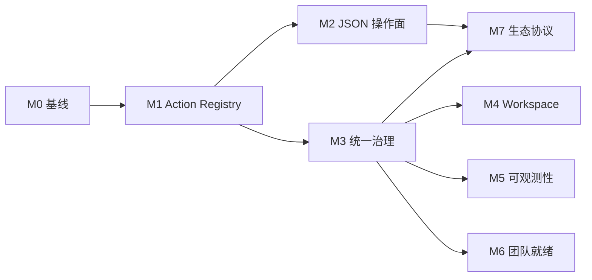

本路线图将 [Agent-Native 架构符合性评估](/zh/research/agent-native-architecture-assessment/) 中的差距，转化为可分批交付的里程碑。目标是在不推翻现有 Stage / Canvas / Video / Agent store 的前提下，把 Director 从「核心路径 agent-native」推进到「全面对等 + 统一治理」。

Drafted: **2026-08-02**。最近核验：**2026-08-25**。

## 已完成基础：naive caller boundary

当前 mutation surface 已统一经过公开 Agent 边界。调用方可以只提交语义意图，无需预先管理
浏览器 lease、revision/fingerprint 或 retry key。Director 会发现一个精确目标，执行必要的
只读 preflight，注入缺失的 guard/key，并返回结构化 `agent_boundary` 回执。浏览器执行边界
仍保持严格；精确重试会重放原结果，changed-key reuse 与 stale replay 都会被拒绝。

覆盖 Workbench 项目 mutation 与证据、Production CRUD、Creative 编辑、Canvas pipeline
start、协作评论、generation/transcription/3D durable submit/retry、Generated 3D 晋升、
Storyboard 捕获/导出以及 Blender native apply。后续里程碑处理的是 UI/action parity、
治理、协作广度和可观察性，不再是 naive-call 正确性基础。

Blender `apply` 会快照原生场景并注入缺失的 epoch、revision 和 intent ID。派发后的结果
若不确定，Gateway 会返回完整的已绑定输入，作为精确重试票据。

相关文档：

- [Agent-native Production](/zh/concepts/agent-native-production/) — 控制循环与契约
- [Feature Status](/zh/reference/feature-status/) — 当前能力边界
- [Pipeline implementation roadmap](/zh/engineering/pipeline_implementation_roadmap/) — 数据模型与 ProductionGraph 演进（与本路线图并行、需协调）

---

## 目标愿景

到 **Milestone 4** 结束时，Director 应满足：

1. **任意已文档化的 UI 变更** 都有对应的 semantic action，且 Agent 与 UI 走同一 executor。
2. **Interchange / Collaboration / Media** 不再依赖 human-only 面板完成自动化。
3. **MCP / HTTP / CLI / Hosted API** 共享同一套 role 与 audit 策略。
4. **Feature Status** 中 Structured Agent control 仍为 **Implemented**，且 parity 测试覆盖主要 workspace。

综合目标：评估文档中的 **4/5 → 4.5/5**。

---

## 交付规则

1. **契约先于 UI** — 新 action 先进入 Zod schema 与测试，再改 React 组件。
2. **不破坏 revision 守卫** — UI 收敛到 shared action 后，`expected_revision` / `snapshot_fingerprint` 行为不得退化。
3. **每个 user-facing mutation 必须有 Agent 恢复测试** — 与 [Pipeline roadmap](/zh/engineering/pipeline_implementation_roadmap/) 第 5 条一致。
4. **Human-only 能力必须显式标注** — 在 `capabilities`、Skill 与 Feature Status 中同步更新，直到 JSON 操作面落地。
5. **里程碑可独立合并** — 每个 milestone 完成后产品仍可发布；不要求一次大迁移。
6. _*stage_* 只减不增_* — 新 automation 一律走 `director_workbench` / `director_creative`；`stage_*` 仅维护兼容。

---

## 阶段总览

| 阶段   | 主题                   | 状态        | 主要产出                                                                         | 依赖             |
| ------ | ---------------------- | ----------- | -------------------------------------------------------------------------------- | ---------------- |
| **M0** | 基线与度量             | **Partial**     | Stage 清单 + parity 测试 + Feature Status 行已交付；生成脚本与 `stage_*` 对照表未完成 | 无               |
| **M1** | Shared action registry | **Partial**     | Stage 单次 mutator 已共享 `applyDirectorAuthoringActions`；Canvas/Video（1e/1f）未完成 | M0               |
| **M2** | Human-only 面消除      | **Implemented** | Interchange 导出 + 导入（plan-import/import）与 collaboration 读写（resolve、version create/restore 等）均为 JSON 操作 | M1（部分可并行） |
| **M3** | Gateway 统一治理       | **Partial** | 策略、统一审计与确认边界已覆盖原始 HTTP/CLI；role 限制 UI 已交付；只读 mode 未完成 | M1               |
| **M4** | 产品内 workspace       | Planned     | SQL-backed instructions / skills / memory                                        | M3               |
| **M5** | 可观测性               | Planned     | Trace、cost、长任务进度                                                          | M3               |
| **M6** | 团队就绪               | Planned     | Collaboration auth、multi-agent 增强                                             | M3、M5           |
| **M7** | 生态协议               | **Implemented** | Tool manifest、A2A go/no-go 已在 ADR 0004 得出结论（runtime no-go；提供 discovery-only card）、cross-app 回执 recipe。A2A runtime 未交付 | M2、M3           |

---

## Milestone 0 — 基线与度量

**状态：Partial**（核验于 2026-08-25）。

**目标：** 让后续 parity 工作可量化、可回归。

### 已交付

- [UI/Agent 对等清单](/zh/engineering/ui-agent-parity-inventory/) 覆盖 Stage `directorStore` 全部
  变更入口，含 mutator、文件、semantic action 与
  `shared` / `ui-only` / `human-only-interactive` 状态（35 / 87 项目 mutator 已 shared，约 40%）。
- `frontend/director/tests/agent/dispatchDirectorAuthoringActions.test.ts` 的 parity 测试断言
  store mutator 与直接 `applyDirectorAuthoringActions` 对删除、变换、相机 update/add/activate、
  角色 motion set/clear、灯光 add/update/delete 产出相同 `getDirectorProjectRevision`。
- Feature Status 已有 **Agent UI parity coverage** 行并链接清单。

### 剩余工作

- 把清单扩展到 Canvas/Video 的 top 变更路径（目前只有 out-of-scope 说明，没有逐 mutator 行）。
- Parity harness 失败时应输出 revision **diff**，而非仅 boolean 断言。
- 可选清单生成脚本（`tools/scripts/auditUiMutations.ts`），防止文档漂移。
- 文档化 `stage_*` → `director_workbench` **迁移对照表**（op 映射、废弃时间表）。

### 验收

- Inventory 覆盖 Stage / Canvas / Video 三大 workspace 的 top 20 变更路径（Stage 已穷举；
  Canvas/Video 行仍未完成）。
- Parity harness 至少对现有 `directorAuthoring` 全集通过。
- 无运行时行为变更。

---

## Milestone 1 — Shared Action Registry

**状态：Partial**（核验于 2026-08-25）。Stage 的对象、相机、角色/motion/IK、灯光、世界、场景、
Storyboard 与实体动画的单次项目 mutator 已经经 `dispatchDirectorAuthoringActions` 执行
（1a–1c 批次加灯光/世界；每个 mutator 的精确状态与旧路径回退见
[对等清单](/zh/engineering/ui-agent-parity-inventory/)）。Timeline 音频、标注/测量、图层、材质、
资产流程以及整个 Canvas/Video（1e/1f）仍直接 patch 状态，因此 M1 **尚未完成**。

**目标：** UI 与 Agent 共享同一 mutation 路径，消除「双轨写入」。

### 工作项

#### 1.1 引入 UI dispatch 层 — Stage 已交付

- `dispatchDirectorAuthoringActions(actions, context)`
  （`frontend/director/src/agent/dispatchDirectorAuthoringActions.ts`）— UI 专用薄封装：
  - 自动填充 `expected_revision` / `idempotency_key`；
  - 统一错误 toast / undo 挂钩；
  - 内部仍调用 `applyDirectorAuthoringActions`。
- UI patch → action 编译器在
  `frontend/director/src/agent/compileDirectorUiAuthoringActions.ts`。
- Canvas / Video 同理：Creative workspace 经 `creativeWorkspaceAgentContract` 执行，UI 不再直接 patch snapshot — **未完成**。

#### 1.2 分批迁移 UI mutation（按 inventory 优先级）

| 批次   | 范围                 | 典型 action                                            | 状态                                               |
| ------ | -------------------- | ------------------------------------------------------ | -------------------------------------------------- |
| **1a** | 对象 CRUD、transform | `add_object`, `update_object`, `delete_objects`        | 删除/单次变换/开关已 shared；新建流程与多选批量未完成 |
| **1b** | 相机与镜头           | `add_camera`, `update_camera`, `set_active_camera`     | 已 shared                                          |
| **1c** | 角色与 motion        | `set_character_motion`, `set_character_pose_controls`, `set_character_ik` | 已 shared                       |
| **1d** | Timeline / coverage  | `add_coverage_shot`, `add_performance_take`, timeline 音频 | Storyboard + 实体动画已 shared；timeline 音频未完成 |
| **1e** | Canvas nodes / edges | creative `author` batch                                | 未完成                                             |
| **1f** | Video tracks / clips | creative `author` batch                                | 未完成                                             |

#### 1.3 交互式操控的 semantic 等价物

- **Viewport 拖拽** → `update_object` with computed transform（debounce + revision batch）。
- **Camera pilot** → `update_camera` stream 或 `pilot_camera` 新 action（需 schema 扩展）。
- 无法 semantic 化的操作（如 raw pointer paint）保留 human-only 并写入 capabilities 排除列表。

#### 1.4 stage_* 收敛

- 在 MCP / docs / Skill 中标记 `stage_*` 为 **legacy compact surface**。
- 新增 automation 示例全部改用 `director_workbench`。
- 不删除 `stage_*`，但停止扩展 op 集。

### 验收

- Parity harness 覆盖 **1a–1d** 批次，UI 与 Agent 路径 revision 一致
  （目前已覆盖 1a–1c 加灯光/世界/Storyboard；timeline 音频未完成）。
- 无新增「UI 直连 store、Agent 无等价」的高优先级 gap。
- 现有 MCP / HTTP / CLI 集成测试全部通过。

### 风险与缓解

| 风险                             | 缓解                                      |
| -------------------------------- | ----------------------------------------- |
| UI 性能退化（每操作算 revision） | 本地 batching；拖拽用 debounced author    |
| Undo/redo 与 author batch 冲突   | M1 先接现有 undo stack；M4 再统一 receipt |

---

## Milestone 2 — Human-only 面消除

**状态：Implemented**（核验于 2026-08-25）。

**目标：** Interchange、Collaboration、Media 可通过 JSON 操作完成，且带 plan/receipt。

### 已交付

`director_creative` 已暴露完整 JSON 操作面：

| 操作面                 | Actions                                                                                                                                                       | 证据                                                                                                                                                        |
| ---------------------- | -------------------------------------------------------------------------------------------------------------------------------------------------------------- | ------------------------------------------------------------------------------------------------------------------------------------------------------------ |
| Interchange 导出       | `capabilities`、`plan-export`、`export`                                                                                                                         | `packages/protocol/src/creativeWorkspaceProtocol.ts`、Creative Agent 测试、[交换格式](/zh/pipelines/interchange/)                                            |
| Interchange 导入       | `plan-import`（source 支持 `inline`、Gallery `media_id`、`workspace_path`），随后 `import`（`plan_id` + `expected_guard_fingerprint` + `confirm:true`）         | 同一协议、`frontend/director/src/agent/creativeWorkspaceSemanticOperations.ts`、`frontend/director/tests/agent/creativeWorkspaceAgentContract.test.ts`      |
| Collaboration 评论     | `observe`、`list-comments`、`add-comment`、`resolve-comment`、`reopen-comment`、`update-comment`、`delete-comment`（fingerprint guard + idempotency；删除需确认） | 同一协议、`frontend/director/tests/agent/creativeWorkspaceSemanticOperations.test.ts`（resolve-comment）                                                     |
| Collaboration 版本     | `list-versions`、`compare`、`create-version`、`restore-version`、`delete-version`（restore/delete 需 `confirm:true`）                                           | 同一协议 + 语义操作测试（create-version、restore-version）                                                                                                   |
| Gallery / media 变更   | `gallery.media.*`、`media.proxy.attach` 及相关 execute ops                                                                                                      | Feature Status 中 Gallery 为 **Implemented**；持久媒体为 **Limited**                                                                                         |

浏览器文件选择器仍作为可选便捷入口保留（针对人类本地已打开的文件），但它不再是唯一导入路径，
也不再阻塞 Agent 自动化。格式边界不变：Feature Status 中 Fountain / OTIO / glTF / USD 仍为
**Limited**（记录在案的子集；FBX 导出与丰富 rig/动画往返仍不在范围内），大媒体字节仍不进入 Yjs。

### 遗留项（非阻塞）

- Verified-shot 教程尚未以「纯 Agent 完成 OTIO 导入 + 版本快照」的形式重录；所需 JSON 操作均已存在。

---

## Milestone 3 — Gateway 统一治理

**状态：Partial**（核验于 2026-08-25）。

**目标：** 任意控制面入口受同一 permission 与 audit 策略约束。

### 已交付

角色策略在 `backend/gateway/agents/filmRoleToolPolicy.ts`（并未另建 `gatewayToolPolicy.ts`）。MCP、Multi-Agent production runner 与原始 gateway HTTP 工具边界共用：

| 入口             | 绑定                                                                                                                                                                                          |
| ---------------- | --------------------------------------------------------------------------------------------------------------------------------------------------------------------------------------------- |
| MCP              | `backend/gateway/mcp-server.ts` 中的 `DIRECTOR_FILM_ROLE`                                                                                                                                     |
| Multi-Agent runs | `backend/gateway/multiAgent/hostedProductionAgentRunner.ts` 及其 run 路由                                                                                                                     |
| 原始 HTTP / CLI  | `backend/gateway/agents/httpToolGovernance.ts` 应用于每条 `/api/tools/*` 路由（`x-director-film-role` header，其次 `DIRECTOR_FILM_ROLE`；403 拒绝体与 MCP 一致；Stage CLI 与 DSH plugin 走同一批路由，因此同样被覆盖） |

#### 3.1 原始 HTTP 与 CLI 权限

- 已交付（2026-08-25）：`backend/gateway/agents/httpToolGovernance.ts` 已把 `filmRoleToolPolicy` 接到所有原始 `POST /api/tools/{tool-name}`（因此也覆盖 CLI）。Role 依次取 `x-director-film-role` header、`DIRECTOR_FILM_ROLE` 环境变量，否则不受限；策略拒绝返回 HTTP 403。
- 已交付（2026-08-25）：与 policy 同源的 role 限制 UI。Allow-table 移至 `packages/protocol/src/filmRoleToolPolicy.ts`（gateway 路径 re-export），`GET /api/control-plane/film-role` 暴露当前 role，`frontend/director/src/comprehensive/editor/api/filmRoleGate.ts` 对不可 author 的 role（如 `visual-critic`）禁用 Stage 写控件与 UI authoring dispatch；observe/capture 保持可用。
- 可选（未完成）：完整只读 mode。

#### 3.2 统一 audit trail

- 已交付（2026-08-25）：所有 tool invocation 写入 JSON 持久化的 `backend/gateway/agentToolAuditStore.ts`（含 UI-dispatched author，标记 `source: ui | mcp | http | cli`），可经 `GET /api/agent/tool-audit` 读取。
- 结构化字段：`tool`, `operation`, `revision_before`, `revision_after`, `idempotency_key`, `role`, `outcome`, `session_id`。

#### 3.3 确认边界（governed execution）

- 已交付（2026-08-25）：`CONFIRMABLE_TOOL_OPERATIONS` 定义封闭的 destructive/publish 列表（`director_workbench` `deliver`；`director_creative` interchange `export`/`import`、collaboration `restore-version`/`delete-version`/`delete-comment`、`gallery.media.purge`）。这些操作在 `POST /api/tools/*`（HTTP、MCP、CLI）上仅当 schema 已定义的 protocol 级 `confirm: true` 字段存在、或携带有效的单次 `confirm_token` 时才执行；否则返回 403 `confirm_required`（含 issue-on-deny 重试信息），绝不执行。
- Token 由 `POST /api/agent/confirm-token` 签发（需 gateway auth），2 分钟过期、单次使用、绑定 tool + operation + role + session，以 SHA-256 hash 存于 `backend/gateway/agentConfirmTokenStore.ts`（JSON + `writeJsonAtomic`，与审计 store 同目录）。调用方以 body 顶层 `confirm_token` 字段（MCP/CLI 会从 tool input 中提出；CLI 亦读取 `DIRECTOR_CONFIRM_TOKEN`）或 `x-director-confirm-token` header 传递。Role policy 优先：被拒绝的 role 在读取 token 之前即被拒绝。
- UI modal 继续使用 protocol 级 `confirm: true`；不阻塞无关编辑。

### 剩余项

- 可选：与 policy 同源的完整只读 mode。

### 验收

- 同一 role 下，MCP 被拒绝的 op 在原始 HTTP/CLI 也被拒绝 — 已完成（`backend/gateway/tests/routes/httpToolPolicy.test.ts`）。
- Audit log 可通过 `GET /api/agent/tool-audit` 跨 HTTP/CLI/MCP/UI 入口还原 tool 链 — 已完成（`backend/gateway/tests/routes/agentToolAuditRoutes.test.ts`）。
- 确认边界覆盖封闭的 destructive/publish 列表 — 已完成（`backend/gateway/tests/routes/httpToolConfirmation.test.ts`）。

---

## Milestone 4 — 产品内 Agent Workspace

**目标：** 团队指令、skills、memory 存于 SQLite，可在 app 内编辑，而非仅 repo 文件。

### 工作项

- 新增 `agent_workspace` 表族（org / user scope）：
  - `instructions`（等价 AGENTS.md）
  - `learnings`（等价 LEARNINGS.md）
  - `skill_refs`（指向 bundled 或 custom skills）
  - `memory_entries`（结构化 KV，带 TTL）
- Workbench harness 启动时 merge：repo Skills → DB workspace → session override。
- UI：**Settings → Agent Workspace** 编辑器（Markdown + 版本历史）。
- 与现有 `DIRECTOR_AGENT_PROFILES_JSON` 合并或迁移。

### 验收

- 修改 DB instructions 后，新 session 可见，无需改 repo。
- Export/import workspace bundle（JSON）用于 clone 场景。
- 敏感字段 redaction 与现有 harness 一致。

---

## Milestone 5 — 可观测性

**目标：** 长任务、多步 Agent 工作可监督、可度量。

### 工作项

- **Trace 视图**：按 session 展示 tool 链、revision 变化、capture 缩略图。
- **Cost / latency**：从 provider adapter 汇总 token、wall time、retry 次数。
- **Progress API**：video job、multi-agent run、DCC export 统一 progress schema。
- **Eval hooks**：deliver 后可挂载 rubric score（人工或自动），写入 session artifact。

### 验收

- Workbench UI 或独立 `/agent/traces` 页可查看最近一次 production run。
- Feature Status 新增 Observability 行，状态从 Partial → Implemented。

---

## Milestone 6 — 团队就绪

**目标：** 多人在线协作与 multi-agent 编排达到可托管试运行。

### 工作项

- Collaboration：**room auth**、invite token、server snapshot policy。
- Multi-agent：从固定 serial DAG → **可配置 graph**（仍保持 fail-closed）；parallel critic + operator where safe。
- Deployment：internet-facing hardening checklist（auth、rate limit、CORS、secret rotation）。
- Org 模型（轻量）：users、roles、shared workspace — 可先文件/SQLite，不必上完整 SaaS。

### 验收

- 两人协作 + Agent 第三人修改同一 scene，冲突可预期、可 audit。
- Multi-agent run 可从 checkpoint resume（已有 Experimental 能力扩展）。
- 部署文档列出 production 最低配置。

### 与 Pipeline roadmap 的协调

- ProductionGraph v1（Pipeline M1）提供跨 workspace identity — 本阶段 multi-agent 应消费 graph ID，而非临时字符串。

---

## Milestone 7 — 生态协议

**状态：Implemented**（核验于 2026-08-25；完整 A2A runtime 有意未交付）。

**目标：** 与其他 agent-native app 互操作。

### 已交付

- **Tool manifest 导出**：`GET /api/control-plane/tool-manifest` 返回机器可读的
  `director-tool-manifest-v1` catalog，由与执行校验相同的 Zod schema 派生 —
  surface（`mcp` / `http` / `both`）、wire `op` 枚举、HTTP 绑定，以及 HTTP-only
  `stage_*` 兼容工具上的 `legacy` 标记。证据：`backend/gateway/controlPlane/toolManifest.ts`、
  `backend/gateway/routes/controlPlaneRoutes.ts` 及对应测试。
- **A2A spike 结论**：[ADR 0004](/zh/engineering/adr/0004-a2a-gateway-spike/) 给出书面
  go/no-go —— live A2A JSON-RPC runtime 为 **no-go**（与 loopback-only、进程 token 的
  gateway 鉴权不匹配；会形成第二套执行协议；exact-target 与 revision 守卫没有 A2A 原生
  字段），discovery-only agent card 为 **go**。`GET /api/control-plane/a2a-agent-card`
  提供该卡片：`discovery_only: true`、A2A endpoint 为 `null`、只含 loopback URL，skills
  镜像实时 tool manifest。完整 A2A 持续推迟，除非合作产品具体需要。
- **Cross-app recipe**：[Control surfaces — 跨 app 回执交接](/zh/agents/control-surfaces/#跨-app-回执交接)
  文档化外部 app 如何消费 `deliver` 与 interchange `export` 回执 ——
  `plan_id` / `receipt_id`、guard fingerprint 与逐文件 SHA-256 校验 —— 依照
  [ADR 0003](/zh/engineering/adr/0003-import-export-receipts/)。

---

## 建议时间线（示意）

以 **2 周 / milestone** 为节奏（可随人力调整）：

| 时段        | 里程碑                           |
| ----------- | -------------------------------- |
| 第 1–2 周   | M0 基线                          |
| 第 3–6 周   | M1 Shared action（分 6 批 PR）   |
| 第 5–8 周   | M2 JSON 操作面（与 M1 后期并行） |
| 第 7–8 周   | M3 统一治理                      |
| 第 9–10 周  | M4 Workspace                     |
| 第 11–12 周 | M5 可观测性                      |
| 第 13–16 周 | M6 团队就绪                      |
| 第 17–18 周 | M7 生态协议                      |

**关键路径：** M0 → M1 → M3。M2 可与 M1 后期并行；M4–M7 依赖 M3。

---

## 不做清单（本路线图范围外）

- 替换 Zustand 为远程 CRDT 主 store
- 完整 SaaS 多租户 billing
- 标准 A2A 完整实现（ADR 0004：runtime no-go；仅 discovery-only card，除非合作方有更多需求）
- 移除 `stage_*` 工具（仅冻结扩展）
- LTX / UE pipeline 完成（见 [Pipeline roadmap](/zh/engineering/pipeline_implementation_roadmap/)）

---

## 成功指标

| 指标                             | 当前（2026-08-25）                                | 剩余 M3 完成后     | M4 后 |
| -------------------------------- | ------------------------------------------------- | ------------------ | ----- |
| Parity coverage（top mutations） | Stage 项目 mutator 约 40%（35/87）                | ≥85%               | ≥95%  |
| Human-only 能力（已文档化）      | 0 类（M2 已交付；保留边界见 M2，OBJ/STL 仍只导出） | 0 类               | 0 类  |
| Gateway 入口 policy 一致         | 是（MCP / 本地 / 托管 / 原始 HTTP+CLI；UI dispatch 仍未门控） | 是，含可选 UI 门控 | 是    |
| In-product workspace             | 否                                                | 否                 | 是    |
| Agent-native 综合评分（自评）    | 4.1                                               | 4.2                | 4.5   |

---

## 下一步行动

1. M1 剩余：Canvas/Video UI store（1e/1f）以及[对等清单](/zh/engineering/ui-agent-parity-inventory/)中仍为 ui-only 的 Stage 写入
2. 完成剩余 M3：可选的完整只读 mode（原始 HTTP/UI 策略、统一审计轨迹、确认边界与 role 限制 UI 已于 2026-08-25 交付）
3. M7 遗留已落地：ADR 0004 完成 A2A spike 结论（runtime no-go；已提供 discovery-only card），cross-app 回执 recipe 已写入 Control surfaces
